```mermaid
graph LR
    Application_Orchestration["Application Orchestration"]
    Data_Management_Preprocessing["Data Management & Preprocessing"]
    U_Net_Model_Definition["U-Net Model Definition"]
    Model_Training_Optimization["Model Training & Optimization"]
    Model_Inference_Prediction["Model Inference & Prediction"]
    Output_Processing_Visualization["Output Processing & Visualization"]
    Application_Orchestration -- "requests data from" --> Data_Management_Preprocessing
    Application_Orchestration -- "initializes" --> U_Net_Model_Definition
    Application_Orchestration -- "triggers" --> Model_Training_Optimization
    Application_Orchestration -- "triggers" --> Model_Inference_Prediction
    Output_Processing_Visualization -- "displays results to" --> Application_Orchestration
    Data_Management_Preprocessing -- "provides input data to" --> Model_Training_Optimization
    Data_Management_Preprocessing -- "provides input data to" --> Model_Inference_Prediction
    U_Net_Model_Definition -- "defines architecture for" --> Model_Training_Optimization
    U_Net_Model_Definition -- "provides model for" --> Model_Inference_Prediction
    Model_Training_Optimization -- "updates parameters of" --> U_Net_Model_Definition
    Model_Inference_Prediction -- "sends predictions to" --> Output_Processing_Visualization
    click Application_Orchestration href "https://github.com/CodeBoarding/GeneratedOnBoardings/blob/main/tf_unet/Application_Orchestration.md" "Details"
    click Data_Management_Preprocessing href "https://github.com/CodeBoarding/GeneratedOnBoardings/blob/main/tf_unet/Data_Management_Preprocessing.md" "Details"
    click U_Net_Model_Definition href "https://github.com/CodeBoarding/GeneratedOnBoardings/blob/main/tf_unet/U_Net_Model_Definition.md" "Details"
    click Model_Training_Optimization href "https://github.com/CodeBoarding/GeneratedOnBoardings/blob/main/tf_unet/Model_Training_Optimization.md" "Details"
```

## Details

The `tf_unet` project is architected as a specialized ML toolkit for image segmentation, primarily centered around the U-Net convolutional neural network. Its design emphasizes a clear data processing pipeline and distinct phases of the machine learning lifecycle. The `Application Orchestration` layer acts as the user-facing interface and workflow manager, initiating processes that involve `Data Management & Preprocessing` for input handling. The core `U-Net Model Definition` provides the adaptable neural network structure, which is then either trained by the `Model Training & Optimization` component or used for inference by the `Model Inference & Prediction` component. Finally, the `Output Processing & Visualization` component ensures that the model's predictions are post-processed and presented effectively. This modular and sequential flow makes `tf_unet` highly suitable for visual representation as a data flow diagram, highlighting the progression from raw data to processed insights through the U-Net model.

### Application Orchestration [[Expand]](./Application_Orchestration.md)
The primary entry points for different use cases (e.g., RFI, UFIG, Ultrasound). These components orchestrate the overall workflow, from data acquisition and preparation to model execution (training or inference) and result handling, acting as the central coordinator.

**Related Classes/Methods**:

- <a href="https://github.com/jakeret/tf_unet/blob/master/scripts/rfi_launcher.py" target="_blank" rel="noopener noreferrer">`rfi_launcher`</a>
- <a href="https://github.com/jakeret/tf_unet/blob/master/scripts/ufig_launcher.py" target="_blank" rel="noopener noreferrer">`ufig_launcher`</a>
- <a href="https://github.com/jakeret/tf_unet/blob/master/scripts/ultrasound_launcher.py" target="_blank" rel="noopener noreferrer">`ultrasound_launcher`</a>

### Data Management & Preprocessing [[Expand]](./Data_Management_Preprocessing.md)
Responsible for handling all aspects of data. This includes loading raw image data and labels, performing necessary preprocessing steps (e.g., resizing, normalization), and providing data batches. It also encompasses the generation of synthetic data when real data is unavailable or insufficient.

**Related Classes/Methods**:

- <a href="https://github.com/jakeret/tf_unet/blob/master/tf_unet/image_util.py" target="_blank" rel="noopener noreferrer">`image_util`</a>
- <a href="https://github.com/jakeret/tf_unet/blob/master/tf_unet/image_gen.py" target="_blank" rel="noopener noreferrer">`image_gen`</a>

### U-Net Model Definition [[Expand]](./U_Net_Model_Definition.md)
Encapsulates the definition and initialization of the U-Net convolutional neural network architecture, including its encoder-decoder paths and the TensorFlow graph construction.

**Related Classes/Methods**:

- <a href="https://github.com/jakeret/tf_unet/blob/master/tf_unet/unet.py" target="_blank" rel="noopener noreferrer">`unet:__init__`</a>
- <a href="https://github.com/jakeret/tf_unet/blob/master/tf_unet/unet.py" target="_blank" rel="noopener noreferrer">`unet:create_conv_net`</a>

### Model Training & Optimization [[Expand]](./Model_Training_Optimization.md)
Manages the entire training lifecycle of the U-Net model. This includes defining the cost function, setting up the optimizer, performing gradient updates, and reporting training statistics.

**Related Classes/Methods**:

- <a href="https://github.com/jakeret/tf_unet/blob/master/tf_unet/unet.py" target="_blank" rel="noopener noreferrer">`unet:train`</a>
- <a href="https://github.com/jakeret/tf_unet/blob/master/tf_unet/unet.py" target="_blank" rel="noopener noreferrer">`unet:_get_cost`</a>
- <a href="https://github.com/jakeret/tf_unet/blob/master/tf_unet/unet.py" target="_blank" rel="noopener noreferrer">`unet:_get_optimizer`</a>
- <a href="https://github.com/jakeret/tf_unet/blob/master/tf_unet/unet.py" target="_blank" rel="noopener noreferrer">`unet:_update_avg_gradients`</a>
- <a href="https://github.com/jakeret/tf_unet/blob/master/tf_unet/unet.py" target="_blank" rel="noopener noreferrer">`unet:output_minibatch_stats`</a>
- <a href="https://github.com/jakeret/tf_unet/blob/master/tf_unet/unet.py" target="_blank" rel="noopener noreferrer">`unet:output_epoch_stats`</a>

### Model Inference & Prediction
Handles the process of using a trained U-Net model to make predictions on new, unseen data. It includes loading the trained model and executing the forward pass.

**Related Classes/Methods**:

- <a href="https://github.com/jakeret/tf_unet/blob/master/tf_unet/unet.py" target="_blank" rel="noopener noreferrer">`unet:predict`</a>
- <a href="https://github.com/jakeret/tf_unet/blob/master/tf_unet/unet.py" target="_blank" rel="noopener noreferrer">`unet:store_prediction`</a>

### Output Processing & Visualization
Takes the raw predictions from the U-Net model and performs post-processing steps (e.g., cropping to original dimensions) and visualizes the results for analysis and display.

**Related Classes/Methods**:

- <a href="https://github.com/jakeret/tf_unet/blob/master/tf_unet/util.py" target="_blank" rel="noopener noreferrer">`util:plot_prediction`</a>
- <a href="https://github.com/jakeret/tf_unet/blob/master/tf_unet/util.py" target="_blank" rel="noopener noreferrer">`util:combine_img_prediction`</a>
- <a href="https://github.com/jakeret/tf_unet/blob/master/tf_unet/util.py" target="_blank" rel="noopener noreferrer">`util:crop_to_shape`</a>
- <a href="https://github.com/jakeret/tf_unet/blob/master/tf_unet/util.py" target="_blank" rel="noopener noreferrer">`util:to_rgb`</a>

### [FAQ](https://github.com/CodeBoarding/GeneratedOnBoardings/tree/main?tab=readme-ov-file#faq)