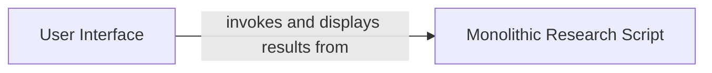

## Details

One paragraph explaining the functionality which is represented by this graph. What the main flow is and what is its purpose.

### User Interface
A Streamlit-based web interface that serves as the entry point for the user. It captures the research query and triggers the backend processing script. After the script completes its execution, the UI is responsible for displaying the final, formatted report.

**Related Classes/Methods**:

- `app/streamlit_app.py`

### Monolithic Research Script
A single, cohesive script that orchestrates the entire research and data processing workflow. It is not broken into separate components but rather into a series of functions that are called sequentially to perform the end-to-end task. This design centralizes all core logic, making it highly coupled but simple to execute. Key responsibilities include: Workflow Orchestration (run_pipeline), LLM Interaction (choose_llm, _build_chain), Data Processing & Formatting (_merge, _dedupe, _to_md), and Data Structure Definition (Product dataclass).

**Related Classes/Methods**:

- <a href="https://github.com/terrytompkins/the-matrix/blob/main/app/research_agent.py#L145-L184" target="_blank" rel="noopener noreferrer">`app/research_agent.py:run_pipeline` (145:184)</a>
- <a href="https://github.com/terrytompkins/the-matrix/blob/main/app/research_agent.py#L101-L108" target="_blank" rel="noopener noreferrer">`app/research_agent.py:choose_llm` (101:108)</a>
- <a href="https://github.com/terrytompkins/the-matrix/blob/main/app/research_agent.py#L114-L116" target="_blank" rel="noopener noreferrer">`app/research_agent.py:_build_chain` (114:116)</a>
- <a href="https://github.com/terrytompkins/the-matrix/blob/main/app/research_agent.py#L132-L134" target="_blank" rel="noopener noreferrer">`app/research_agent.py:_merge` (132:134)</a>
- <a href="https://github.com/terrytompkins/the-matrix/blob/main/app/research_agent.py#L122-L130" target="_blank" rel="noopener noreferrer">`app/research_agent.py:_dedupe` (122:130)</a>
- <a href="https://github.com/terrytompkins/the-matrix/blob/main/app/research_agent.py#L137-L139" target="_blank" rel="noopener noreferrer">`app/research_agent.py:_to_md` (137:139)</a>
- <a href="https://github.com/terrytompkins/the-matrix/blob/main/app/research_agent.py#L84-L91" target="_blank" rel="noopener noreferrer">`app/research_agent.py:Product` (84:91)</a>

### [FAQ](https://github.com/CodeBoarding/GeneratedOnBoardings/tree/main?tab=readme-ov-file#faq)