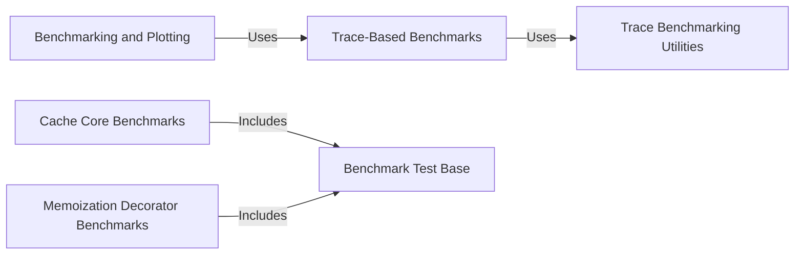

## Component Details

The Benchmarking Suite provides a comprehensive framework for evaluating the performance of the Theine caching library. It encompasses various benchmark types, including core cache operations, memoization decorator performance, and trace-based simulations. The suite facilitates performance analysis, optimization, and identification of potential bottlenecks within the caching library.

### Cache Core Benchmarks
This component focuses on benchmarking the fundamental cache operations such as read and write, employing different replacement policies to assess their impact on performance. It provides insights into the efficiency of the core caching mechanisms under various workloads.
- **Related Classes/Methods**: `theine.benchmarks.benchmark_test:test_write`, `theine.benchmarks.benchmark_test:test_read`, `theine.benchmarks.benchmark_test:test_write_clockpro`, `theine.benchmarks.benchmark_test:test_read_clockpro`

### Memoization Decorator Benchmarks
This component evaluates the performance of the memoization decorator, covering both synchronous and asynchronous operations. It also considers different workload distributions to provide a comprehensive understanding of the decorator's efficiency in various scenarios.
- **Related Classes/Methods**: `theine.benchmarks.benchmark_test:test_decorator_read`, `theine.benchmarks.benchmark_test:test_decorator_read_async`, `theine.benchmarks.benchmark_test:test_decorator_write_async`, `theine.benchmarks.benchmark_test:test_decorator_write`, `theine.benchmarks.benchmark_test:test_decorator_zipf`

### Trace-Based Benchmarks
This component utilizes trace data to simulate real-world workloads, enabling the evaluation of cache performance under realistic conditions. By replaying actual access patterns, it provides valuable insights into the cache's behavior in production environments.
- **Related Classes/Methods**: `theine.benchmarks.trace_bench:bench_theine`

### Benchmarking and Plotting
This component is responsible for orchestrating the execution of benchmarks and generating plots of the results. It provides tools for analyzing and visualizing the performance data, facilitating the identification of trends and areas for improvement.
- **Related Classes/Methods**: `theine.benchmarks.trace_bench:bench_and_plot`

### Benchmark Test Base
This component serves as the foundation for all benchmark tests, providing common functionality and setup routines. It ensures consistency and simplifies the development of new benchmarks by encapsulating shared logic.
- **Related Classes/Methods**: `theine.benchmarks.benchmark_test`

### Trace Benchmarking Utilities
This component offers utilities and helper functions specifically designed for trace-based benchmarking. It includes functionalities for loading, processing, and manipulating trace data, streamlining the process of simulating real-world workloads.
- **Related Classes/Methods**: `theine.benchmarks.trace_bench`
