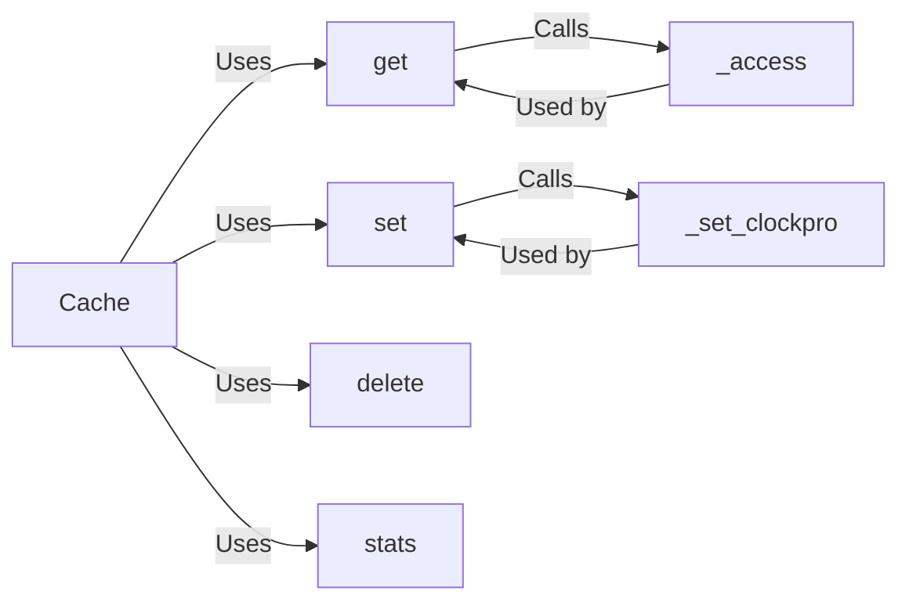

## Component Details

The Cache Core component provides a high-performance, in-memory caching solution using the ClockPro eviction algorithm. It centers around the `Cache` class, which manages the storage, retrieval, and eviction of cached items. The core operations include `get` for retrieving items, `set` for adding or updating items, and `delete` for removing items. The `_access` method updates the cache's internal state upon access, while `_set_clockpro` implements the ClockPro eviction policy. The `stats` method provides cache performance metrics. This component ensures efficient memory utilization and fast data access for applications.

### Cache
The main cache class, responsible for storing items and managing their eviction based on the ClockPro algorithm. It holds the cache data, implements the core caching logic, and provides methods for interacting with the cache.
- **Related Classes/Methods**: `theine.theine.theine.Cache`

### get
Retrieves an item from the cache. If the item is present, it's returned; otherwise, None is returned. This method also updates the cache's internal state to reflect the access.
- **Related Classes/Methods**: `theine.theine.theine.Cache:get`

### _access
Updates the internal state of the cache when an item is accessed (either retrieved or updated). This is a core part of the ClockPro algorithm, managing the 'recent' and 'protected' status of cache entries.
- **Related Classes/Methods**: `theine.theine.theine.Cache:_access`

### set
Adds or updates an item in the cache. If the cache is full, it evicts an item based on the ClockPro replacement policy before adding the new item.
- **Related Classes/Methods**: `theine.theine.theine.Cache:set`

### _set_clockpro
Implements the ClockPro replacement policy. It determines which item to evict when the cache is full, considering the 'recent' and 'protected' status of entries.
- **Related Classes/Methods**: `theine.theine.theine.Cache:_set_clockpro`

### delete
Removes an item from the cache.
- **Related Classes/Methods**: `theine.theine.theine.Cache:delete`

### stats
Returns statistics about the cache's performance, such as hit rate and miss rate.
- **Related Classes/Methods**: `theine.theine.theine.Cache:stats`
