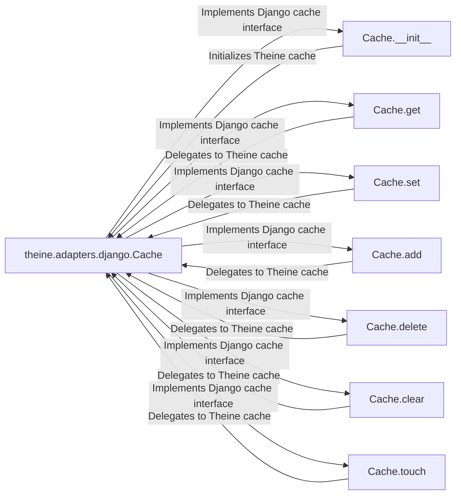

## Component Details

The Django Framework Adapter enables seamless integration of Theine caching with Django applications. It provides a Django-compatible cache interface, allowing developers to leverage Theine's performance benefits without modifying existing Django cache usage. The adapter initializes a Theine cache instance using Django settings and translates Django's caching operations (get, set, add, delete, clear, touch) into corresponding Theine cache operations.

### theine.adapters.django.Cache
This class adapts the Theine cache to the Django cache interface. It initializes a Theine cache instance using Django settings such as `default_timeout`, `params`, and `key_prefix`, and implements the standard Django cache methods.
- **Related Classes/Methods**: `theine.adapters.django.Cache`

### Cache.__init__
The constructor initializes the Theine cache instance. It retrieves configuration parameters from Django's cache settings and uses them to configure the underlying Theine cache.
- **Related Classes/Methods**: `theine.adapters.django.Cache.__init__`

### Cache.get
Retrieves a value from the cache based on the provided key. It calls the `get` method of the underlying Theine cache instance.
- **Related Classes/Methods**: `theine.adapters.django.Cache.get`

### Cache.set
Sets a value in the cache for a given key with an optional expiration time. It calls the `set` method of the underlying Theine cache instance.
- **Related Classes/Methods**: `theine.adapters.django.Cache.set`

### Cache.add
Adds a value to the cache if the key does not already exist. It calls the `add` method of the underlying Theine cache instance.
- **Related Classes/Methods**: `theine.adapters.django.Cache.add`

### Cache.delete
Deletes a value from the cache based on the provided key. It calls the `delete` method of the underlying Theine cache instance.
- **Related Classes/Methods**: `theine.adapters.django.Cache.delete`

### Cache.clear
Clears the entire cache, removing all stored values. It calls the `clear` method of the underlying Theine cache instance.
- **Related Classes/Methods**: `theine.adapters.django.Cache.clear`

### Cache.touch
Updates the expiration time of a value in the cache without modifying the value itself. It calls the `touch` method of the underlying Theine cache instance.
- **Related Classes/Methods**: `theine.adapters.django.Cache.touch`
