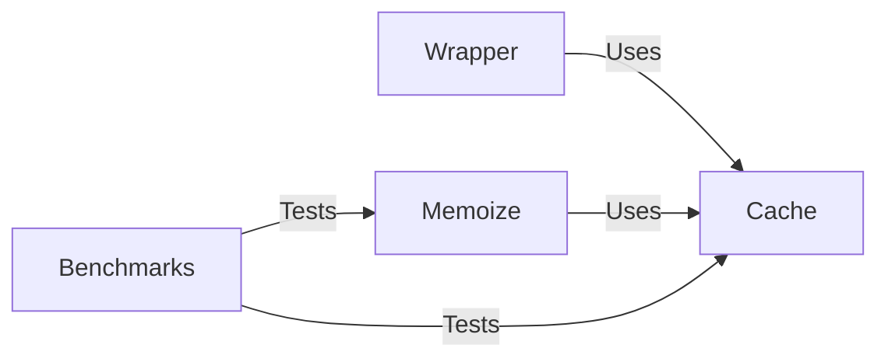

## Component Details

The Theine library provides a memoization decorator and caching mechanism to improve performance by storing and reusing the results of function calls. The core components include the Cache, which stores the cached values, the Memoize decorator, which wraps functions to enable caching, and the Wrapper, which provides an interface for interacting with the Cache. Benchmarks are included to evaluate the performance of the cache.

### Cache
The Cache class is the central component responsible for storing and retrieving cached values. It uses a clock-pro algorithm for cache eviction. It provides methods for inserting, retrieving, and evicting entries. It interacts with the Wrapper for external access and the Memoize decorator for function caching.
- **Related Classes/Methods**: `theine.theine.theine.Cache`

### Memoize
The Memoize decorator is used to automatically cache the results of function calls. It wraps the function and uses the Cache to store and retrieve the results. It interacts with the Cache to store and retrieve values and the decorated function. It determines the cache key based on the function arguments.
- **Related Classes/Methods**: `theine.theine.theine.Memoize`

### Wrapper
The Wrapper class provides an interface for interacting with the Cache. It encapsulates the Cache instance and provides methods for accessing and modifying the cache. It interacts with the Cache to perform operations on the cache, such as getting, setting, and deleting values.
- **Related Classes/Methods**: `theine.theine.theine.Wrapper`

### Benchmarks
The benchmark tests measure the performance of the cache in different scenarios, such as read and write operations, with and without asynchronous execution. They interact with the Cache and Memoize to evaluate their performance.
- **Related Classes/Methods**: `theine.benchmarks.benchmark_test`
