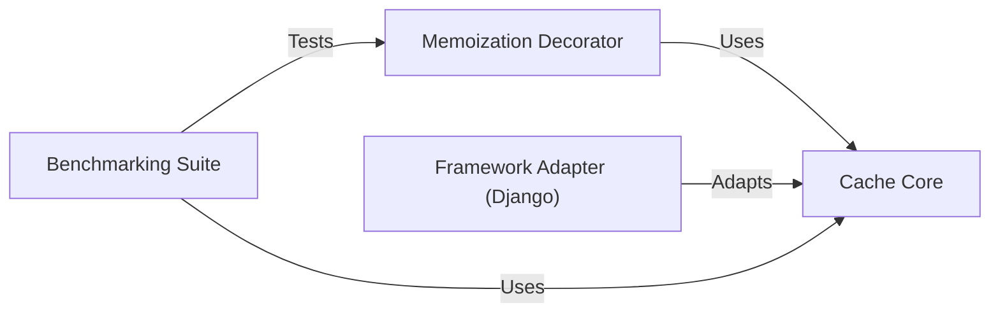

## Component Details

The Theine library provides a high-performance caching solution with a focus on efficient memory management and adaptability to different frameworks. It offers a core caching mechanism with advanced eviction policies, a memoization decorator for simplifying function result caching, and framework adapters for seamless integration with existing applications. The library also includes a benchmarking suite for performance evaluation and optimization.

### Cache Core
The Cache Core component is the foundation of the Theine library, responsible for storing, retrieving, and managing cached data. It implements the clock pro algorithm for efficient cache eviction, ensuring optimal memory utilization. This component provides the fundamental caching logic and data structures used by other components.
- **Related Classes/Methods**: `theine.theine.theine.Cache`, `theine.theine.theine._set_clockpro`, `theine.theine.theine.get`, `theine.theine.theine.set`, `theine.theine.theine.delete`, `theine.theine.theine._access`, `theine.theine.theine.stats`

### Memoization Decorator
The Memoization Decorator component offers a convenient way to automatically cache the results of function calls. By wrapping a function with this decorator, the library caches the function's return value based on its input arguments, avoiding redundant computations and improving performance. It leverages the Cache Core for storing and retrieving cached results.
- **Related Classes/Methods**: `theine.theine.theine.Memoize`, `theine.theine.theine.Wrapper`

### Framework Adapter (Django)
The Framework Adapter component facilitates the integration of the Theine library with specific frameworks, such as Django. It provides an interface that allows applications using these frameworks to seamlessly utilize Theine's caching capabilities. This adapter translates framework-specific caching operations into Theine's core caching operations, enabling a smooth transition and enhanced performance.
- **Related Classes/Methods**: `theine.theine.adapters.django.Cache`, `theine.theine.adapters.django.Cache.add`, `theine.theine.adapters.django.Cache.get`, `theine.theine.adapters.django.Cache.set`, `theine.theine.adapters.django.Cache.touch`, `theine.theine.adapters.django.Cache.delete`, `theine.theine.adapters.django.Cache.clear`

### Benchmarking Suite
The Benchmarking Suite component provides a comprehensive set of benchmarks for evaluating the performance of the Theine caching library. These benchmarks assess the library's efficiency under various workloads and configurations, providing valuable insights for optimization and tuning. It measures the performance of the Cache Core and Memoization Decorator, helping to identify potential bottlenecks and areas for improvement.
- **Related Classes/Methods**: `theine.benchmarks.benchmark_test`, `theine.benchmarks.trace_bench`