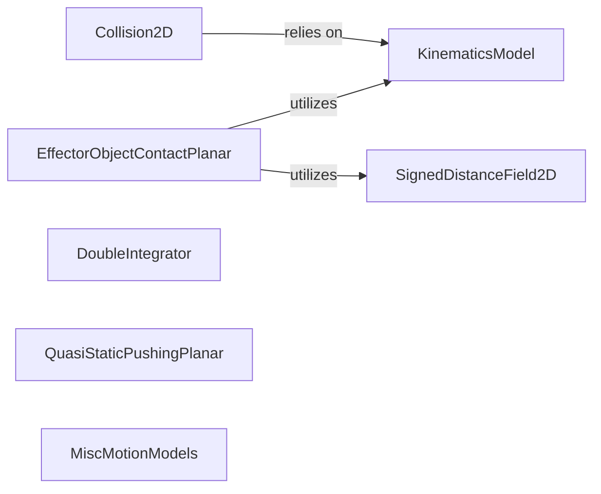

## Details

The `Embodied AI Models & Cost Functions` subsystem within `theseus` provides specialized models and cost functions essential for robotics and embodied AI applications. It focuses on representing robot kinematics, detecting collisions, and modeling various motion dynamics.

### KinematicsModel
Serves as the foundational abstract class for representing robot geometry and transformations. It provides the interface for forward kinematics, crucial for other embodied AI components to understand the robot's configuration. This component is fundamental as it defines how robot poses and structures are handled, which is a prerequisite for motion planning and collision avoidance.

**Related Classes/Methods**:

- <a href="https://github.com/facebookresearch/theseus/blob/main/theseus/embodied/kinematics/kinematics_model.py#L23-L33" target="_blank" rel="noopener noreferrer">`KinematicsModel`:23-33</a>

### Collision2D
Computes the error and Jacobians for 2D collision detection between geometric primitives. It functions as a generic 2D collision cost function, enabling the optimization engine to minimize collision penetration. Its importance lies in providing a differentiable collision avoidance mechanism.

**Related Classes/Methods**:

- <a href="https://github.com/facebookresearch/theseus/blob/main/theseus/embodied/collision/collision.py#L17-L92" target="_blank" rel="noopener noreferrer">`Collision2D`:17-92</a>

### EffectorObjectContactPlanar
Models the cost and Jacobians for contact interactions between a robot effector and an object in a planar environment. This is typically used for collision avoidance or contact-rich manipulation tasks, allowing the optimizer to enforce or penalize specific contact conditions.

**Related Classes/Methods**:

- <a href="https://github.com/facebookresearch/theseus/blob/main/theseus/embodied/collision/eff_obj_contact.py#L17-L126" target="_blank" rel="noopener noreferrer">`EffectorObjectContactPlanar`:17-126</a>

### SignedDistanceField2D
Manages and provides a 2D signed distance field (SDF) for efficient spatial queries. It is crucial for determining distances to obstacles or objects, which is a core primitive for collision detection and path planning.

**Related Classes/Methods**:

- <a href="https://github.com/facebookresearch/theseus/blob/main/theseus/embodied/collision/signed_distance_field.py#L16-L246" target="_blank" rel="noopener noreferrer">`SignedDistanceField2D`:16-246</a>

### DoubleIntegrator
Implements a cost function for a double integrator motion model, computing errors and Jacobians based on deviations from this dynamic model. This component is a fundamental building block for trajectory optimization, ensuring smooth and physically plausible motions.

**Related Classes/Methods**:

- <a href="https://github.com/facebookresearch/theseus/blob/main/theseus/embodied/motionmodel/double_integrator.py#L14-L91" target="_blank" rel="noopener noreferrer">`DoubleIntegrator`:14-91</a>

### QuasiStaticPushingPlanar
Calculates the error and Jacobians for a quasi-static pushing motion model in a planar setting. This is relevant for robotic manipulation tasks where objects are pushed without significant dynamic effects, providing a specialized cost function for such scenarios.

**Related Classes/Methods**:

- <a href="https://github.com/facebookresearch/theseus/blob/main/theseus/embodied/motionmodel/quasi_static_pushing_planar.py#L19-L297" target="_blank" rel="noopener noreferrer">`QuasiStaticPushingPlanar`:19-297</a>

### MiscMotionModels
Provides various utility cost functions for motion models, such as enforcing limits (`HingeCost`) or modeling non-holonomic constraints (`Nonholonomic`). These components offer flexible ways to incorporate common motion constraints into optimization problems.

**Related Classes/Methods**:

- <a href="https://github.com/facebookresearch/theseus/blob/main/theseus/embodied/motionmodel/misc.py" target="_blank" rel="noopener noreferrer">`MiscMotionModels`</a>

### [FAQ](https://github.com/CodeBoarding/GeneratedOnBoardings/tree/main?tab=readme-ov-file#faq)