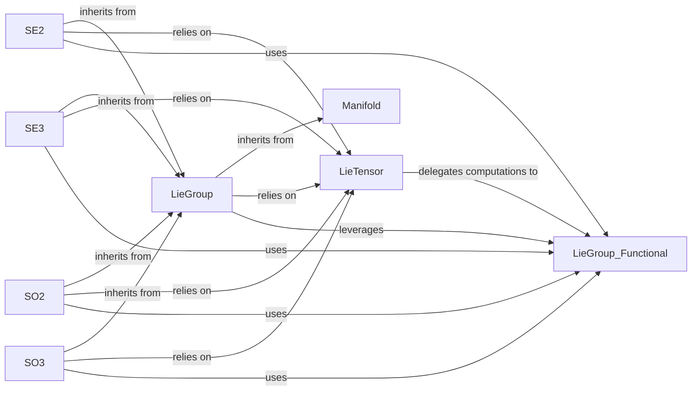

## Details

The `Geometric Primitives & Lie Groups` subsystem is primarily defined by the `theseus.geometry` package and its foundational dependencies within `torchlie`. It encompasses the abstract definitions of geometric manifolds and Lie groups, their concrete implementations for common transformations (e.g., SE(2), SE(3), SO(2), SO(3)), and the mechanisms for integrating these mathematical concepts with PyTorch's computational graph.

### Manifold
The foundational abstract base class for all geometric objects that are manifolds. It defines fundamental operations common to all manifolds, such as projection and local coordinate mapping, establishing the core interface for geometric primitives.

**Related Classes/Methods**:

- <a href="https://github.com/facebookresearch/theseus/blob/main/theseus/geometry/manifold.py" target="_blank" rel="noopener noreferrer">`theseus.geometry.manifold`</a>

### LieGroup
An abstract base class that extends `Manifold`, providing the interface for Lie group specific operations (e.g., `log_map`, `compose`, `exp_map`). It acts as a contract for all concrete Lie group implementations, ensuring a consistent API for group operations.

**Related Classes/Methods**:

- <a href="https://github.com/facebookresearch/theseus/blob/main/theseus/geometry/lie_group.py" target="_blank" rel="noopener noreferrer">`theseus.geometry.lie_group`</a>

### SE2
Concrete implementation of the 2D Special Euclidean Group, representing rigid transformations (rotation and translation) in 2D. It provides specific implementations for Lie group operations tailored to 2D transformations.

**Related Classes/Methods**:

- <a href="https://github.com/facebookresearch/theseus/blob/main/theseus/geometry/se2.py" target="_blank" rel="noopener noreferrer">`theseus.geometry.se2`</a>

### SE3
Concrete implementation of the 3D Special Euclidean Group, representing rigid transformations (rotation and translation) in 3D. Provides specific implementations for Lie group operations crucial for 3D robotics and vision.

**Related Classes/Methods**:

- <a href="https://github.com/facebookresearch/theseus/blob/main/theseus/geometry/se3.py" target="_blank" rel="noopener noreferrer">`theseus.geometry.se3`</a>

### SO2
Concrete implementation of the 2D Special Orthogonal Group, representing 2D rotations. Provides specific implementations for Lie group operations for planar rotations.

**Related Classes/Methods**:

- <a href="https://github.com/facebookresearch/theseus/blob/main/theseus/geometry/so2.py" target="_blank" rel="noopener noreferrer">`theseus.geometry.so2`</a>

### SO3
Concrete implementation of the 3D Special Orthogonal Group, representing 3D rotations. Provides specific implementations for Lie group operations for spatial rotations.

**Related Classes/Methods**:

- <a href="https://github.com/facebookresearch/theseus/blob/main/theseus/geometry/so3.py" target="_blank" rel="noopener noreferrer">`theseus.geometry.so3`</a>

### LieTensor
A core data structure that wraps PyTorch tensors, imbuing them with Lie group semantics. It enables differentiable operations on Lie group elements and acts as the crucial bridge between mathematical abstractions and PyTorch's computational graph, facilitating end-to-end differentiability.

**Related Classes/Methods**:

- <a href="https://github.com/facebookresearch/theseus/blob/main/torchlie/torchlie/lie_tensor.py" target="_blank" rel="noopener noreferrer">`torchlie.torchlie.lie_tensor`</a>

### LieGroup_Functional
Offers a high-level functional interface for Lie group operations, abstracting away specific group implementations. It dispatches calls to the appropriate low-level `_Impl` components (like `SE3_Impl`, `SO3_Impl`), providing a unified entry point for Lie group computations.

**Related Classes/Methods**:

- <a href="https://github.com/facebookresearch/theseus/blob/main/torchlie/torchlie/functional/lie_group.py" target="_blank" rel="noopener noreferrer">`torchlie.torchlie.functional.lie_group`</a>

### [FAQ](https://github.com/CodeBoarding/GeneratedOnBoardings/tree/main?tab=readme-ov-file#faq)