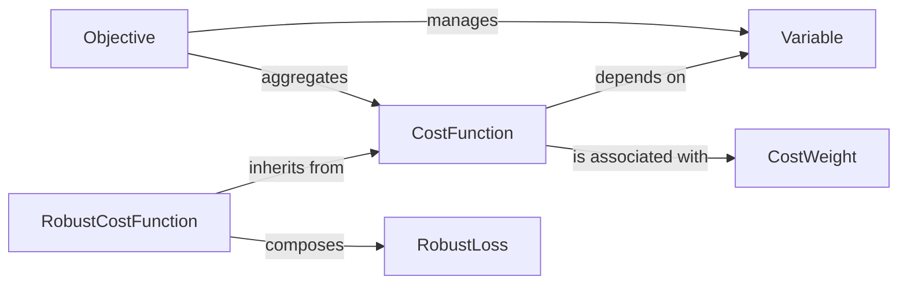

## Details

The `Optimization Problem Definition` subsystem is responsible for defining the core elements of an optimization problem: optimizable variables, differentiable error functions, and their aggregation into a unified objective. It provides the foundational abstractions upon which the `theseus` optimization framework is built.

### Variable
Represents an optimizable quantity within the optimization problem. It encapsulates a PyTorch tensor and manages its properties, such as dimension and whether it's a free variable or part of a manifold. It serves as the atomic unit of data that optimizers manipulate.

**Related Classes/Methods**:

- <a href="https://github.com/facebookresearch/theseus/blob/main/theseus/core/variable.py#L14-L104" target="_blank" rel="noopener noreferrer">`theseus.core.variable.Variable`:14-104</a>

### CostFunction
Defines a differentiable error term. It takes `Variable` instances as input, computes an error vector, and provides methods to compute its Jacobian with respect to the input variables. This component is where the problem's constraints and objectives are mathematically expressed.

**Related Classes/Methods**:

- <a href="https://github.com/facebookresearch/theseus/blob/main/theseus/core/cost_function.py#L64-L149" target="_blank" rel="noopener noreferrer">`theseus.core.cost_function.CostFunction`:64-149</a>

### Objective
Aggregates multiple `CostFunction` instances and manages all `Variable` instances involved in the optimization problem. It provides a unified interface to compute the total error and the overall Jacobian of the entire system, which is then used by the optimizers. It acts as the central representation of the optimization problem.

**Related Classes/Methods**:

- <a href="https://github.com/facebookresearch/theseus/blob/main/theseus/core/objective.py#L42-L956" target="_blank" rel="noopener noreferrer">`theseus.core.objective.Objective`:42-956</a>

### RobustCostFunction
A specialized `CostFunction` that incorporates robust loss functions to mitigate the influence of outliers in the error computation.

**Related Classes/Methods**:

- <a href="https://github.com/facebookresearch/theseus/blob/main/theseus/core/cost_function.py" target="_blank" rel="noopener noreferrer">`theseus.core.cost_function.RobustCostFunction`</a>

### RobustLoss
Represents a robust loss function (e.g., Huber, Cauchy) that can be applied to the error terms of a `CostFunction` to reduce the impact of outliers.

**Related Classes/Methods**:

- <a href="https://github.com/facebookresearch/theseus/blob/main/theseus/core/robust_loss.py#L13-L30" target="_blank" rel="noopener noreferrer">`theseus.core.robust_loss.RobustLoss`:13-30</a>

### CostWeight
Represents a scalar weight associated with a `CostFunction`, allowing different error terms to contribute more or less to the overall objective.

**Related Classes/Methods**:

- <a href="https://github.com/facebookresearch/theseus/blob/main/theseus/core/cost_function.py" target="_blank" rel="noopener noreferrer">`theseus.core.cost_function.CostWeight`</a>

### [FAQ](https://github.com/CodeBoarding/GeneratedOnBoardings/tree/main?tab=readme-ov-file#faq)