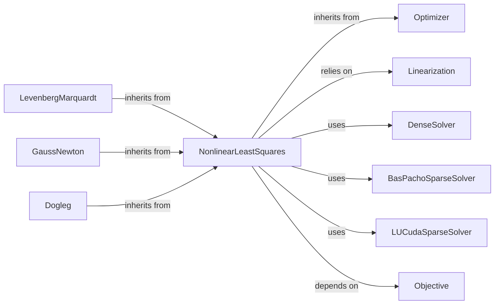

## Details

The Optimization Solvers subsystem is a core part of the theseus library, responsible for implementing various iterative algorithms to solve defined optimization problems, particularly non-linear least squares.

### Optimizer
The abstract base class that defines the common interface for all optimization algorithms. It serves as the entry point for initiating an optimization process, embodying the Strategy Pattern for interchangeable solvers.

**Related Classes/Methods**:

- <a href="https://github.com/facebookresearch/theseus/blob/main/theseus/optimizer/optimizer.py#L27-L53" target="_blank" rel="noopener noreferrer">`theseus.optimizer.optimizer.Optimizer`:27-53</a>

### NonlinearLeastSquares
An abstract orchestrator for iterative non-linear least squares optimization. It manages the core optimization loop, including convergence checks and the delegation of step computation, embodying the Iterative Optimization pattern.

**Related Classes/Methods**:

- <a href="https://github.com/facebookresearch/theseus/blob/main/theseus/optimizer/nonlinear/nonlinear_least_squares.py#L57-L396" target="_blank" rel="noopener noreferrer">`theseus.optimizer.nonlinear.nonlinear_least_squares.NonlinearLeastSquares`:57-396</a>

### LevenbergMarquardt
A concrete implementation of a non-linear least squares solver, specifically the Levenberg-Marquardt algorithm, known for its dynamic damping adjustment.

**Related Classes/Methods**:

- <a href="https://github.com/facebookresearch/theseus/blob/main/theseus/optimizer/nonlinear/levenberg_marquardt.py#L51-L201" target="_blank" rel="noopener noreferrer">`theseus.optimizer.nonlinear.levenberg_marquardt.LevenbergMarquardt`:51-201</a>

### GaussNewton
A concrete implementation of the Gauss-Newton algorithm for non-linear least squares.

**Related Classes/Methods**:

- <a href="https://github.com/facebookresearch/theseus/blob/main/theseus/optimizer/nonlinear/gauss_newton.py#L17-L47" target="_blank" rel="noopener noreferrer">`theseus.optimizer.nonlinear.gauss_newton.GaussNewton`:17-47</a>

### Dogleg
A concrete implementation of the Dogleg algorithm, a trust-region method for non-linear least squares.

**Related Classes/Methods**:

- <a href="https://github.com/facebookresearch/theseus/blob/main/theseus/optimizer/nonlinear/dogleg.py#L18-L105" target="_blank" rel="noopener noreferrer">`theseus.optimizer.nonlinear.dogleg.Dogleg`:18-105</a>

### Linearization
An abstract base class defining the interface for linearizing the non-linear objective function into a linear system (Hessian approximation and gradient vector). This is a crucial step in iterative non-linear optimization.

**Related Classes/Methods**:

- <a href="https://github.com/facebookresearch/theseus/blob/main/theseus/optimizer/linearization.py#L16-L87" target="_blank" rel="noopener noreferrer">`theseus.optimizer.linearization.Linearization`:16-87</a>

### DenseSolver
A concrete implementation for efficiently solving dense linear systems.

**Related Classes/Methods**:

- <a href="https://github.com/facebookresearch/theseus/blob/main/theseus/optimizer/linear/dense_solver.py#L19-L122" target="_blank" rel="noopener noreferrer">`theseus.optimizer.linear.dense_solver.DenseSolver`:19-122</a>

### BasPachoSparseSolver
A concrete implementation for efficiently solving sparse linear systems using BasPacho.

**Related Classes/Methods**:

- <a href="https://github.com/facebookresearch/theseus/blob/main/theseus/optimizer/linear/baspacho_sparse_solver.py#L23-L148" target="_blank" rel="noopener noreferrer">`theseus.optimizer.linear.baspacho_sparse_solver.BasPachoSparseSolver`:23-148</a>

### LUCudaSparseSolver
A concrete implementation for efficiently solving sparse linear systems using CUDA LU decomposition.

**Related Classes/Methods**:

- <a href="https://github.com/facebookresearch/theseus/blob/main/theseus/optimizer/linear/lu_cuda_sparse_solver.py#L20-L172" target="_blank" rel="noopener noreferrer">`theseus.optimizer.linear.lu_cuda_sparse_solver.LUCudaSparseSolver`:20-172</a>

### Objective
Defines the problem, evaluates errors, and computes Jacobians, which are essential inputs for the linearization process.

**Related Classes/Methods**:

- <a href="https://github.com/facebookresearch/theseus/blob/main/theseus/core/objective.py#L42-L956" target="_blank" rel="noopener noreferrer">`theseus.core.objective.Objective`:42-956</a>

### [FAQ](https://github.com/CodeBoarding/GeneratedOnBoardings/tree/main?tab=readme-ov-file#faq)