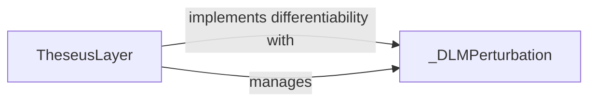

## Details

This subsystem is dedicated to seamlessly integrating the `theseus` optimization framework with PyTorch's automatic differentiation system, enabling `theseus` optimization problems to function as differentiable layers within larger PyTorch computational graphs.

### TheseusLayer
This class serves as the primary bridge between the `theseus` optimization framework and PyTorch's automatic differentiation system. It encapsulates a `theseus` optimization problem, allowing it to be treated as a differentiable layer within PyTorch models. Its core responsibility is to manage the forward pass (solving the optimization problem) and orchestrate the backward pass to compute gradients through the optimization.

**Related Classes/Methods**:

- <a href="https://github.com/facebookresearch/theseus/blob/main/theseus/theseus_layer.py#L29-L161" target="_blank" rel="noopener noreferrer">`theseus.theseus_layer.TheseusLayer`:29-161</a>

### _DLMPerturbation
This internal component is crucial for the backward pass of the `TheseusLayer`. It is responsible for managing and applying the necessary perturbations for the Differentiable Linearized Model (DLM) approach. This mechanism is fundamental to how `theseus` achieves implicit differentiation for its iterative optimization process, ensuring that gradients can flow through the optimization layer.

**Related Classes/Methods**:

- <a href="https://github.com/facebookresearch/theseus/blob/main/theseus/theseus_layer.py#L283-L336" target="_blank" rel="noopener noreferrer">`theseus.theseus_layer._DLMPerturbation`:283-336</a>

### [FAQ](https://github.com/CodeBoarding/GeneratedOnBoardings/tree/main?tab=readme-ov-file#faq)