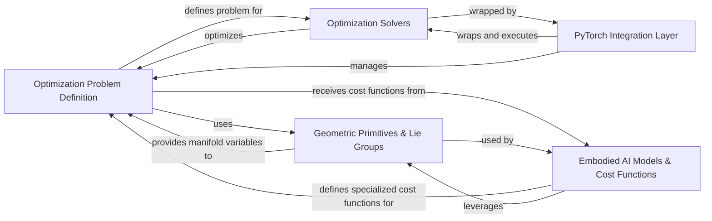

## Details

The `theseus` library provides a robust, modular architecture for differentiable optimization, primarily targeting machine learning, robotics, and computer vision. The core workflow begins with the **Optimization Problem Definition**, where users construct problems using variables and cost functions, often leveraging the specialized geometric types from **Geometric Primitives & Lie Groups** and domain-specific cost functions from **Embodied AI Models & Cost Functions**. Once defined, these problems are passed to the **Optimization Solvers** for efficient resolution. Crucially, the entire optimization pipeline can be embedded within larger PyTorch models via the **PyTorch Integration Layer**, enabling end-to-end differentiability and learning. This design emphasizes extensibility, allowing users to define custom components and seamlessly integrate `theseus` into complex computational graphs.

### Optimization Problem Definition [[Expand]](./Optimization_Problem_Definition.md)
Core component for defining optimization problems, managing variables, cost functions, and the overall objective.

**Related Classes/Methods**:

- <a href="https://github.com/facebookresearch/theseus/blob/main/theseus/core/variable.py" target="_blank" rel="noopener noreferrer">`theseus/core/variable.py`</a>
- <a href="https://github.com/facebookresearch/theseus/blob/main/theseus/core/cost_function.py" target="_blank" rel="noopener noreferrer">`theseus/core/cost_function.py`</a>
- <a href="https://github.com/facebookresearch/theseus/blob/main/theseus/core/objective.py" target="_blank" rel="noopener noreferrer">`theseus/core/objective.py`</a>

### Geometric Primitives & Lie Groups [[Expand]](./Geometric_Primitives_Lie_Groups.md)
Provides the mathematical framework for geometric transformations and Lie group operations, crucial for robotics and vision.

**Related Classes/Methods**:

- <a href="https://github.com/facebookresearch/theseus/blob/main/theseus/geometry/lie_group.py" target="_blank" rel="noopener noreferrer">`theseus/geometry/lie_group.py`</a>
- <a href="https://github.com/facebookresearch/theseus/blob/main/theseus/geometry/se2.py" target="_blank" rel="noopener noreferrer">`theseus/geometry/se2.py`</a>
- <a href="https://github.com/facebookresearch/theseus/blob/main/theseus/geometry/se3.py" target="_blank" rel="noopener noreferrer">`theseus/geometry/se3.py`</a>
- <a href="https://github.com/facebookresearch/theseus/blob/main/theseus/geometry/so2.py" target="_blank" rel="noopener noreferrer">`theseus.geometry.so2.py`</a>
- <a href="https://github.com/facebookresearch/theseus/blob/main/theseus/geometry/so3.py" target="_blank" rel="noopener noreferrer">`theseus/geometry/so3.py`</a>

### Optimization Solvers [[Expand]](./Optimization_Solvers.md)
Implements various linear and non-linear optimization algorithms (e.g., Gauss-Newton, Levenberg-Marquardt) to solve defined problems.

**Related Classes/Methods**:

- <a href="https://github.com/facebookresearch/theseus/blob/main/theseus/optimizer/optimizer.py" target="_blank" rel="noopener noreferrer">`theseus/optimizer/optimizer.py`</a>
- <a href="https://github.com/facebookresearch/theseus/blob/main/theseus/optimizer/nonlinear/nonlinear_least_squares.py" target="_blank" rel="noopener noreferrer">`theseus/optimizer/nonlinear/nonlinear_least_squares.py`</a>
- <a href="https://github.com/facebookresearch/theseus/blob/main/theseus/optimizer/nonlinear/gauss_newton.py" target="_blank" rel="noopener noreferrer">`theseus/optimizer/nonlinear/gauss_newton.py`</a>
- <a href="https://github.com/facebookresearch/theseus/blob/main/theseus/optimizer/nonlinear/levenberg_marquardt.py" target="_blank" rel="noopener noreferrer">`theseus/optimizer/nonlinear/levenberg_marquardt.py`</a>
- <a href="https://github.com/facebookresearch/theseus/blob/main/theseus/optimizer/nonlinear/dogleg.py" target="_blank" rel="noopener noreferrer">`theseus/optimizer/nonlinear/dogleg.py`</a>

### PyTorch Integration Layer [[Expand]](./PyTorch_Integration_Layer.md)
A specialized layer that integrates the `theseus` optimization framework seamlessly into PyTorch's computational graph for end-to-end differentiability.

**Related Classes/Methods**:

- <a href="https://github.com/facebookresearch/theseus/blob/main/theseus/theseus_layer.py" target="_blank" rel="noopener noreferrer">`theseus/theseus_layer.py`</a>

### Embodied AI Models & Cost Functions [[Expand]](./Embodied_AI_Models_Cost_Functions.md)
Offers domain-specific models and cost functions tailored for robotics and embodied AI applications, including collision detection and motion models.

**Related Classes/Methods**:

- <a href="https://github.com/facebookresearch/theseus/blob/main/theseus/embodied/collision/collision.py" target="_blank" rel="noopener noreferrer">`theseus/embodied/collision/collision.py`</a>
- <a href="https://github.com/facebookresearch/theseus/blob/main/theseus/embodied/motionmodel/double_integrator.py" target="_blank" rel="noopener noreferrer">`theseus/embodied/motionmodel/double_integrator.py`</a>
- <a href="https://github.com/facebookresearch/theseus/blob/main/theseus/embodied/kinematics/kinematics_model.py" target="_blank" rel="noopener noreferrer">`theseus/embodied/kinematics/kinematics_model.py`</a>

### [FAQ](https://github.com/CodeBoarding/GeneratedOnBoardings/tree/main?tab=readme-ov-file#faq)