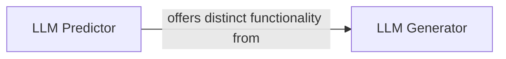

## Details

The `thinkgpt.llm` subsystem provides core functionalities for interacting with Large Language Models, primarily through two distinct interfaces: `LLM Predictor` and `LLM Generator`. The `LLM Predictor` serves as a streamlined entry point for direct, stateless LLM queries, focusing on preparing the input and invoking the underlying LLM execution mechanism. In contrast, the `LLM Generator` offers a more sophisticated interface, incorporating context management capabilities to facilitate conversational or stateful interactions with the LLM. Both components independently leverage a shared internal execution chain to process requests and retrieve LLM responses, ensuring flexibility in how external systems can interact with the LLM while maintaining a consistent backend for processing.

### LLM Predictor
Serves as a direct, simplified interface for initiating LLM predictions. Its primary role is to prepare the input for the underlying LLM execution chain and trigger the prediction process, acting as a straightforward wrapper for basic prediction requests.

**Related Classes/Methods**:

- <a href="https://github.com/jina-ai/thinkgpt/blob/main/thinkgpt/llm.py#L79-L82" target="_blank" rel="noopener noreferrer">`thinkgpt.llm.predict`:79-82</a>

### LLM Generator
Manages the core logic for generating LLM responses, including sophisticated context management. It prepares prompts, potentially incorporating conversational history or other contextual information via internal mechanisms like `self.remember`, and then dispatches requests to the underlying LLM execution chain. It handles the immediate retrieval of the raw LLM output and any initial processing related to context.

**Related Classes/Methods**:

- <a href="https://github.com/jina-ai/thinkgpt/blob/main/thinkgpt/llm.py#L62-L77" target="_blank" rel="noopener noreferrer">`thinkgpt.llm.generate`:62-77</a>

### [FAQ](https://github.com/CodeBoarding/GeneratedOnBoardings/tree/main?tab=readme-ov-file#faq)