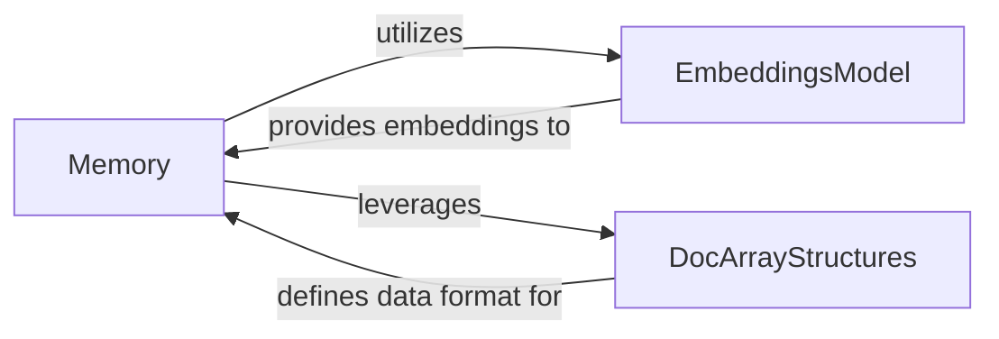

## Details

The Memory Management Module, centered around the `Memory` component (specifically `MemoryMixin`), is responsible for the storage, organization, and retrieval of conversational history and factual knowledge. It orchestrates memory operations by utilizing an `EmbeddingsModel` (e.g., `langchain.embeddings.OpenAIEmbeddings`) to convert textual concepts into numerical vector embeddings, enabling efficient similarity-based retrieval. Furthermore, the `Memory` component leverages `DocArrayStructures` (`docarray.Document` and `docarray.DocumentArray`) to encapsulate and manage individual memory units and collections, providing a standardized and flexible data format for handling diverse memory types. This architecture ensures that the system can efficiently store, retrieve, and process contextual information for various AI tasks.

### Memory
This is the core component of the Memory Management Module. It is responsible for the storage, organization, and retrieval of all forms of memory, including conversational history and factual knowledge. It acts as the central orchestrator for memory operations within the system.

**Related Classes/Methods**:

- <a href="https://github.com/jina-ai/thinkgpt/blob/main/thinkgpt/memory.py#L26-L66" target="_blank" rel="noopener noreferrer">`thinkgpt.memory.MemoryMixin`:26-66</a>

### EmbeddingsModel
An external model integrated by the `Memory` component to convert string-based concepts (e.g., text, facts) into numerical vector embeddings. These embeddings are crucial for efficient similarity search and retrieval of relevant memories.

**Related Classes/Methods**:

- <a href="https://github.com/jina-ai/thinkgpt/blob/main/" target="_blank" rel="noopener noreferrer">`langchain.embeddings.OpenAIEmbeddings`</a>

### DocArrayStructures
Represents the data structures (specifically `Document` and `DocumentArray` from the DocArray library) utilized by the `Memory` component to encapsulate and manage individual memory units and collections of memories. These structures provide a standardized way to handle multimodal data, which is beneficial for complex memory types.

**Related Classes/Methods**:

- <a href="https://github.com/jina-ai/thinkgpt/blob/main/" target="_blank" rel="noopener noreferrer">`docarray.Document`</a>
- <a href="https://github.com/jina-ai/thinkgpt/blob/main/" target="_blank" rel="noopener noreferrer">`docarray.DocumentArray`</a>

### [FAQ](https://github.com/CodeBoarding/GeneratedOnBoardings/tree/main?tab=readme-ov-file#faq)