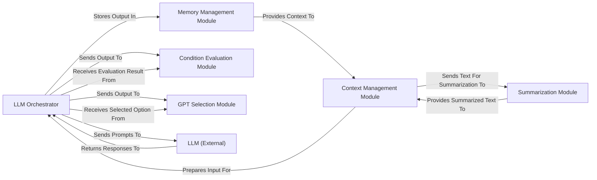

## Details

The `thinkgpt` project is structured around an `LLM Orchestrator` that serves as the central hub for interacting with external Large Language Models. This orchestrator is supported by several specialized modules: the `Context Management Module` prepares and optimizes input, integrating information from the `Memory Management Module` and `Summarization Module`. The `Memory Management Module` handles persistent and transient data storage. Post-LLM response, the `Condition Evaluation Module` and `GPT Selection Module` interpret and process the output for specific decision-making and conditional logic. The `Summarization Module` condenses large texts to fit LLM constraints. This modular design ensures efficient, context-aware, and adaptable LLM interactions. The core of the `thinkgpt` architecture revolves around the `LLM Orchestrator`, which acts as the primary interface to external LLMs. Data flow is largely initiated by the `LLM Orchestrator` sending prompts to the `LLM (External)` and receiving responses. Before prompt submission, the `Context Management Module` plays a crucial role in preparing the input, drawing upon historical data from the `Memory Management Module` and condensed information from the `Summarization Module`. After receiving responses from the LLM, the `LLM Orchestrator` dispatches these outputs to specialized modules like the `Condition Evaluation Module` for logical assessment and the `GPT Selection Module` for decision-making, receiving processed results back. This clear separation of concerns facilitates maintainable and scalable LLM application development, with distinct components handling context preparation, memory, summarization, and output interpretation.

### LLM Orchestrator [[Expand]](./LLM_Orchestrator.md)
The central component for direct interaction with the Large Language Model, managing prompt submission, API calls, and raw response retrieval. It acts as the gateway for all LLM-driven operations and integrates basic memory.

**Related Classes/Methods**:

- <a href="https://github.com/jina-ai/thinkgpt/blob/main/thinkgpt/llm.py" target="_blank" rel="noopener noreferrer">`thinkgpt/llm.py:predict`</a>
- <a href="https://github.com/jina-ai/thinkgpt/blob/main/thinkgpt/llm.py" target="_blank" rel="noopener noreferrer">`thinkgpt/llm.py:generate`</a>

### Context Management Module
Responsible for preparing and optimizing input context for the LLM, including token limit fitting, truncation, and integration of summarized or memorized information.

**Related Classes/Methods**:

- <a href="https://github.com/jina-ai/thinkgpt/blob/main/thinkgpt/helper.py" target="_blank" rel="noopener noreferrer">`thinkgpt/helper.py:fit_context`</a>
- <a href="https://github.com/jina-ai/thinkgpt/blob/main/thinkgpt/helper.py" target="_blank" rel="noopener noreferrer">`thinkgpt/helper.py:get_n_tokens`</a>

### Memory Management Module [[Expand]](./Memory_Management_Module.md)
Manages the system's persistent and transient memory, storing past interactions, facts, or conversational history to provide crucial context for LLM prompts.

**Related Classes/Methods**:

- <a href="https://github.com/jina-ai/thinkgpt/blob/main/thinkgpt/memory.py" target="_blank" rel="noopener noreferrer">`thinkgpt/memory.py:memorize`</a>

### Condition Evaluation Module
Interprets and evaluates specific conditions or logical statements based on the LLM's output, parsing structured data to determine true/false outcomes or extract values.

**Related Classes/Methods**:

- <a href="https://github.com/jina-ai/thinkgpt/blob/main/thinkgpt/condition.py" target="_blank" rel="noopener noreferrer">`thinkgpt/condition.py:predict`</a>
- <a href="https://github.com/jina-ai/thinkgpt/blob/main/thinkgpt/condition.py" target="_blank" rel="noopener noreferrer">`thinkgpt/condition.py:ConditionOutputParser`</a>
- <a href="https://github.com/jina-ai/thinkgpt/blob/main/thinkgpt/condition.py" target="_blank" rel="noopener noreferrer">`thinkgpt/condition.py:parse`</a>

### GPT Selection Module
Facilitates decision-making and option selection processes by formatting choices for the LLM and parsing the LLM's chosen option(s) from its response.

**Related Classes/Methods**:

- <a href="https://github.com/jina-ai/thinkgpt/blob/main/thinkgpt/gpt_select.py" target="_blank" rel="noopener noreferrer">`thinkgpt/gpt_select.py:predict`</a>
- <a href="https://github.com/jina-ai/thinkgpt/blob/main/thinkgpt/gpt_select.py" target="_blank" rel="noopener noreferrer">`thinkgpt/gpt_select.py:select`</a>
- <a href="https://github.com/jina-ai/thinkgpt/blob/main/thinkgpt/gpt_select.py" target="_blank" rel="noopener noreferrer">`thinkgpt/gpt_select.py:SelectOutputParser`</a>
- <a href="https://github.com/jina-ai/thinkgpt/blob/main/thinkgpt/gpt_select.py" target="_blank" rel="noopener noreferrer">`thinkgpt/gpt_select.py:format_options`</a>
- <a href="https://github.com/jina-ai/thinkgpt/blob/main/thinkgpt/gpt_select.py" target="_blank" rel="noopener noreferrer">`thinkgpt/gpt_select.py:parse`</a>

### Summarization Module
Processes and condenses large blocks of text into shorter, manageable summaries, vital for handling extensive documents or conversations that exceed LLM token limits.

**Related Classes/Methods**:

- <a href="https://github.com/jina-ai/thinkgpt/blob/main/thinkgpt/summarize.py" target="_blank" rel="noopener noreferrer">`thinkgpt/summarize.py:chunked_summarize`</a>
- <a href="https://github.com/jina-ai/thinkgpt/blob/main/thinkgpt/summarize.py" target="_blank" rel="noopener noreferrer">`thinkgpt/summarize.py:summarize`</a>

### LLM (External)
Represents the external Large Language Model service that the `LLM Orchestrator` interacts with for generating predictions and responses. This component is external to the `thinkgpt` codebase.

**Related Classes/Methods**: _None_

### [FAQ](https://github.com/CodeBoarding/GeneratedOnBoardings/tree/main?tab=readme-ov-file#faq)