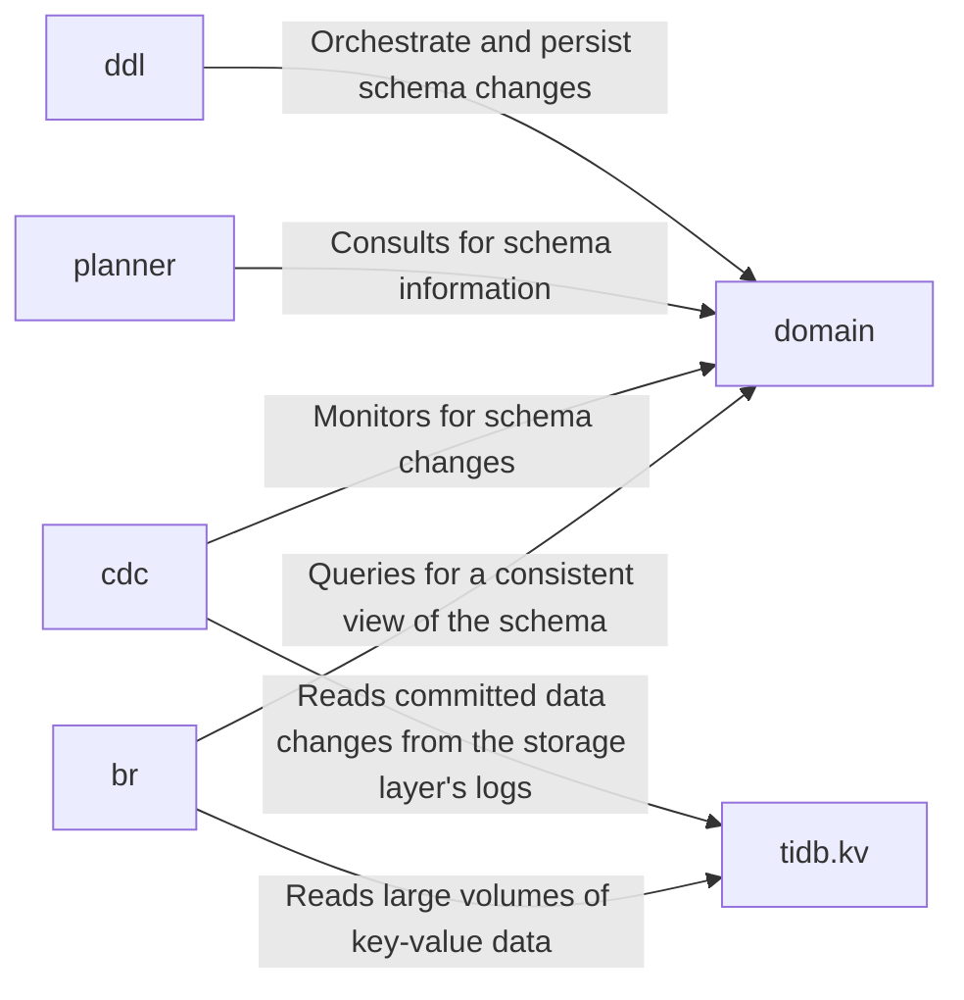

## Details

The `Cluster Management` subsystem is composed of operational tools and a central metadata component that enables their function. The following six components are fundamental to its architecture and its interaction with the core database.

### domain
Acts as the central authority for cluster-wide metadata. It caches and manages schema information, versions, and coordinates online DDL jobs, serving as the bridge between the database core and management tools.

**Related Classes/Methods**:

- `domain/`

### br
Manages the creation of consistent, distributed snapshots for backup and restore operations. It coordinates with the underlying storage to capture a transactionally consistent view of the data across the cluster.

**Related Classes/Methods**:

- `br/`

### cdc
Captures and streams row-level data changes (INSERT, UPDATE, DELETE) in real-time to downstream systems. It enables data integration by tapping into the underlying storage logs.

**Related Classes/Methods**:

- `cdc/`

### tidb.kv
Provides the primary abstraction layer for accessing the distributed key-value data in the underlying storage engine (TiKV). It is optimized for the high-throughput reads required by `br` and `cdc`.

**Related Classes/Methods**:

- `tidb/kv/`

### planner
Responsible for parsing and optimizing SQL queries. It is a critical consumer of the `domain` component, relying on it for the schema information necessary to build efficient query execution plans.

**Related Classes/Methods**:

- `planner/`

### ddl
Manages the execution of Data Definition Language (DDL) statements. It interacts directly with the `domain` component to apply and track schema changes across the distributed environment.

**Related Classes/Methods**:

- `ddl/`

### [FAQ](https://github.com/CodeBoarding/GeneratedOnBoardings/tree/main?tab=readme-ov-file#faq)