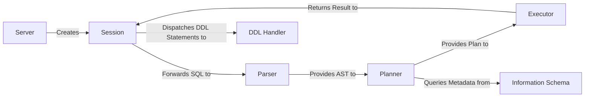

## Details

One paragraph explaining the functionality which is represented by this graph. What the main flow is and what is its purpose.

### Server
Acts as the network gateway, listening for client connections and speaking the MySQL wire protocol. It handles handshake, authentication, and the creation of a dedicated `Session` for each authenticated client.

**Related Classes/Methods**:

- `server`

### Session
Represents a single user session and manages its context, including transaction state, session variables, and security settings. It acts as the central orchestrator, driving the SQL query through the subsequent parsing, planning, and execution stages.

**Related Classes/Methods**:

- `session`

### Parser
Responsible for lexical analysis and parsing of the SQL query text. It transforms the raw SQL string into an Abstract Syntax Tree (AST), a structured, hierarchical representation of the query's logic, which is then passed to the Planner.

**Related Classes/Methods**:

- `parser`

### Planner
Receives the AST from the Parser and performs query optimization. It validates the query, resolves names, and uses a cost-based optimizer to transform the AST into an efficient physical execution plan that can be distributed across the cluster.

**Related Classes/Methods**:

- `planner`

### Executor
The execution engine that brings the physical plan to life. It interprets the plan, dispatches tasks to the underlying storage layer (TiKV) to fetch or modify data, and processes the results before returning them to the client via the `Session`.

**Related Classes/Methods**:

- `executor`

### DDL Handler
A specialized component for handling Data Definition Language (DDL) statements like `CREATE TABLE` or `ADD INDEX`. It manages the complex, stateful process of performing online schema changes across the distributed cluster without blocking ongoing transactions.

**Related Classes/Methods**:

- `ddl`

### Information Schema
Provides access to database metadata, adhering to the ANSI-standard `INFORMATION_SCHEMA`. It exposes internal system tables containing information about schemas, tables, columns, and statistics, making the database's structure queryable via standard SQL.

**Related Classes/Methods**:

- `infoschema`

### [FAQ](https://github.com/CodeBoarding/GeneratedOnBoardings/tree/main?tab=readme-ov-file#faq)