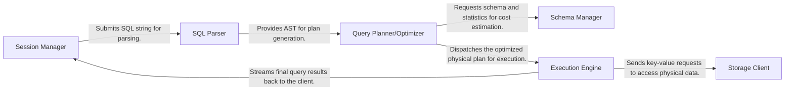

## Details

One paragraph explaining the functionality which is represented by this graph. What the main flow is and what is its purpose.

### Session Manager
Manages client connections, transactional states, and user-specific context. It serves as the entry point for all queries, receiving the raw SQL string from the client and forwarding it to the parser. It is also the final exit point, streaming results back to the client.

**Related Classes/Methods**:

- `session.session`
- `server.server`

### SQL Parser
Transforms the raw SQL query string into an Abstract Syntax Tree (AST). This component is responsible for syntactic and semantic validation, ensuring the query conforms to the supported SQL dialect. The resulting AST is a structured, hierarchical representation of the query's logic.

**Related Classes/Methods**:

- `parser.parser`

### Schema Manager
Provides access to the database's metadata, including table and index definitions, column types, and statistical information about data distribution (e.g., histograms, cardinality). This information is critical for cost-based optimization.

**Related Classes/Methods**:

- `infoschema.infoschema`

### Query Planner/Optimizer
The core of query optimization. It receives the AST from the parser and generates an efficient physical execution plan. This process involves two main phases: logical optimization (e.g., predicate pushdown, join reordering) and physical optimization (e.g., choosing specific join algorithms, selecting indexes).

**Related Classes/Methods**:

- `planner.core.planner`

### Execution Engine
Executes the physical plan generated by the optimizer. It interprets the plan's operators (e.g., TableScan, Join, Aggregate) and orchestrates data retrieval and processing. For distributed queries, it schedules and coordinates tasks across multiple compute nodes.

**Related Classes/Methods**:

- `executor.executor`

### Storage Client
An abstraction layer that communicates with the underlying distributed key-value storage layer (e.g., TiKV). It translates the Execution Engine's requests for data into low-level key-value operations (e.g., Get, Scan, Put).

**Related Classes/Methods**:

- `store.tikv.client`
- `kv.kv`

### [FAQ](https://github.com/CodeBoarding/GeneratedOnBoardings/tree/main?tab=readme-ov-file#faq)