```mermaid
graph LR
    Storage_Driver["Storage Driver"]
    Transactional_KV_Interface["Transactional KV Interface"]
    Transaction["Transaction"]
    Snapshot["Snapshot"]
    TiKV_Client["TiKV Client"]
    PD_Client["PD Client"]
    Execution_Engine["Execution Engine"]
    Placement_Driver_PD_External_["Placement Driver (PD) (External)"]
    TiKV_Storage_Cluster["TiKV Storage Cluster"]
    Execution_Engine -- "Executes operations via" --> Storage_Driver
    Storage_Driver -- "Initiates" --> Transactional_KV_Interface
    Transactional_KV_Interface -- "Creates & Manages" --> Transaction
    Transactional_KV_Interface -- "Creates & Manages" --> Snapshot
    Transactional_KV_Interface -- "Obtains timestamp from" --> PD_Client
    Transaction -- "Sends 2PC requests via" --> TiKV_Client
    Snapshot -- "Sends read requests via" --> TiKV_Client
    TiKV_Client -- "Resolves key location from" --> PD_Client
    TiKV_Client -- "Sends gRPC requests to" --> TiKV_Storage_Cluster
    PD_Client -- "Fetches timestamps & metadata from" --> Placement_Driver_PD_External_
```

## Details

One paragraph explaining the functionality which is represented by this graph. What the main flow is and what is its purpose.

### Storage Driver
A high-level abstraction layer that provides a stable, implementation-agnostic API to the `Execution Engine`. It translates query execution requests into concrete transactional or snapshot-based operations.

**Related Classes/Methods**:

- `store/driver/`

### Transactional KV Interface
The core of the subsystem, responsible for managing the lifecycle of transactions and snapshots. It serves as the primary entry point for the `Storage Driver` and orchestrates interactions with the `PD Client` to obtain timestamps.

**Related Classes/Methods**:

- `kv/`

### Transaction
Manages the state of a single read-write transaction. It buffers all write operations (Set, Delete) and implements the two-phase commit (2PC) protocol by coordinating pre-write and commit phases with the `TiKV Client`.

**Related Classes/Methods**:

- `kv/transaction.go`

### Snapshot
Represents a consistent, read-only view of the database at a specific point in time (timestamp). It is used for all read operations, ensuring data consistency without locking by leveraging multi-version concurrency control (MVCC).

**Related Classes/Methods**:

- `kv/snapshot.go`

### TiKV Client
A specialized client responsible for all direct communication with the TiKV storage cluster. It handles sending gRPC requests for key-value operations (e.g., `kv_prewrite`, `kv_commit`, `kv_get`), batching requests, and interpreting responses or errors from TiKV nodes.

**Related Classes/Methods**:

- `store/tikv/`

### PD Client
A dedicated client for communicating with the Placement Driver (PD) cluster. Its primary responsibilities are to obtain globally unique, monotonically increasing timestamps for new transactions and to resolve key ranges to their physical storage locations (Region metadata).

**Related Classes/Methods**:

- `store/tikv/pd/`

### Execution Engine
The TiDB component responsible for parsing, planning, and executing SQL queries. It is the primary consumer of the `Transactional KV` subsystem, interacting with it through the `Storage Driver`.

**Related Classes/Methods**:

- `executor/`

### Placement Driver (PD) (External)
The metadata brain of the entire TiDB cluster. It manages TiKV region information, allocates transaction IDs (timestamps), and makes scheduling decisions to balance the cluster.

**Related Classes/Methods**: _None_

### TiKV Storage Cluster
The underlying distributed key-value storage.

**Related Classes/Methods**: _None_

### [FAQ](https://github.com/CodeBoarding/GeneratedOnBoardings/tree/main?tab=readme-ov-file#faq)