```mermaid
graph LR
    Distributed_SQL_Layer["Distributed SQL Layer"]
    Query_Engine["Query Engine"]
    Transactional_KV["Transactional KV"]
    Scheduling_Consensus_Raft_["Scheduling & Consensus (Raft)"]
    Cluster_Management["Cluster Management"]
    Distributed_SQL_Layer -- "Forwards SQL queries for processing" --> Query_Engine
    Query_Engine -- "Executes data access plan" --> Transactional_KV
    Transactional_KV -- "Replicates data and ensures consistency" --> Scheduling_Consensus_Raft_
    Cluster_Management -- "Performs backup and restore operations" --> Transactional_KV
    click Distributed_SQL_Layer href "https://github.com/CodeBoarding/GeneratedOnBoardings/blob/main/tidb/Distributed_SQL_Layer.md" "Details"
    click Query_Engine href "https://github.com/CodeBoarding/GeneratedOnBoardings/blob/main/tidb/Query_Engine.md" "Details"
    click Transactional_KV href "https://github.com/CodeBoarding/GeneratedOnBoardings/blob/main/tidb/Transactional_KV.md" "Details"
    click Cluster_Management href "https://github.com/CodeBoarding/GeneratedOnBoardings/blob/main/tidb/Cluster_Management.md" "Details"
```

## Details

One paragraph explaining the functionality which is represented by this graph. What the main flow is and what is its purpose.

### Distributed SQL Layer [[Expand]](./Distributed_SQL_Layer.md)
Acts as the primary entry point for clients, handling session management, user authentication, transaction control, and SQL parsing. It is the stateless component that clients connect to.

**Related Classes/Methods**:

- `server/`
- `session/`
- `parser/`
- `ddl/`
- `infoschema/`

### Query Engine [[Expand]](./Query_Engine.md)
Optimizes SQL queries for distributed execution and generates a physical plan to access data efficiently from the underlying storage layer. It compiles the SQL query into a set of key-value operations.

**Related Classes/Methods**:

- `planner/`
- `executor/`
- `disttask/`

### Transactional KV [[Expand]](./Transactional_KV.md)
Provides the core distributed storage functionality, managing data persistence and consistency through a transactional key-value store interface. This component interacts with the underlying storage engine (like TiKV).

**Related Classes/Methods**:

- `kv/`
- `store/`

### Scheduling & Consensus (Raft)
This functionality is primarily handled by the underlying TiKV storage engine, which is a separate project. TiKV uses the Raft consensus algorithm to ensure data is safely replicated and that the cluster maintains a consistent state. The TiDB codebase interacts with TiKV through the client in the `store/tikv/` directory.

**Related Classes/Methods**:

- `store/tikv/`

### Cluster Management [[Expand]](./Cluster_Management.md)
Offers operational tools for managing the database cluster, including backup and restore (BR), data import/export, and change data capture (CDC).

**Related Classes/Methods**:

- `br/`
- `cdc/`
- `domain/`

### [FAQ](https://github.com/CodeBoarding/GeneratedOnBoardings/tree/main?tab=readme-ov-file#faq)