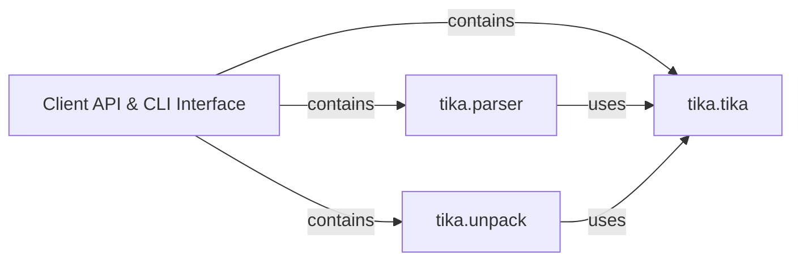

## Details

The `tika-python` project provides a robust client for interacting with the Apache Tika server, offering both a Python API and a command-line interface. The `Client API & CLI Interface` acts as the primary conceptual entry point, encapsulating the functionalities provided by the core modules. At its heart, the `tika.tika` module orchestrates all server interactions, managing the Tika server's lifecycle and executing core operations like parsing, language detection, and translation via HTTP requests. Building upon this foundation, `tika.parser` and `tika.unpack` offer simplified, high-level Python APIs specifically for document parsing and unpacking, respectively. Both `tika.parser` and `tika.unpack` leverage the underlying capabilities of `tika.tika` to communicate with the Tika server, ensuring a streamlined and efficient user experience. This modular design separates concerns, allowing for clear responsibilities and maintainable code, while providing a unified and accessible interface for users.

### Client API & CLI Interface [[Expand]](./Client_API_CLI_Interface.md)
The overarching public-facing entry point for users. It unifies the Python API functions and command-line utilities, providing a simplified interface to the underlying Tika client logic. This component is conceptual, representing the collective public interfaces exposed by the `tika.tika`, `tika.parser`, and `tika.unpack` modules.

**Related Classes/Methods**: _None_

### tika.tika
This module is the central orchestrator for all client-side interactions with the Apache Tika server. It manages the server's lifecycle (starting, checking status, downloading JARs), dispatches command-line arguments, and handles core Tika operations (parsing, language detection, type detection, translation) by making direct HTTP requests. It serves as the backbone for both the CLI and the underlying API calls.

**Related Classes/Methods**:

- <a href="https://github.com/chrismattmann/tika-python/blob/master/tika/tika.py" target="_blank" rel="noopener noreferrer">`tika.tika`</a>

### tika.parser
Provides a high-level, user-friendly Python API specifically for initiating document parsing. It simplifies the process for end-users by abstracting the complexities of server communication related to parsing tasks.

**Related Classes/Methods**:

- <a href="https://github.com/chrismattmann/tika-python/blob/master/tika/parser.py" target="_blank" rel="noopener noreferrer">`tika.parser`</a>

### tika.unpack
Offers a high-level, user-friendly Python API specifically for initiating document unpacking. Similar to `tika.parser`, it simplifies the process of interacting with the Tika server for unpacking operations.

**Related Classes/Methods**:

- <a href="https://github.com/chrismattmann/tika-python/blob/master/tika/unpack.py" target="_blank" rel="noopener noreferrer">`tika.unpack`</a>

### [FAQ](https://github.com/CodeBoarding/GeneratedOnBoardings/tree/main?tab=readme-ov-file#faq)