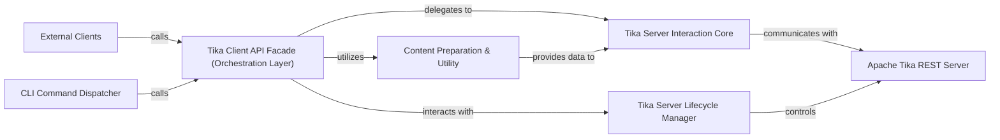

## Details

The `tika-python` subsystem acts as a client-side facade for the Apache Tika REST Server, simplifying complex interactions into a user-friendly API. Its core functionality revolves around orchestrating requests to the Tika server for content parsing, language detection, and translation. The system manages the lifecycle of a local Tika server instance, prepares diverse input data for processing, and handles communication protocols. External clients, including a command-line interface, interact with this facade, which then delegates tasks to internal components responsible for server communication and data handling.

### Tika Client API Facade (Orchestration Layer)
This is the core of the subsystem, serving as the primary client-side facade. It provides a high-level, user-friendly interface for interacting with the Apache Tika server, orchestrating various Tika operations by abstracting the complexities of server communication, content preparation, and error handling.

**Related Classes/Methods**:

- <a href="https://github.com/chrismattmann/tika-python/blob/master/tika/tika.py" target="_blank" rel="noopener noreferrer">`tika.tika:parse`</a>
- <a href="https://github.com/chrismattmann/tika-python/blob/master/tika/tika.py" target="_blank" rel="noopener noreferrer">`tika.tika:detectLang`</a>
- <a href="https://github.com/chrismattmann/tika-python/blob/master/tika/tika.py" target="_blank" rel="noopener noreferrer">`tika.tika:doTranslate`</a>
- <a href="https://github.com/chrismattmann/tika-python/blob/master/tika/tika.py" target="_blank" rel="noopener noreferrer">`tika.tika:detectType`</a>
- <a href="https://github.com/chrismattmann/tika-python/blob/master/tika/tika.py" target="_blank" rel="noopener noreferrer">`tika.tika:getConfig`</a>
- <a href="https://github.com/chrismattmann/tika-python/blob/master/tika/tika.py" target="_blank" rel="noopener noreferrer">`tika.tika:runCommand`</a>

### Tika Server Interaction Core
Responsible for handling the actual HTTP communication and data exchange with the Apache Tika REST server, abstracting the underlying network requests and response handling.

**Related Classes/Methods**:

- <a href="https://github.com/chrismattmann/tika-python/blob/master/tika/tika.py" target="_blank" rel="noopener noreferrer">`tika.tika:parse1`</a>
- <a href="https://github.com/chrismattmann/tika-python/blob/master/tika/parser.py" target="_blank" rel="noopener noreferrer">`tika.parser:from_file`</a>
- <a href="https://github.com/chrismattmann/tika-python/blob/master/tika/parser.py" target="_blank" rel="noopener noreferrer">`tika.parser:from_buffer`</a>

### Content Preparation & Utility
Prepares input data (e.g., resolving file paths, determining content types, constructing headers) into a format suitable for transmission to the Tika server. This component also includes general utility functions for file handling and configuration.

**Related Classes/Methods**:

- <a href="https://github.com/chrismattmann/tika-python/blob/master/tika/tika.py" target="_blank" rel="noopener noreferrer">`tika.tika:getPaths`</a>
- <a href="https://github.com/chrismattmann/tika-python/blob/master/tika/tika.py" target="_blank" rel="noopener noreferrer">`tika.tika:make_content_disposition_header`</a>
- <a href="https://github.com/chrismattmann/tika-python/blob/master/tika/config.py" target="_blank" rel="noopener noreferrer">`tika.config`</a>
- <a href="https://github.com/chrismattmann/tika-python/blob/master/tika/detector.py" target="_blank" rel="noopener noreferrer">`tika.detector`</a>
- <a href="https://github.com/chrismattmann/tika-python/blob/master/tika/language.py" target="_blank" rel="noopener noreferrer">`tika.language`</a>
- <a href="https://github.com/chrismattmann/tika-python/blob/master/tika/translate.py" target="_blank" rel="noopener noreferrer">`tika.translate`</a>
- <a href="https://github.com/chrismattmann/tika-python/blob/master/tika/unpack.py" target="_blank" rel="noopener noreferrer">`tika.unpack`</a>

### Tika Server Lifecycle Manager
Manages the lifecycle of the Tika server, including starting, stopping, and checking its status, particularly for locally managed instances.

**Related Classes/Methods**:

- <a href="https://github.com/chrismattmann/tika-python/blob/master/tika/tika.py" target="_blank" rel="noopener noreferrer">`tika.tika:TikaServerProcess`</a>
- <a href="https://github.com/chrismattmann/tika-python/blob/master/tika/tika.py" target="_blank" rel="noopener noreferrer">`tika.tika:startServer`</a>
- <a href="https://github.com/chrismattmann/tika-python/blob/master/tika/config.py" target="_blank" rel="noopener noreferrer">`tika.config:get_tika_version`</a>
- <a href="https://github.com/chrismattmann/tika-python/blob/master/tika/config.py" target="_blank" rel="noopener noreferrer">`tika.config:get_config`</a>
- <a href="https://github.com/chrismattmann/tika-python/blob/master/tika/config.py" target="_blank" rel="noopener noreferrer">`tika.config:set_config`</a>

### CLI Command Dispatcher
Translates command-line interface commands and arguments into appropriate high-level API calls to the `Tika Client API Facade`, serving as the entry point for CLI users.

**Related Classes/Methods**:

- <a href="https://github.com/chrismattmann/tika-python/blob/master/tika/tika.py" target="_blank" rel="noopener noreferrer">`tika.tika:USAGE`</a>
- <a href="https://github.com/chrismattmann/tika-python/blob/master/tika/tika.py" target="_blank" rel="noopener noreferrer">`tika.tika:runCommand`</a>

### External Clients
Represents any external application, script, or user that utilizes the `tika-python` library's public API to interact with Apache Tika.

**Related Classes/Methods**: _None_

### Apache Tika REST Server
Represents the external Apache Tika REST Server that the client library communicates with.

**Related Classes/Methods**: _None_

### [FAQ](https://github.com/CodeBoarding/GeneratedOnBoardings/tree/main?tab=readme-ov-file#faq)