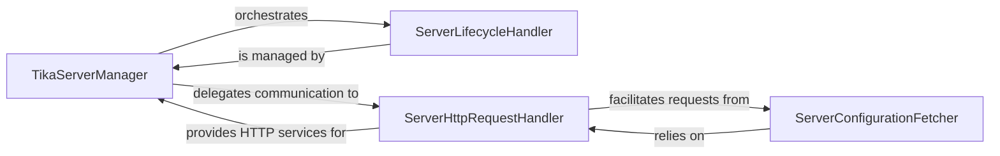

## Details

The `tika-python` library's server interaction subsystem is designed around the `TikaServerManager`, which serves as the central orchestrator and facade for managing and communicating with the Apache Tika server. This manager orchestrates the `ServerLifecycleHandler` to ensure the Tika server's proper startup and operational status. All direct HTTP interactions are handled by the `ServerHttpRequestHandler`, a dedicated component that provides essential communication services. Specialized functionalities, such as fetching server configurations via the `ServerConfigurationFetcher`, consistently rely on the `ServerHttpRequestHandler` for their underlying HTTP communication needs, establishing a clear and efficient pathway for client-server interactions.

### TikaServerManager
This is the overarching component, represented by the `tika.tika` module itself. It orchestrates all server management and communication tasks, providing a unified facade for the rest of the `tika-python` library to interact with the Tika server. Its fundamental importance lies in abstracting the complexities of server interaction.

**Related Classes/Methods**:

- <a href="https://github.com/chrismattmann/tika-python/blob/master/tika/tika.py" target="_blank" rel="noopener noreferrer">`tika.tika`</a>

### ServerLifecycleHandler
Manages the complete lifecycle of the Apache Tika server. This includes ensuring the Tika JAR is available, initiating the server process, and verifying its operational status (e.g., `checkTikaServer`, `startServer`, `checkPortIsOpen`). It's crucial for the client library's ability to autonomously manage the Tika backend.

**Related Classes/Methods**:

- <a href="https://github.com/chrismattmann/tika-python/blob/master/tika/tika.py" target="_blank" rel="noopener noreferrer">`tika.tika:checkTikaServer`</a>
- <a href="https://github.com/chrismattmann/tika-python/blob/master/tika/tika.py" target="_blank" rel="noopener noreferrer">`tika.tika:startServer`</a>
- <a href="https://github.com/chrismattmann/tika-python/blob/master/tika/tika.py" target="_blank" rel="noopener noreferrer">`tika.tika:checkPortIsOpen`</a>

### ServerHttpRequestHandler
Responsible for all direct HTTP communication with the Apache Tika REST endpoint. It handles the mechanics of sending requests and receiving responses (e.g., `callServer`). This component is vital as it embodies the client-server interaction pattern, acting as the direct communication channel.

**Related Classes/Methods**:

- <a href="https://github.com/chrismattmann/tika-python/blob/master/tika/tika.py" target="_blank" rel="noopener noreferrer">`tika.tika:callServer`</a>

### ServerConfigurationFetcher
Specifically handles the retrieval of configuration details directly from the running Tika server via an HTTP request (e.g., `getConfig`). This component is important for dynamic configuration and introspection of the Tika server's capabilities.

**Related Classes/Methods**:

- <a href="https://github.com/chrismattmann/tika-python/blob/master/tika/tika.py" target="_blank" rel="noopener noreferrer">`tika.tika:getConfig`</a>

### [FAQ](https://github.com/CodeBoarding/GeneratedOnBoardings/tree/main?tab=readme-ov-file#faq)