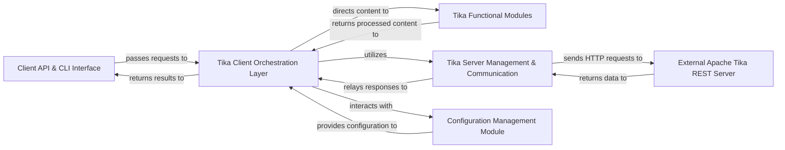

## Details

The tika-python library provides a robust Pythonic interface for interacting with the Apache Tika REST Server. Its architecture is segmented into a Client API & CLI Interface for user interaction, a Tika Client Orchestration Layer that serves as the central coordinator, and specialized Tika Functional Modules for data preparation. Communication with the external Apache Tika REST Server is managed by the Tika Server Management & Communication component, which handles server lifecycle and HTTP requests. A dedicated Configuration Management Module ensures flexible setup. This design promotes modularity, clear separation of concerns, and efficient data flow, making it ideal for both programmatic and command-line content analysis tasks.

### Client API & CLI Interface [[Expand]](./Client_API_CLI_Interface.md)
The public-facing entry point for users, offering Python API functions and command-line utilities.

**Related Classes/Methods**:

- <a href="https://github.com/chrismattmann/tika-python/blob/master/tika/parser.py" target="_blank" rel="noopener noreferrer">`tika.parser`</a>
- <a href="https://github.com/chrismattmann/tika-python/blob/master/tika/unpack.py" target="_blank" rel="noopener noreferrer">`tika.unpack`</a>
- <a href="https://github.com/chrismattmann/tika-python/blob/master/tika/tika.py" target="_blank" rel="noopener noreferrer">`tika.tika`</a>

### Tika Client Orchestration Layer [[Expand]](./Tika_Client_Orchestration_Layer.md)
The central control module that coordinates various Tika operations, acting as a facade for the client-side logic.

**Related Classes/Methods**:

- <a href="https://github.com/chrismattmann/tika-python/blob/master/tika/tika.py" target="_blank" rel="noopener noreferrer">`tika.tika`</a>

### Tika Functional Modules
A collection of specialized modules responsible for preparing data for specific Tika operations like parsing, unpacking, language detection, type detection, and translation.

**Related Classes/Methods**:

- <a href="https://github.com/chrismattmann/tika-python/blob/master/tika/parser.py" target="_blank" rel="noopener noreferrer">`tika.parser`</a>
- <a href="https://github.com/chrismattmann/tika-python/blob/master/tika/unpack.py" target="_blank" rel="noopener noreferrer">`tika.unpack`</a>
- <a href="https://github.com/chrismattmann/tika-python/blob/master/tika/language.py" target="_blank" rel="noopener noreferrer">`tika.language`</a>
- <a href="https://github.com/chrismattmann/tika-python/blob/master/tika/detector.py" target="_blank" rel="noopener noreferrer">`tika.detector`</a>
- <a href="https://github.com/chrismattmann/tika-python/blob/master/tika/translate.py" target="_blank" rel="noopener noreferrer">`tika.translate`</a>

### Tika Server Management & Communication [[Expand]](./Tika_Server_Management_Communication.md)
Handles the lifecycle of the Apache Tika server (e.g., starting, checking status) and manages all direct HTTP communication with its REST endpoint.

**Related Classes/Methods**:

- <a href="https://github.com/chrismattmann/tika-python/blob/master/tika/tika.py" target="_blank" rel="noopener noreferrer">`tika.tika`</a>

### Configuration Management Module
Manages client-side configuration settings for tika-python, including server URL, port, and other operational parameters.

**Related Classes/Methods**:

- <a href="https://github.com/chrismattmann/tika-python/blob/master/tika/config.py" target="_blank" rel="noopener noreferrer">`tika.config`</a>

### External Apache Tika REST Server
The external Java application that performs the actual content analysis, parsing, metadata extraction, and other Tika functionalities. This component is an external dependency and does not have source code within the tika-python project.

**Related Classes/Methods**: _None_

### [FAQ](https://github.com/CodeBoarding/GeneratedOnBoardings/tree/main?tab=readme-ov-file#faq)