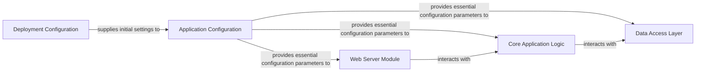

## Details

The `timetagger` application follows a layered architectural pattern, centered around a robust `Application Configuration` component that centralizes all operational settings. The `Deployment Configuration` acts as the external input mechanism, feeding initial parameters to the `Application Configuration`. The `Web Server Module` handles all external communication, routing requests to the `Core Application Logic`. The `Core Application Logic`, which embodies the application's primary features, depends on the `Application Configuration` for its operational parameters and interacts with the `Data Access Layer` for persistent storage. This structure ensures a clear separation of concerns, promoting maintainability and scalability.

### Application Configuration [[Expand]](./Application_Configuration.md)
A central point for managing application settings, responsible for configuration loading, prioritization, setting provisioning, and flexibility. It aggregates settings from default values, environment variables, and command-line arguments, applies a defined hierarchy, and makes consolidated settings available globally.

**Related Classes/Methods**:

- <a href="https://github.com/almarklein/timetagger/blob/main/timetagger/_config.py#L60-L69" target="_blank" rel="noopener noreferrer">`timetagger._config.set_config`:60-69</a>
- <a href="https://github.com/almarklein/timetagger/blob/main/timetagger/_config.py#L72-L74" target="_blank" rel="noopener noreferrer">`timetagger._config._reset_config_to_defaults`:72-74</a>
- <a href="https://github.com/almarklein/timetagger/blob/main/timetagger/_config.py#L97-L105" target="_blank" rel="noopener noreferrer">`timetagger._config._update_config_from_env`:97-105</a>
- <a href="https://github.com/almarklein/timetagger/blob/main/timetagger/_config.py#L77-L94" target="_blank" rel="noopener noreferrer">`timetagger._config._update_config_from_argv`:77-94</a>

### Core Application Logic
This component encapsulates the primary business rules and functionalities of the TimeTagger application, including time tracking, task management, and data processing. It orchestrates interactions between the user interface and data storage, relying on configuration parameters for its operation.

**Related Classes/Methods**:

- <a href="https://github.com/almarklein/timetagger/blob/main/timetagger/app/front.py" target="_blank" rel="noopener noreferrer">`timetagger.app.front`</a>
- <a href="https://github.com/almarklein/timetagger/blob/main/timetagger/app/dt.py" target="_blank" rel="noopener noreferrer">`timetagger.app.dt`</a>
- <a href="https://github.com/almarklein/timetagger/blob/main/timetagger/app/tools.py" target="_blank" rel="noopener noreferrer">`timetagger.app.tools`</a>

### Web Server Module
Responsible for handling HTTP requests, serving static assets, and exposing the application's API endpoints. It manages server-side routing, request parsing, and response generation, utilizing configuration for parameters like server ports and authentication settings.

**Related Classes/Methods**:

- <a href="https://github.com/almarklein/timetagger/blob/main/timetagger/server/_apiserver.py" target="_blank" rel="noopener noreferrer">`timetagger.server._apiserver`</a>
- <a href="https://github.com/almarklein/timetagger/blob/main/timetagger/server/_assets.py" target="_blank" rel="noopener noreferrer">`timetagger.server._assets`</a>

### Data Access Layer
Manages the persistence and retrieval of application data. This layer abstracts the underlying storage mechanism, providing a consistent interface for the Core Application Logic to interact with data, such as user settings, time entries, and task details. It relies on configuration for data storage paths or connection strings.

**Related Classes/Methods**:

- <a href="https://github.com/almarklein/timetagger/blob/main/timetagger/app/stores.py" target="_blank" rel="noopener noreferrer">`timetagger.app.stores`</a>

### Deployment Configuration
Represents external mechanisms (e.g., environment variables, command-line arguments, Docker configurations) that provide initial configuration parameters to the `Application Configuration` component during application startup. This component is external to the application's codebase but crucial for its operational environment.

**Related Classes/Methods**:

- <a href="https://github.com/almarklein/timetagger/blob/main/timetagger/__main__.py" target="_blank" rel="noopener noreferrer">`timetagger.__main__`</a>

### [FAQ](https://github.com/CodeBoarding/GeneratedOnBoardings/tree/main?tab=readme-ov-file#faq)