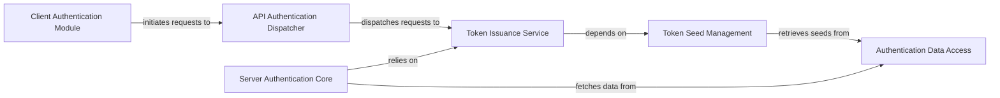

## Details

The `Authentication & Authorization` subsystem is a critical cross-cutting concern within the `timetagger` project, responsible for managing user authentication, web token issuance, and ensuring secure access to application resources. It spans both client-side initiation and server-side processing, integrating with the core application logic and data storage.

### Client Authentication Module
Manages the client-side aspects of authentication, including initiating web token acquisition and validating user authentication status. This component acts as the user's direct interface with the authentication process.

**Related Classes/Methods**:

- <a href="https://github.com/almarklein/timetagger/blob/main/timetagger/__main__.py#L131-L144" target="_blank" rel="noopener noreferrer">`timetagger.__main__.get_webtoken`:131-144</a>
- <a href="https://github.com/almarklein/timetagger/blob/main/timetagger/__main__.py#L222-L230" target="_blank" rel="noopener noreferrer">`timetagger.__main__.validate_auth`:222-230</a>

### API Authentication Dispatcher
Serves as the primary server-side entry point for all authentication and token issuance requests. It triages incoming API calls and dispatches them to the appropriate handlers within the authentication subsystem.

**Related Classes/Methods**:

- <a href="https://github.com/almarklein/timetagger/blob/main/timetagger/server/_apiserver.py#L88-L139" target="_blank" rel="noopener noreferrer">`timetagger.server._apiserver.api_handler_triage`:88-139</a>

### Server Authentication Core
Contains the core logic for verifying user credentials against stored authentication data. It is responsible for the actual authentication process and handling any related exceptions.

**Related Classes/Methods**:

- <a href="https://github.com/almarklein/timetagger/blob/main/timetagger/server/_apiserver.py#L150-L199" target="_blank" rel="noopener noreferrer">`timetagger.server._apiserver.authenticate`:150-199</a>

### Token Issuance Service
Centralized component for generating and issuing various types of tokens, including web tokens for client sessions and API tokens for programmatic access. It abstracts the underlying token generation mechanism.

**Related Classes/Methods**:

- <a href="https://github.com/almarklein/timetagger/blob/main/timetagger/server/_apiserver.py#L202-L210" target="_blank" rel="noopener noreferrer">`timetagger.server._apiserver.get_webtoken`:202-210</a>
- <a href="https://github.com/almarklein/timetagger/blob/main/timetagger/server/_apiserver.py#L213-L221" target="_blank" rel="noopener noreferrer">`timetagger.server._apiserver.get_apitoken`:213-221</a>
- <a href="https://github.com/almarklein/timetagger/blob/main/timetagger/server/_apiserver.py#L224-L241" target="_blank" rel="noopener noreferrer">`timetagger.server._apiserver._get_any_token`:224-241</a>

### Token Seed Management
Responsible for securely retrieving and managing sensitive seeds or secrets required for cryptographic token generation from the database. This ensures the integrity and security of issued tokens.

**Related Classes/Methods**:

- <a href="https://github.com/almarklein/timetagger/blob/main/timetagger/server/_apiserver.py#L244-L257" target="_blank" rel="noopener noreferrer">`timetagger.server._apiserver._get_token_seed_from_db`:244-257</a>

### Authentication Data Access
Provides a dedicated interface for the authentication subsystem to retrieve user credentials and other authentication-related information from the application's persistent data store.

**Related Classes/Methods**:

- <a href="https://github.com/almarklein/timetagger/blob/main/timetagger/app/stores.py#L795-L815" target="_blank" rel="noopener noreferrer">`timetagger.app.stores.get_auth`:795-815</a>

### [FAQ](https://github.com/CodeBoarding/GeneratedOnBoardings/tree/main?tab=readme-ov-file#faq)