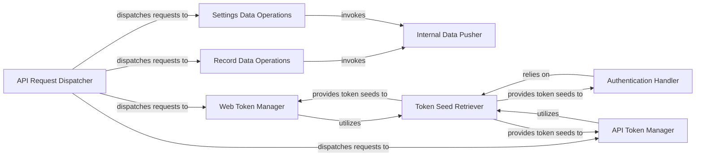

## Details

Analysis of the Backend API Services subsystem, detailing its central components and their interactions for handling API requests, authentication, and data operations.

### API Request Dispatcher
Serves as the primary entry point for all incoming API requests, parsing them and dispatching them to the appropriate specific handlers based on the request path and method. It acts as the central router for the API.

**Related Classes/Methods**:

- <a href="https://github.com/almarklein/timetagger/blob/main/timetagger/server/_apiserver.py" target="_blank" rel="noopener noreferrer">`timetagger.server._apiserver:api_handler_triage`</a>

### Authentication Handler
Verifies the authenticity of API requests by validating provided authentication tokens (both web and API tokens). It ensures that only authorized requests proceed.

**Related Classes/Methods**:

- <a href="https://github.com/almarklein/timetagger/blob/main/timetagger/server/_apiserver.py" target="_blank" rel="noopener noreferrer">`timetagger.server._apiserver:authenticate`</a>

### Web Token Manager
Manages the generation and retrieval of web authentication tokens, primarily used for browser-based access to the application.

**Related Classes/Methods**:

- <a href="https://github.com/almarklein/timetagger/blob/main/timetagger/server/_apiserver.py" target="_blank" rel="noopener noreferrer">`timetagger.server._apiserver:get_webtoken`</a>

### API Token Manager
Manages the generation and retrieval of API authentication tokens, designed for programmatic access and integration with external services or scripts.

**Related Classes/Methods**:

- <a href="https://github.com/almarklein/timetagger/blob/main/timetagger/server/_apiserver.py" target="_blank" rel="noopener noreferrer">`timetagger.server._apiserver:get_apitoken`</a>

### Record Data Operations
Handles the core business logic for creating, updating, and storing time tracking records. It processes the data specific to time entries.

**Related Classes/Methods**:

- <a href="https://github.com/almarklein/timetagger/blob/main/timetagger/server/_apiserver.py" target="_blank" rel="noopener noreferrer">`timetagger.server._apiserver:put_records`</a>

### Settings Data Operations
Manages the persistence and retrieval of user-specific application settings, allowing users to customize their experience.

**Related Classes/Methods**:

- <a href="https://github.com/almarklein/timetagger/blob/main/timetagger/server/_apiserver.py" target="_blank" rel="noopener noreferrer">`timetagger.server._apiserver:put_settings`</a>

### Internal Data Pusher
An internal abstraction responsible for persisting various data items (records, settings) to the underlying data storage. It centralizes the write operations to the database.

**Related Classes/Methods**:

- <a href="https://github.com/almarklein/timetagger/blob/main/timetagger/server/_apiserver.py" target="_blank" rel="noopener noreferrer">`timetagger.server._apiserver:_push_items`</a>

### Token Seed Retriever
A utility for securely retrieving token seeds from the database, which are essential for authentication and the generation of new web and API tokens. It centralizes the read operations for security-related data.

**Related Classes/Methods**:

- <a href="https://github.com/almarklein/timetagger/blob/main/timetagger/server/_apiserver.py" target="_blank" rel="noopener noreferrer">`timetagger.server._apiserver:_get_token_seed_from_db`</a>

### [FAQ](https://github.com/CodeBoarding/GeneratedOnBoardings/tree/main?tab=readme-ov-file#faq)