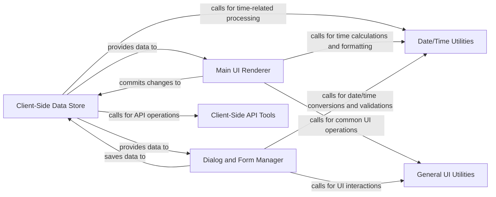

## Details

The Client-Side Application subsystem is the interactive frontend of the timetagger project, responsible for rendering the user interface, managing user interactions, maintaining in-memory data state, and synchronizing with the Backend API. It encompasses core UI logic, dialog management, and client-side data stores.

### Client-Side Data Store
Manages the in-memory state of application data (records, tags, settings), handles data persistence (caching), and orchestrates synchronization with the backend API. It includes logic for data validation, querying, and managing data bins.

**Related Classes/Methods**:

- <a href="https://github.com/almarklein/timetagger/blob/main/timetagger/app/stores.py" target="_blank" rel="noopener noreferrer">`timetagger.app.stores`</a>

### Main UI Renderer
Renders the primary application interface, including records and statistics. It manages user input (pointer, wheel, keyboard events) and animations, updating the display based on internal state and data from the store.

**Related Classes/Methods**:

- <a href="https://github.com/almarklein/timetagger/blob/main/timetagger/app/front.py" target="_blank" rel="noopener noreferrer">`timetagger.app.front`</a>

### Dialog and Form Manager
Manages various interactive dialogs and forms for tasks like creating/editing records, managing settings, and displaying reports. It handles form input, validation, and submission logic.

**Related Classes/Methods**:

- <a href="https://github.com/almarklein/timetagger/blob/main/timetagger/app/dialogs.py" target="_blank" rel="noopener noreferrer">`timetagger.app.dialogs`</a>

### Client-Side API Tools
Contains client-side tools for interacting with the backend API, primarily for authentication token renewal and general asynchronous storage operations.

**Related Classes/Methods**:

- <a href="https://github.com/almarklein/timetagger/blob/main/timetagger/app/tools.py" target="_blank" rel="noopener noreferrer">`timetagger.app.tools`</a>

### Date/Time Utilities
Offers a set of functions for date and time manipulation, formatting, and calculations specific to the application's requirements (e.g., converting time formats, calculating durations).

**Related Classes/Methods**:

- <a href="https://github.com/almarklein/timetagger/blob/main/timetagger/app/dt.py" target="_blank" rel="noopener noreferrer">`timetagger.app.dt`</a>

### General UI Utilities
Provides reusable utility functions for common UI tasks, including color manipulation, tag validation, handling browser events (mouse, wheel, touch, resize), canvas drawing primitives, and managing local/synced storage. It bridges Python logic with browser interactions.

**Related Classes/Methods**:

- <a href="https://github.com/almarklein/timetagger/blob/main/timetagger/app/utils.py" target="_blank" rel="noopener noreferrer">`timetagger.app.utils`</a>

### [FAQ](https://github.com/CodeBoarding/GeneratedOnBoardings/tree/main?tab=readme-ov-file#faq)