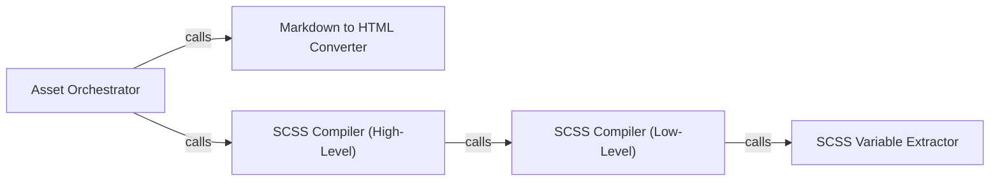

## Details

The Static Asset Management subsystem is responsible for compiling, caching, and serving static assets like SCSS, Markdown, and JavaScript for the timetagger web application. Its core functionality resides within the timetagger.server._assets and timetagger.server._utils modules, which process raw asset files (e.g., timetagger/app/app.scss, timetagger/app/index.md) into web-ready formats.

### Asset Orchestrator
This is the primary entry point for asset compilation. It scans a specified directory, identifies various asset types (Markdown, SCSS), and delegates their processing to specialized components. It ensures all necessary static files are prepared for the web application.

**Related Classes/Methods**:

- <a href="https://github.com/almarklein/timetagger/blob/main/timetagger/server/_assets.py#L94-L149" target="_blank" rel="noopener noreferrer">`timetagger.server._assets.create_assets_from_dir`:94-149</a>

### Markdown to HTML Converter
Dedicated to transforming Markdown (.md) content into HTML. This component enables the application to serve dynamic content derived from simple, easy-to-write Markdown files, integrating them seamlessly into the web interface.

**Related Classes/Methods**:

- <a href="https://github.com/almarklein/timetagger/blob/main/timetagger/server/_assets.py#L50-L91" target="_blank" rel="noopener noreferrer">`timetagger.server._assets.md2html`:50-91</a>

### SCSS Compiler (High-Level)
Manages the overall process of compiling SCSS (Sass) files into standard CSS. It acts as an intermediary, preparing SCSS content for the actual compilation and handling any high-level logic related to SCSS processing.

**Related Classes/Methods**:

- <a href="https://github.com/almarklein/timetagger/blob/main/timetagger/server/_assets.py#L46-L47" target="_blank" rel="noopener noreferrer">`timetagger.server._assets.compile_scss`:46-47</a>

### SCSS Compiler (Low-Level)
Encapsulates the specific logic for performing the actual conversion of SCSS to CSS. This component likely interacts with an underlying SCSS processing library or tool, handling the technical details of the compilation.

**Related Classes/Methods**:

- <a href="https://github.com/almarklein/timetagger/blob/main/timetagger/server/_utils.py#L121-L163" target="_blank" rel="noopener noreferrer">`timetagger.server._utils.compile_scss_to_css`:121-163</a>

### SCSS Variable Extractor
A utility component responsible for parsing SCSS files to extract variables. This is crucial for dynamic styling or configuration, allowing the application to read and potentially manipulate SCSS-defined values during the compilation process.

**Related Classes/Methods**:

- <a href="https://github.com/almarklein/timetagger/blob/main/timetagger/server/_utils.py#L108-L118" target="_blank" rel="noopener noreferrer">`timetagger.server._utils.get_scss_vars`:108-118</a>

### [FAQ](https://github.com/CodeBoarding/GeneratedOnBoardings/tree/main?tab=readme-ov-file#faq)