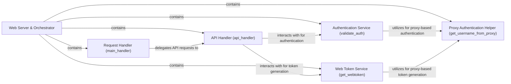

## Details

The Web Server & Orchestrator subsystem serves as the core entry point and control center for the Timetagger web application. It is responsible for initializing the application, handling all incoming HTTP requests, routing them to appropriate handlers, and managing critical aspects like user authentication and web token generation. Its functionality is primarily encapsulated within the timetagger.__main__ module.

### Web Server & Orchestrator [[Expand]](./Web_Server_Orchestrator.md)
The overarching component that acts as the primary entry point and request router for the Timetagger web application. It handles application initialization, serves the main application interface, and dispatches all incoming requests to the appropriate handlers, serving as the central hub for server-side logic.

**Related Classes/Methods**:

- <a href="https://github.com/almarklein/timetagger/blob/main/timetagger/__main__.py#L1-L1000" target="_blank" rel="noopener noreferrer">`timetagger.__main__`:1-1000</a>

### Request Handler (main_handler)
The top-level request handler responsible for processing all incoming web requests. It acts as the initial point of contact, broadly categorizing requests (e.g., API calls, static file requests) and delegating them to more specialized handlers for further processing.

**Related Classes/Methods**:

- <a href="https://github.com/almarklein/timetagger/blob/main/timetagger/__main__.py#L1-L100" target="_blank" rel="noopener noreferrer">`timetagger.__main__:main_handler`:1-100</a>

### API Handler (api_handler)
Dedicated to processing API-specific requests. This component manages the logic for various API endpoints, interacts with authentication services to validate API calls, and handles operations related to web token management for programmatic access.

**Related Classes/Methods**:

- <a href="https://github.com/almarklein/timetagger/blob/main/timetagger/__main__.py#L1-L100" target="_blank" rel="noopener noreferrer">`timetagger.__main__:api_handler`:1-100</a>

### Authentication Service (validate_auth)
Manages the validation of user authentication credentials. It verifies user identity against configured authentication mechanisms, ensuring that only authorized users can access protected resources within the application.

**Related Classes/Methods**:

- <a href="https://github.com/almarklein/timetagger/blob/main/timetagger/__main__.py#L1-L100" target="_blank" rel="noopener noreferrer">`timetagger.__main__:validate_auth`:1-100</a>

### Web Token Service (get_webtoken)
Orchestrates the generation of web tokens (e.g., JSON Web Tokens) based on different authentication mechanisms, such as username/password, proxy-based authentication, or localhost access. It acts as a central point for issuing secure tokens for session management and API access.

**Related Classes/Methods**:

- <a href="https://github.com/almarklein/timetagger/blob/main/timetagger/__main__.py#L1-L100" target="_blank" rel="noopener noreferrer">`timetagger.__main__:get_webtoken`:1-100</a>

### Proxy Authentication Helper (get_username_from_proxy)
A utility function specifically designed to extract username information from incoming requests when the application is deployed behind a proxy. It supports authentication flows where the proxy handles the initial user identification.

**Related Classes/Methods**:

- <a href="https://github.com/almarklein/timetagger/blob/main/timetagger/__main__.py#L1-L100" target="_blank" rel="noopener noreferrer">`timetagger.__main__:get_username_from_proxy`:1-100</a>

### [FAQ](https://github.com/CodeBoarding/GeneratedOnBoardings/tree/main?tab=readme-ov-file#faq)