```mermaid
graph LR
    Web_Server_Orchestrator["Web Server & Orchestrator"]
    Backend_API_Services["Backend API Services"]
    Static_Asset_Management["Static Asset Management"]
    Client_Side_Application["Client-Side Application"]
    Authentication_Authorization["Authentication & Authorization"]
    Application_Configuration["Application Configuration"]
    Web_Server_Orchestrator -- "routes dynamic API requests to" --> Backend_API_Services
    Web_Server_Orchestrator -- "requests and serves assets from" --> Static_Asset_Management
    Client_Side_Application -- "initiates data requests with" --> Backend_API_Services
    Backend_API_Services -- "responds to data requests from" --> Client_Side_Application
    Backend_API_Services -- "validates API requests with" --> Authentication_Authorization
    Authentication_Authorization -- "manages user sessions for" --> Backend_API_Services
    Client_Side_Application -- "handles authentication with" --> Authentication_Authorization
    Authentication_Authorization -- "manages client-side tokens for" --> Client_Side_Application
    Application_Configuration -- "provides settings to" --> Web_Server_Orchestrator
    Application_Configuration -- "supplies configuration to" --> Backend_API_Services
    click Web_Server_Orchestrator href "https://github.com/CodeBoarding/GeneratedOnBoardings/blob/main/timetagger/Web_Server_Orchestrator.md" "Details"
    click Backend_API_Services href "https://github.com/CodeBoarding/GeneratedOnBoardings/blob/main/timetagger/Backend_API_Services.md" "Details"
    click Static_Asset_Management href "https://github.com/CodeBoarding/GeneratedOnBoardings/blob/main/timetagger/Static_Asset_Management.md" "Details"
    click Client_Side_Application href "https://github.com/CodeBoarding/GeneratedOnBoardings/blob/main/timetagger/Client_Side_Application.md" "Details"
    click Authentication_Authorization href "https://github.com/CodeBoarding/GeneratedOnBoardings/blob/main/timetagger/Authentication_Authorization.md" "Details"
    click Application_Configuration href "https://github.com/CodeBoarding/GeneratedOnBoardings/blob/main/timetagger/Application_Configuration.md" "Details"
```

## Details

The `timetagger` architecture is centered around a Python-based Web Server & Orchestrator that serves the Client-Side Application and routes API requests to Backend API Services. The Static Asset Management component pre-processes and delivers all necessary frontend resources. Authentication & Authorization is integrated across both client and server to secure interactions and data access. All components rely on the Application Configuration for their operational settings. This structure facilitates a clear data flow from user interaction in the client, through secure API calls to the backend, and back to the client for display, all managed by a central Python server.

### Web Server & Orchestrator [[Expand]](./Web_Server_Orchestrator.md)
The primary entry point and request router for the Timetagger web application, responsible for initialization, serving the main application interface, and dispatching requests.

**Related Classes/Methods**:

- <a href="https://github.com/almarklein/timetagger/blob/main/timetagger/__main__.py" target="_blank" rel="noopener noreferrer">`timetagger.__main__`</a>

### Backend API Services [[Expand]](./Backend_API_Services.md)
Exposes RESTful API endpoints for all data operations (records, tags, settings), encapsulating core business logic and interacting with the underlying data persistence layer.

**Related Classes/Methods**:

- <a href="https://github.com/almarklein/timetagger/blob/main/timetagger/server/_apiserver.py" target="_blank" rel="noopener noreferrer">`timetagger.server._apiserver`</a>

### Static Asset Management [[Expand]](./Static_Asset_Management.md)
Manages the compilation, caching, and serving of all static assets (SCSS, Markdown, JS, images) required by the web application.

**Related Classes/Methods**:

- <a href="https://github.com/almarklein/timetagger/blob/main/timetagger/server/_assets.py" target="_blank" rel="noopener noreferrer">`timetagger.server._assets`</a>
- <a href="https://github.com/almarklein/timetagger/blob/main/timetagger/app/app.scss" target="_blank" rel="noopener noreferrer">`timetagger/app/app.scss`</a>
- <a href="https://github.com/almarklein/timetagger/blob/main/timetagger/app/index.md" target="_blank" rel="noopener noreferrer">`timetagger/app/index.md`</a>

### Client-Side Application [[Expand]](./Client_Side_Application.md)
The interactive frontend, managing UI rendering, user interactions, in-memory data state, and synchronization with the Backend API. It includes core UI logic, dialog management, and client-side data stores.

**Related Classes/Methods**:

- <a href="https://github.com/almarklein/timetagger/blob/main/timetagger/app/stores.py" target="_blank" rel="noopener noreferrer">`timetagger.app.stores`</a>
- <a href="https://github.com/almarklein/timetagger/blob/main/timetagger/app/front.py" target="_blank" rel="noopener noreferrer">`timetagger.app.front`</a>
- <a href="https://github.com/almarklein/timetagger/blob/main/timetagger/app/dialogs.py" target="_blank" rel="noopener noreferrer">`timetagger.app.dialogs`</a>
- <a href="https://github.com/almarklein/timetagger/blob/main/timetagger/app/dt.py" target="_blank" rel="noopener noreferrer">`timetagger.app.dt`</a>
- <a href="https://github.com/almarklein/timetagger/blob/main/timetagger/app/utils.py" target="_blank" rel="noopener noreferrer">`timetagger.app.utils`</a>
- <a href="https://github.com/almarklein/timetagger/blob/main/timetagger/app/tools.py" target="_blank" rel="noopener noreferrer">`timetagger.app.tools`</a>

### Authentication & Authorization [[Expand]](./Authentication_Authorization.md)
A cross-cutting component handling user authentication, web token management, and ensuring secure access to application resources and API endpoints across both client and server.

**Related Classes/Methods**:

- <a href="https://github.com/almarklein/timetagger/blob/main/timetagger/__main__.py" target="_blank" rel="noopener noreferrer">`timetagger.__main__`</a>
- <a href="https://github.com/almarklein/timetagger/blob/main/timetagger/server/_apiserver.py" target="_blank" rel="noopener noreferrer">`timetagger.server._apiserver`</a>
- <a href="https://github.com/almarklein/timetagger/blob/main/timetagger/app/stores.py" target="_blank" rel="noopener noreferrer">`timetagger.app.stores`</a>

### Application Configuration [[Expand]](./Application_Configuration.md)
Responsible for loading and providing application-wide settings from various sources (command-line arguments, environment variables) to other components.

**Related Classes/Methods**:

- <a href="https://github.com/almarklein/timetagger/blob/main/timetagger/_config.py" target="_blank" rel="noopener noreferrer">`timetagger._config`</a>

### [FAQ](https://github.com/CodeBoarding/GeneratedOnBoardings/tree/main?tab=readme-ov-file#faq)