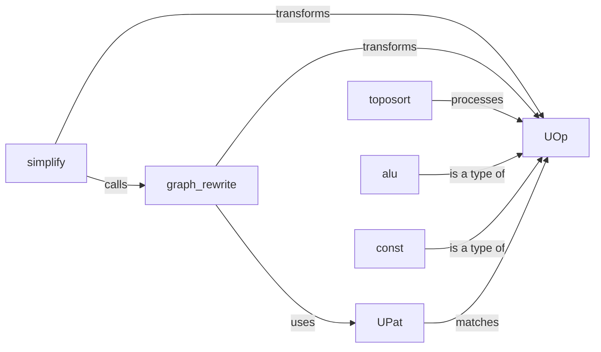

## Details

The core of this subsystem revolves around the `UOp` (Universal Operation) component, which serves as the fundamental, device-agnostic building block of the computation graph. `UOp` instances represent individual operations, including `alu` (arithmetic/logical units) and `const` (constant values), effectively defining the graph's nodes. The graph's structure and dependencies are managed through `UOp`'s internal mechanisms, including its `toposort` method, which establishes a valid execution order. Optimization is a key function, with `simplify` and `graph_rewrite` acting as primary transformers. `simplify` performs local algebraic and structural optimizations on the `UOp` graph, while `graph_rewrite` enables more extensive, high-level transformations. Both optimization components heavily rely on `UPat` (Universal Pattern) to define and match specific subgraphs or sequences of `UOp`s, guiding the transformation process. This architecture ensures a flexible and optimizable intermediate representation for computational tasks.

### UOp
The atomic, device-agnostic representation of a single operation in the computation graph. It encapsulates the operation type, its inputs (other `UOp`s), and any relevant metadata. This is the fundamental building block of the IR.

**Related Classes/Methods**:

- <a href="https://github.com/tinygrad/tinygrad/blob/master/tinygrad/uop/ops.py" target="_blank" rel="noopener noreferrer">`tinygrad.uop.ops.UOp`</a>

### simplify
A method of `UOp` that applies algebraic and structural simplification rules to a `UOp` graph to reduce redundancy and improve performance through local optimizations. It leverages `graph_rewrite` for its functionality.

**Related Classes/Methods**:

- <a href="https://github.com/tinygrad/tinygrad/blob/master/tinygrad/uop/ops.py" target="_blank" rel="noopener noreferrer">`tinygrad.uop.ops.UOp.simplify`</a>

### graph_rewrite
A core utility that transforms the `UOp` graph by applying a set of predefined rewrite rules, enabling more extensive, high-level optimizations beyond simple algebraic simplifications. It is used by `simplify` and other optimization passes.

**Related Classes/Methods**:

### toposort
A method of `UOp` that performs a topological sort on the `UOp` graph to determine a valid execution order, ensuring that all dependencies between operations are respected.

**Related Classes/Methods**:

- <a href="https://github.com/tinygrad/tinygrad/blob/master/tinygrad/uop/ops.py" target="_blank" rel="noopener noreferrer">`tinygrad.uop.ops.UOp.toposort`</a>

### UPat
Defines patterns that can be matched against the `UOp` graph. These patterns are crucial for identifying specific subgraphs or sequences of operations that can be optimized or transformed by components like `graph_rewrite`.

**Related Classes/Methods**:

- <a href="https://github.com/tinygrad/tinygrad/blob/master/tinygrad/uop/ops.py#L598-L685" target="_blank" rel="noopener noreferrer">`tinygrad.uop.ops.UPat`:598-685</a>

### alu
Represents fundamental arithmetic and logical operations (e.g., addition, multiplication, comparison) as specific types of `UOp`s within the computation graph. It is a method of the `UOp` class for creating such operations.

**Related Classes/Methods**:

- <a href="https://github.com/tinygrad/tinygrad/blob/master/tinygrad/uop/ops.py" target="_blank" rel="noopener noreferrer">`tinygrad.uop.ops.UOp.alu`</a>

### const
Represents constant numerical values directly embedded within the `UOp` graph, allowing scalar values to be part of the computation flow. It is a static method of the `UOp` class for creating constant `UOp`s.

**Related Classes/Methods**:

- <a href="https://github.com/tinygrad/tinygrad/blob/master/tinygrad/uop/ops.py" target="_blank" rel="noopener noreferrer">`tinygrad.uop.ops.UOp.const`</a>

### [FAQ](https://github.com/CodeBoarding/GeneratedOnBoardings/tree/main?tab=readme-ov-file#faq)