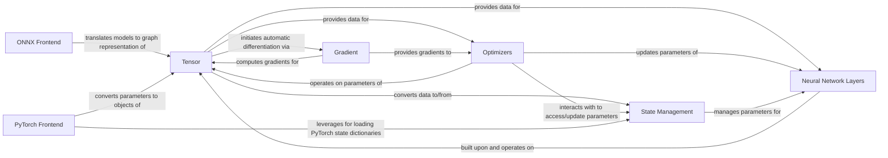

## Details

The tinygrad core subsystem is built around the Tensor component, which acts as the fundamental data structure for all computations and the foundation of the dynamic computational graph. The Gradient component leverages this graph to perform automatic differentiation, computing gradients essential for training. Neural Network Layers are constructed from and operate directly on Tensor objects, forming the model architecture. The Optimizers component utilizes gradients provided by Gradient to update the Tensor-based parameters of Neural Network Layers, driving the learning process. State Management ensures model persistence by handling the serialization and deserialization of these Tensor parameters. Furthermore, tinygrad supports interoperability through its ONNX Frontend and PyTorch Frontend, which translate external model definitions or load state dictionaries into Tensor objects, seamlessly integrating them into the tinygrad computational environment. The subsystem under analysis encompasses the core computational, model building, optimization, and interoperability aspects of tinygrad. Its boundaries are defined by the interactions and functionalities of the Tensor, Gradient, Neural Network Layers, Optimizers, State Management, ONNX Frontend, and PyTorch Frontend components.

### Tensor
The foundational data structure representing multi-dimensional arrays. It provides methods for all core numerical operations, shape manipulation, reductions, and serves as the building block for the computational graph. It also initiates the automatic differentiation process.

**Related Classes/Methods**:

- <a href="https://github.com/tinygrad/tinygrad/blob/master/tinygrad/tensor.py" target="_blank" rel="noopener noreferrer">`tinygrad.tensor`</a>

### Gradient
Manages the automatic differentiation process, computing and propagating gradients through the computational graph built by Tensor operations.

**Related Classes/Methods**:

- <a href="https://github.com/tinygrad/tinygrad/blob/master/tinygrad/gradient.py" target="_blank" rel="noopener noreferrer">`tinygrad.gradient`</a>

### Neural Network Layers
Provides a collection of pre-defined neural network layers (e.g., Linear, Conv2d, BatchNorm) and utilities, enabling users to construct complex models.

**Related Classes/Methods**:

- <a href="https://github.com/tinygrad/tinygrad/blob/master/tinygrad/nn" target="_blank" rel="noopener noreferrer">`tinygrad.nn`</a>

### Optimizers
Implements various optimization algorithms (e.g., SGD, Adam) to update the parameters of neural networks based on computed gradients, minimizing loss functions during training.

**Related Classes/Methods**:

- <a href="https://github.com/tinygrad/tinygrad/blob/master/tinygrad/nn/optim.py" target="_blank" rel="noopener noreferrer">`tinygrad.nn.optim`</a>

### State Management
Manages the serialization and deserialization of model parameters and states, facilitating saving and loading of trained models, including interoperability with other frameworks.

**Related Classes/Methods**:

- <a href="https://github.com/tinygrad/tinygrad/blob/master/tinygrad/nn/state.py" target="_blank" rel="noopener noreferrer">`tinygrad.nn.state`</a>

### ONNX Frontend
Parses ONNX (Open Neural Network Exchange) model definitions and translates them into tinygrad's internal computational graph representation, enabling interoperability with models from other frameworks.

**Related Classes/Methods**:

- <a href="https://github.com/tinygrad/tinygrad/blob/master/tinygrad/frontend/onnx.py" target="_blank" rel="noopener noreferrer">`tinygrad.frontend.onnx`</a>

### PyTorch Frontend
Facilitates the import of models from the PyTorch framework, primarily by loading PyTorch state dictionaries.

**Related Classes/Methods**:

- <a href="https://github.com/tinygrad/tinygrad/blob/master/tinygrad/frontend/torch.py" target="_blank" rel="noopener noreferrer">`tinygrad.frontend.torch`</a>

### [FAQ](https://github.com/CodeBoarding/GeneratedOnBoardings/tree/main?tab=readme-ov-file#faq)