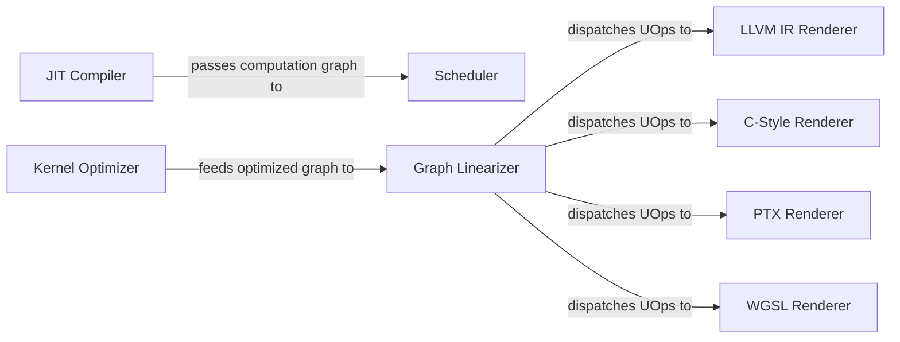

## Details

The Graph Compiler & Optimizer subsystem is the core compilation pipeline responsible for transforming, optimizing, and generating low-level code from the Computation Graph. This includes graph optimization passes, scheduling, linearization, and device-specific code generation, along with the JIT system for runtime optimization.

### JIT Compiler
Manages Just-In-Time compilation, capturing computation graphs, handling symbolic dimensions, and initiating the compilation and execution process.

**Related Classes/Methods**:

- <a href="https://github.com/tinygrad/tinygrad/blob/master/tinygrad/engine/jit.py" target="_blank" rel="noopener noreferrer">`tinygrad.engine.jit`</a>

### Scheduler
Creates an ordered sequence of operations (a schedule) from the computation graph, optimizing the execution flow.

**Related Classes/Methods**:

- <a href="https://github.com/tinygrad/tinygrad/blob/master/tinygrad/engine/schedule.py" target="_blank" rel="noopener noreferrer">`tinygrad.engine.schedule`</a>

### Kernel Optimizer
Applies various graph optimization passes (e.g., dimension simplification, merging, tensor core optimizations) to improve kernel performance.

**Related Classes/Methods**:

- <a href="https://github.com/tinygrad/tinygrad/blob/master/tinygrad/codegen/opt/kernel.py" target="_blank" rel="noopener noreferrer">`tinygrad.codegen.opt.kernel`</a>

### Graph Linearizer
Transforms the optimized computation graph into a linear sequence of micro-operations (UOps), serving as a crucial intermediate representation for code generation.

**Related Classes/Methods**:

- <a href="https://github.com/tinygrad/tinygrad/blob/master/tinygrad/codegen/linearize.py" target="_blank" rel="noopener noreferrer">`tinygrad.codegen.linearize`</a>

### LLVM IR Renderer
Generates LLVM Intermediate Representation (IR) code from linearized UOps for LLVM-compatible targets.

**Related Classes/Methods**:

- <a href="https://github.com/tinygrad/tinygrad/blob/master/tinygrad/renderer/llvmir.py" target="_blank" rel="noopener noreferrer">`tinygrad.renderer.llvmir`</a>

### C-Style Renderer
Generates C-style source code from linearized UOps for C-compatible targets.

**Related Classes/Methods**:

- <a href="https://github.com/tinygrad/tinygrad/blob/master/tinygrad/renderer/cstyle.py" target="_blank" rel="noopener noreferrer">`tinygrad.renderer.cstyle`</a>

### PTX Renderer
Generates PTX (Parallel Thread Execution) assembly code from linearized UOps for NVIDIA GPUs.

**Related Classes/Methods**:

- <a href="https://github.com/tinygrad/tinygrad/blob/master/tinygrad/renderer/ptx.py" target="_blank" rel="noopener noreferrer">`tinygrad.renderer.ptx`</a>

### WGSL Renderer
Generates WGSL (WebGPU Shading Language) code from linearized UOps for WebGPU targets.

**Related Classes/Methods**:

- <a href="https://github.com/tinygrad/tinygrad/blob/master/tinygrad/renderer/wgsl.py" target="_blank" rel="noopener noreferrer">`tinygrad.renderer.wgsl`</a>

### [FAQ](https://github.com/CodeBoarding/GeneratedOnBoardings/tree/main?tab=readme-ov-file#faq)