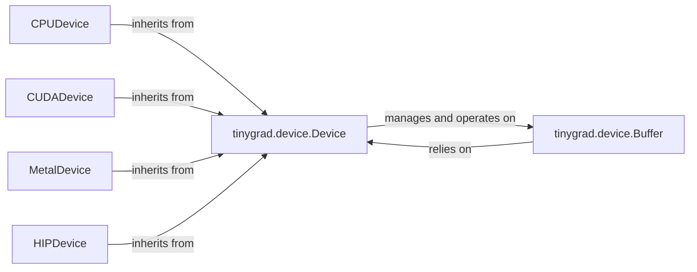

## Details

The `tinygrad.device` subsystem forms the Hardware Abstraction Layer (HAL) of the tinygrad framework, centralizing device management and memory operations. At its core, the abstract `tinygrad.device.Device` class defines a unified interface for various hardware backends, enabling polymorphic interaction with different accelerators like CPU, CUDA, Metal, and HIP. Concrete device implementations such as `CPUDevice`, `CUDADevice`, `MetalDevice`, and `HIPDevice` inherit from `tinygrad.device.Device`, providing specific hardware capabilities while adhering to the common interface. Memory management is handled by `tinygrad.device.Buffer`, which represents device-specific memory blocks. The `tinygrad.device.Device` instances are responsible for managing and operating on these `Buffer` objects, ensuring efficient data transfer and computation across diverse hardware. This design promotes extensibility and maintainability by decoupling the core computation graph from hardware-specific intricacies.

### tinygrad.device.Device
This is the foundational abstract class that defines the unified interface for all hardware devices. It serves as the core of the HAL, embodying the "Device Runtimes/Backends" architectural pattern by providing a consistent API for device operations, regardless of the underlying hardware.

**Related Classes/Methods**:

- <a href="https://github.com/tinygrad/tinygrad/blob/master/tinygrad/device.py" target="_blank" rel="noopener noreferrer">`tinygrad.device.Device`</a>

### tinygrad.device.Buffer
Represents a contiguous block of memory residing on a specific hardware device. This component is central to "Device memory management," providing an abstraction over raw device memory pointers.

**Related Classes/Methods**:

- <a href="https://github.com/tinygrad/tinygrad/blob/master/tinygrad/device.py#L92-L200" target="_blank" rel="noopener noreferrer">`tinygrad.device.Buffer`:92-200</a>

### CPUDevice
Concrete implementation of the `tinygrad.device.Device` abstract interface for CPU.

**Related Classes/Methods**:

- <a href="https://github.com/tinygrad/tinygrad/blob/master/tinygrad/runtime/ops_cpu.py#L121-L125" target="_blank" rel="noopener noreferrer">`tinygrad.runtime.ops_cpu.CPUDevice`:121-125</a>

### CUDADevice
Concrete implementation of the `tinygrad.device.Device` abstract interface for CUDA.

**Related Classes/Methods**:

- <a href="https://github.com/tinygrad/tinygrad/blob/master/tinygrad/runtime/ops_cuda.py#L93-L129" target="_blank" rel="noopener noreferrer">`tinygrad.runtime.ops_cuda.CUDADevice`:93-129</a>

### MetalDevice
Concrete implementation of the `tinygrad.device.Device` abstract interface for Metal.

**Related Classes/Methods**:

- <a href="https://github.com/tinygrad/tinygrad/blob/master/tinygrad/runtime/ops_metal.py#L65-L89" target="_blank" rel="noopener noreferrer">`tinygrad.runtime.ops_metal.MetalDevice`:65-89</a>

### HIPDevice
Concrete implementation of the `tinygrad.device.Device` abstract interface for HIP.

**Related Classes/Methods**:

- <a href="https://github.com/tinygrad/tinygrad/blob/master/tinygrad/runtime/ops_hip.py#L12-L20" target="_blank" rel="noopener noreferrer">`tinygrad.runtime.ops_hip.HIPDevice`:12-20</a>

### [FAQ](https://github.com/CodeBoarding/GeneratedOnBoardings/tree/main?tab=readme-ov-file#faq)