```mermaid
graph LR
    Frontend_API["Frontend & API"]
    Computation_Graph_IR["Computation Graph & IR"]
    Graph_Compiler_Optimizer["Graph Compiler & Optimizer"]
    Hardware_Abstraction_Layer_HAL_["Hardware Abstraction Layer (HAL)"]
    Applications_Examples["Applications & Examples"]
    Frontend_API -- "Generates UOps" --> Computation_Graph_IR
    Computation_Graph_IR -- "Feeds Graph" --> Graph_Compiler_Optimizer
    Graph_Compiler_Optimizer -- "Executes Kernels" --> Hardware_Abstraction_Layer_HAL_
    Hardware_Abstraction_Layer_HAL_ -- "Returns Results/Feedback" --> Graph_Compiler_Optimizer
    Applications_Examples -- "Utilizes API" --> Frontend_API
    Frontend_API -- "Manages Model State" --> Applications_Examples
    click Frontend_API href "https://github.com/CodeBoarding/GeneratedOnBoardings/blob/main/tinygrad/Frontend_API.md" "Details"
    click Computation_Graph_IR href "https://github.com/CodeBoarding/GeneratedOnBoardings/blob/main/tinygrad/Computation_Graph_IR.md" "Details"
    click Graph_Compiler_Optimizer href "https://github.com/CodeBoarding/GeneratedOnBoardings/blob/main/tinygrad/Graph_Compiler_Optimizer.md" "Details"
    click Hardware_Abstraction_Layer_HAL_ href "https://github.com/CodeBoarding/GeneratedOnBoardings/blob/main/tinygrad/Hardware_Abstraction_Layer_HAL_.md" "Details"
```

## Details

Tinygrad's architecture is designed for minimalist, efficient deep learning, centered around a lazy evaluation computation graph. The Frontend & API provides the user interface, allowing definition of models and operations on Tensors, which are then translated into a device-agnostic Computation Graph & IR of Universal Operations (UOps). This graph is then processed by the Graph Compiler & Optimizer, which performs various optimizations, schedules operations, and generates low-level, device-specific code. The Hardware Abstraction Layer (HAL) acts as the bridge to diverse hardware, managing memory and executing the compiled kernels. Finally, Applications & Examples showcase the framework's capabilities, leveraging the Frontend & API to build and run machine learning models. This layered approach ensures portability, performance, and a clear separation of concerns.

### Frontend & API [[Expand]](./Frontend_API.md)
The user-facing layer providing the core Tensor abstraction, automatic differentiation capabilities, and high-level neural network building blocks. It also includes interfaces for importing models from other frameworks. Key Responsibilities: Tensor operations, autograd graph building, NN layer definition, model state management, model import.

**Related Classes/Methods**:

- <a href="https://github.com/tinygrad/tinygrad/blob/master/tinygrad/tensor.py" target="_blank" rel="noopener noreferrer">`tinygrad.tensor`</a>
- <a href="https://github.com/tinygrad/tinygrad/blob/master/tinygrad/gradient.py" target="_blank" rel="noopener noreferrer">`tinygrad.gradient`</a>
- <a href="https://github.com/tinygrad/tinygrad/blob/master/tinygrad/nn/__init__.py" target="_blank" rel="noopener noreferrer">`tinygrad.nn`</a>
- <a href="https://github.com/tinygrad/tinygrad/blob/master/tinygrad/nn/optim.py" target="_blank" rel="noopener noreferrer">`tinygrad.nn.optim`</a>
- <a href="https://github.com/tinygrad/tinygrad/blob/master/tinygrad/nn/state.py" target="_blank" rel="noopener noreferrer">`tinygrad.nn.state`</a>
- <a href="https://github.com/tinygrad/tinygrad/blob/master/tinygrad/frontend/onnx.py" target="_blank" rel="noopener noreferrer">`tinygrad.frontend.onnx`</a>
- <a href="https://github.com/tinygrad/tinygrad/blob/master/tinygrad/frontend/torch.py" target="_blank" rel="noopener noreferrer">`tinygrad.frontend.torch`</a>

### Computation Graph & IR [[Expand]](./Computation_Graph_IR.md)
The central, device-agnostic intermediate representation of computations, expressed as Universal Operations (UOps). This component defines the abstract operations that form the basis of Tinygrad's computation graph. Key Responsibilities: Defining universal operations, representing the computation flow.

**Related Classes/Methods**:

- <a href="https://github.com/tinygrad/tinygrad/blob/master/tinygrad/uop/ops.py" target="_blank" rel="noopener noreferrer">`tinygrad.uop.ops`</a>

### Graph Compiler & Optimizer [[Expand]](./Graph_Compiler_Optimizer.md)
The core compilation pipeline responsible for transforming, optimizing, and generating low-level code from the Computation Graph. This includes graph optimization passes, scheduling, linearization, and device-specific code generation. It also encompasses the JIT system for runtime optimization. Key Responsibilities: Graph optimization, operation scheduling, instruction linearization, code generation (LLVM, C-style, PTX, WGSL), JIT compilation.

**Related Classes/Methods**:

- <a href="https://github.com/tinygrad/tinygrad/blob/master/tinygrad/codegen/opt/kernel.py" target="_blank" rel="noopener noreferrer">`tinygrad.codegen.opt.kernel`</a>
- <a href="https://github.com/tinygrad/tinygrad/blob/master/tinygrad/codegen/linearize.py" target="_blank" rel="noopener noreferrer">`tinygrad.codegen.linearize`</a>
- <a href="https://github.com/tinygrad/tinygrad/blob/master/tinygrad/engine/schedule.py" target="_blank" rel="noopener noreferrer">`tinygrad.engine.schedule`</a>
- <a href="https://github.com/tinygrad/tinygrad/blob/master/tinygrad/renderer/llvmir.py" target="_blank" rel="noopener noreferrer">`tinygrad.renderer.llvmir`</a>
- <a href="https://github.com/tinygrad/tinygrad/blob/master/tinygrad/renderer/cstyle.py" target="_blank" rel="noopener noreferrer">`tinygrad.renderer.cstyle`</a>
- <a href="https://github.com/tinygrad/tinygrad/blob/master/tinygrad/renderer/ptx.py" target="_blank" rel="noopener noreferrer">`tinygrad.renderer.ptx`</a>
- <a href="https://github.com/tinygrad/tinygrad/blob/master/tinygrad/renderer/wgsl.py" target="_blank" rel="noopener noreferrer">`tinygrad.renderer.wgsl`</a>
- <a href="https://github.com/tinygrad/tinygrad/blob/master/tinygrad/engine/jit.py" target="_blank" rel="noopener noreferrer">`tinygrad.engine.jit`</a>

### Hardware Abstraction Layer (HAL) [[Expand]](./Hardware_Abstraction_Layer_HAL_.md)
Provides a unified interface for interacting with various hardware devices (CPU, GPU, etc.). It manages device memory, handles data transfers, and executes the compiled kernels on the target hardware. Key Responsibilities: Device memory management, kernel execution, hardware-specific runtime implementations.

**Related Classes/Methods**:

- <a href="https://github.com/tinygrad/tinygrad/blob/master/tinygrad/device.py" target="_blank" rel="noopener noreferrer">`tinygrad.device`</a>
- <a href="https://github.com/tinygrad/tinygrad/blob/master/tinygrad/runtime/ops_cuda.py" target="_blank" rel="noopener noreferrer">`tinygrad.runtime.ops_cuda`</a>
- <a href="https://github.com/tinygrad/tinygrad/blob/master/tinygrad/runtime/ops_cpu.py" target="_blank" rel="noopener noreferrer">`tinygrad.runtime.ops_cpu`</a>
- <a href="https://github.com/tinygrad/tinygrad/blob/master/tinygrad/runtime/ops_hip.py" target="_blank" rel="noopener noreferrer">`tinygrad.runtime.ops_hip`</a>
- <a href="https://github.com/tinygrad/tinygrad/blob/master/tinygrad/runtime/ops_metal.py" target="_blank" rel="noopener noreferrer">`tinygrad.runtime.ops_metal`</a>
- <a href="https://github.com/tinygrad/tinygrad/blob/master/tinygrad/runtime/ops_amd.py" target="_blank" rel="noopener noreferrer">`tinygrad.runtime.ops_amd`</a>
- <a href="https://github.com/tinygrad/tinygrad/blob/master/tinygrad/runtime/ops_webgpu.py" target="_blank" rel="noopener noreferrer">`tinygrad.runtime.ops_webgpu`</a>
- <a href="https://github.com/tinygrad/tinygrad/blob/master/tinygrad/runtime/ops_qcom.py" target="_blank" rel="noopener noreferrer">`tinygrad.runtime.ops_qcom`</a>
- <a href="https://github.com/tinygrad/tinygrad/blob/master/tinygrad/runtime/ops_nv.py" target="_blank" rel="noopener noreferrer">`tinygrad.runtime.ops_nv`</a>
- <a href="https://github.com/tinygrad/tinygrad/blob/master/tinygrad/runtime/ops_dsp.py" target="_blank" rel="noopener noreferrer">`tinygrad.runtime.ops_dsp`</a>
- <a href="https://github.com/tinygrad/tinygrad/blob/master/tinygrad/runtime/ops_remote.py" target="_blank" rel="noopener noreferrer">`tinygrad.runtime.ops_remote`</a>
- <a href="https://github.com/tinygrad/tinygrad/blob/master/tinygrad/runtime/ops_disk.py" target="_blank" rel="noopener noreferrer">`tinygrad.runtime.ops_disk`</a>
- <a href="https://github.com/tinygrad/tinygrad/blob/master/tinygrad/runtime/ops_null.py" target="_blank" rel="noopener noreferrer">`tinygrad.runtime.ops_null`</a>
- <a href="https://github.com/tinygrad/tinygrad/blob/master/tinygrad/runtime/ops_gpu.py" target="_blank" rel="noopener noreferrer">`tinygrad.runtime.ops_gpu`</a>
- <a href="https://github.com/tinygrad/tinygrad/blob/master/tinygrad/runtime/ops_llvm.py" target="_blank" rel="noopener noreferrer">`tinygrad.runtime.ops_llvm`</a>
- <a href="https://github.com/tinygrad/tinygrad/blob/master/tinygrad/runtime/ops_npy.py" target="_blank" rel="noopener noreferrer">`tinygrad.runtime.ops_npy`</a>

### Applications & Examples
A collection of diverse machine learning models and applications built using the Tinygrad framework, demonstrating its capabilities and serving as practical usage examples. Key Responsibilities: Showcasing framework usage, providing reference implementations.

**Related Classes/Methods**:

- <a href="https://github.com/tinygrad/tinygrad/blob/master/examples/llama.py" target="_blank" rel="noopener noreferrer">`examples.llama`</a>
- <a href="https://github.com/tinygrad/tinygrad/blob/master/examples/sdxl.py" target="_blank" rel="noopener noreferrer">`examples.sdxl`</a>
- <a href="https://github.com/tinygrad/tinygrad/blob/master/examples/yolov8.py" target="_blank" rel="noopener noreferrer">`examples.yolov8`</a>
- <a href="https://github.com/tinygrad/tinygrad/blob/master/examples/mlperf" target="_blank" rel="noopener noreferrer">`examples.mlperf`</a>
- <a href="https://github.com/tinygrad/tinygrad/blob/master/examples/beautiful_cifar.py" target="_blank" rel="noopener noreferrer">`examples.beautiful_cifar`</a>

### [FAQ](https://github.com/CodeBoarding/GeneratedOnBoardings/tree/main?tab=readme-ov-file#faq)