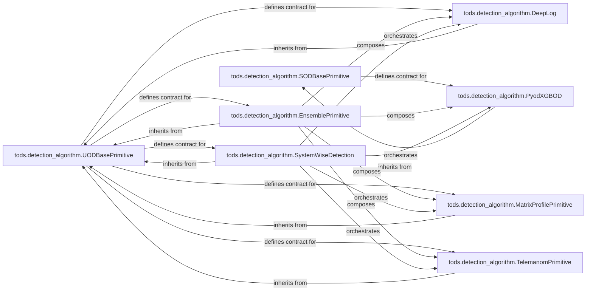

## Details

The feedback highlighted missing source code references for `tods.detection_algorithm.Ensemble`, `tods.detection_algorithm.MatrixProfile`, and `tods.detection_algorithm.Telemanom`. Upon investigation, it was found that these were referring to modules, not specific classes. The correct class references within these modules are `tods.detection_algorithm.EnsemblePrimitive`, `tods.detection_algorithm.MatrixProfilePrimitive`, and `tods.detection_algorithm.TelemanomPrimitive` respectively. The analysis has been updated to reflect these precise class references, ensuring accurate documentation and diagram generation.

### tods.detection_algorithm.SODBasePrimitive
This abstract base class defines the standardized interface (`fit` and `produce` methods) for supervised and semi-supervised anomaly detection algorithms. It ensures consistent data handling and output formatting for models integrated into the AutoML pipeline.

**Related Classes/Methods**:

- <a href="https://github.com/datamllab/tods/blob/master/tods/detection_algorithm/SODBasePrimitive.py" target="_blank" rel="noopener noreferrer">`tods.detection_algorithm.SODBasePrimitive`</a>

### tods.detection_algorithm.UODBasePrimitive
This abstract base class provides standardized methods for unsupervised anomaly detection algorithms, including data preparation (e.g., subsequence handling) and prediction wrapping. It ensures consistency across various unsupervised models.

**Related Classes/Methods**:

- <a href="https://github.com/datamllab/tods/blob/master/tods/detection_algorithm/UODBasePrimitive.py" target="_blank" rel="noopener noreferrer">`tods.detection_algorithm.UODBasePrimitive`</a>

### tods.detection_algorithm.PyodXGBOD
A concrete implementation of the XGBOD (XGBoost Outlier Detection) algorithm. It handles the specific initialization, validation, feature generation, and core fitting/prediction logic for this ensemble-based model, inheriting from `SODBasePrimitive`.

**Related Classes/Methods**:

- <a href="https://github.com/datamllab/tods/blob/master/tods/detection_algorithm/PyodXGBOD.py" target="_blank" rel="noopener noreferrer">`tods.detection_algorithm.PyodXGBOD`</a>

### tods.detection_algorithm.DeepLog
A concrete implementation of the DeepLog algorithm, inheriting from `UODBasePrimitive`. It focuses on LSTM-based anomaly detection, typically for log data, managing neural network model building and specific data preprocessing.

**Related Classes/Methods**:

- <a href="https://github.com/datamllab/tods/blob/master/tods/detection_algorithm/DeepLog.py" target="_blank" rel="noopener noreferrer">`tods.detection_algorithm.DeepLog`</a>

### tods.detection_algorithm.SystemWiseDetection
A specialized component for performing anomaly detection across an entire system or aggregated data. It likely orchestrates or combines results from other detectors to provide a holistic view of system anomalies, inheriting from `UODBasePrimitive`.

**Related Classes/Methods**:

- <a href="https://github.com/datamllab/tods/blob/master/tods/detection_algorithm/SystemWiseDetection.py" target="_blank" rel="noopener noreferrer">`tods.detection_algorithm.SystemWiseDetection`</a>

### tods.detection_algorithm.EnsemblePrimitive
Provides functionality for combining multiple anomaly detection models into an ensemble, inheriting from `UODBasePrimitive`. This is crucial for improving detection robustness and performance, aligning with AutoML strategies.

**Related Classes/Methods**:

- <a href="https://github.com/datamllab/tods/blob/master/tods/detection_algorithm/Ensemble.py" target="_blank" rel="noopener noreferrer">`tods.detection_algorithm.EnsemblePrimitive`</a>

### tods.detection_algorithm.MatrixProfilePrimitive
Implements the Matrix Profile algorithm, a powerful technique for time series anomaly detection, inheriting from `UODBasePrimitive`.

**Related Classes/Methods**:

- <a href="https://github.com/datamllab/tods/blob/master/tods/detection_algorithm/MatrixProfile.py" target="_blank" rel="noopener noreferrer">`tods.detection_algorithm.MatrixProfilePrimitive`</a>

### tods.detection_algorithm.TelemanomPrimitive
Implements the Telemanom algorithm, often used for anomaly detection in multivariate time series data, inheriting from `UODBasePrimitive`.

**Related Classes/Methods**:

- <a href="https://github.com/datamllab/tods/blob/master/tods/detection_algorithm/Telemanom.py" target="_blank" rel="noopener noreferrer">`tods.detection_algorithm.TelemanomPrimitive`</a>

### [FAQ](https://github.com/CodeBoarding/GeneratedOnBoardings/tree/main?tab=readme-ov-file#faq)