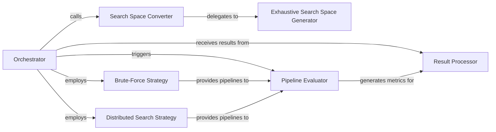

## Details

The AutoML Engine subsystem is primarily responsible for automating the search for optimal pipeline configurations and hyperparameters for anomaly detection. Its core functionality revolves around defining a search space, employing various search strategies, evaluating candidate pipelines, and identifying the best-performing solution. This subsystem is encapsulated within the tods.searcher package.

### Orchestrator
The central component that initiates and coordinates the entire AutoML pipeline search process. It acts as the control flow for defining the search space, executing search strategies, and evaluating pipelines.

**Related Classes/Methods**:

- <a href="https://github.com/datamllab/tods/blob/master/tods/searcher/searcher.py" target="_blank" rel="noopener noreferrer">`tods/searcher/searcher.py`</a>

### Search Space Converter
Responsible for transforming user-defined search space specifications into a structured, machine-readable format that search algorithms can utilize.

**Related Classes/Methods**:

- <a href="https://github.com/datamllab/tods/blob/master/tods/searcher/searcher.py" target="_blank" rel="noopener noreferrer">`tods/searcher/searcher.py`</a>

### Exhaustive Search Space Generator
Systematically generates all possible combinations of primitives (e.g., data preprocessing steps, anomaly detection algorithms) and their associated hyperparameters, forming the complete search space.

**Related Classes/Methods**:

- <a href="https://github.com/datamllab/tods/blob/master/tods/searcher/searcher.py" target="_blank" rel="noopener noreferrer">`tods/searcher/searcher.py`</a>

### Brute-Force Strategy
A concrete implementation of a search strategy that exhaustively explores all generated pipeline combinations.

**Related Classes/Methods**:

- <a href="https://github.com/datamllab/tods/blob/master/tods/searcher/brute_force_search.py" target="_blank" rel="noopener noreferrer">`tods/searcher/brute_force_search.py`</a>

### Distributed Search Strategy
An alternative search strategy, potentially leveraging distributed computing (e.g., Ray) to accelerate the search for optimal pipelines.

**Related Classes/Methods**:

- <a href="https://github.com/datamllab/tods/blob/master/tods/searcher/searcher.py" target="_blank" rel="noopener noreferrer">`tods/searcher/searcher.py`</a>

### Pipeline Evaluator
Executes a given anomaly detection pipeline with a dataset and evaluates its performance based on specified metrics.

**Related Classes/Methods**:

- <a href="https://github.com/datamllab/tods/blob/master/tods/searcher/searcher.py" target="_blank" rel="noopener noreferrer">`tods/searcher/searcher.py`</a>

### Result Processor
Analyzes the performance metrics from evaluated pipelines, identifies the best-performing solution, and provides the final search results.

**Related Classes/Methods**:

- <a href="https://github.com/datamllab/tods/blob/master/tods/searcher/searcher.py" target="_blank" rel="noopener noreferrer">`tods/searcher/searcher.py`</a>

### [FAQ](https://github.com/CodeBoarding/GeneratedOnBoardings/tree/main?tab=readme-ov-file#faq)