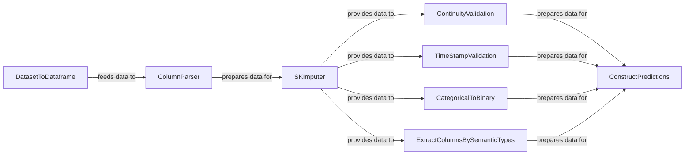

## Details

The `Data Preprocessing` subsystem is a critical initial stage in the `tods` machine learning pipeline, responsible for transforming raw or semi-processed data into a clean, structured format suitable for subsequent feature engineering and model training. It focuses on ensuring data quality, consistency, and proper typing, which are fundamental for the accuracy and reliability of time-series analysis and anomaly detection algorithms.

### DatasetToDataframe
Acts as the entry point for raw data, converting generic dataset objects into a standardized pandas DataFrame format, which is a prerequisite for subsequent processing steps. This component is crucial for ensuring data consistency across the pipeline.

**Related Classes/Methods**:

- <a href="https://github.com/datamllab/tods/blob/master/tods/data_processing/DatasetToDataframe.py" target="_blank" rel="noopener noreferrer">`tods.data_processing.DatasetToDataframe`</a>

### ColumnParser
Parses and transforms data columns into appropriate data types (e.g., categorical, time, integer, float, boolean, float vector), ensuring data consistency and correct typing for ML algorithms. This is a foundational step for any data-driven task.

**Related Classes/Methods**:

- <a href="https://github.com/datamllab/tods/blob/master/tods/data_processing/ColumnParser.py" target="_blank" rel="noopener noreferrer">`tods.data_processing.ColumnParser`</a>

### SKImputer
Addresses missing values within the dataset by performing imputation, a critical step for data quality and model performance. Missing data can severely impact model training, making this component indispensable.

**Related Classes/Methods**:

- <a href="https://github.com/datamllab/tods/blob/master/tods/data_processing/skimputer.py" target="_blank" rel="noopener noreferrer">`tods.data_processing.SKImputer`</a>

### ContinuityValidation
Validates the temporal continuity of data, especially crucial for time-series analysis, and can correct discontinuities through ablation or imputation. This component directly supports the project's focus on time-series data.

**Related Classes/Methods**:

- <a href="https://github.com/datamllab/tods/blob/master/tods/data_processing/ContinuityValidation.py" target="_blank" rel="noopener noreferrer">`tods.data_processing.ContinuityValidation`</a>

### TimeStampValidation
Ensures that timestamps in the data are correctly sorted, which is fundamental for accurate time-series analysis. Proper temporal order is non-negotiable for time-series models.

**Related Classes/Methods**:

- <a href="https://github.com/datamllab/tods/blob/master/tods/data_processing/TimeStampValidation.py" target="_blank" rel="noopener noreferrer">`tods.data_processing.TimeStampValidation`</a>

### CategoricalToBinary
Converts categorical data columns into a binary representation, preparing them for machine learning algorithms that require numerical inputs. This is a standard and necessary transformation for many ML models.

**Related Classes/Methods**:

- <a href="https://github.com/datamllab/tods/blob/master/tods/data_processing/CategoricalToBinary.py" target="_blank" rel="noopener noreferrer">`tods.data_processing.CategoricalToBinary`</a>

### ExtractColumnsBySemanticTypes
Selects and extracts columns based on their assigned semantic types, enabling targeted processing of specific data subsets. This component enhances the modularity and automation capabilities of the AutoML pipeline.

**Related Classes/Methods**:

- <a href="https://github.com/datamllab/tods/blob/master/tods/data_processing/ExtractColumnsBySemanticTypes.py" target="_blank" rel="noopener noreferrer">`tods.data_processing.ExtractColumnsBySemanticTypes`</a>

### ConstructPredictions
Constructs or reconstructs predictions, potentially leveraging semantic types. This component likely serves as a final data preparation step before model consumption or for structuring specific prediction-related outputs, bridging preprocessing with model output.

**Related Classes/Methods**:

- <a href="https://github.com/datamllab/tods/blob/master/tods/data_processing/ConstructPredictions.py" target="_blank" rel="noopener noreferrer">`tods.data_processing.ConstructPredictions`</a>

### [FAQ](https://github.com/CodeBoarding/GeneratedOnBoardings/tree/main?tab=readme-ov-file#faq)