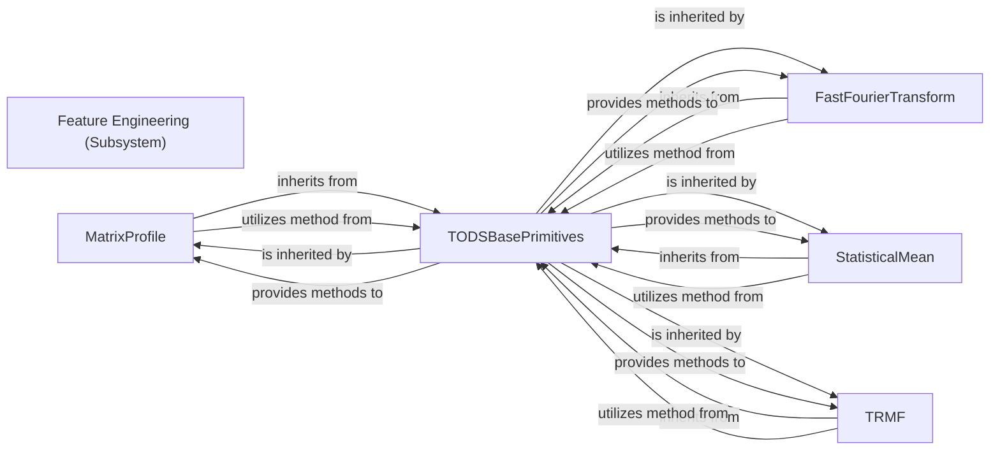

## Details

The Feature Engineering subsystem is responsible for transforming raw or pre-processed time-series data into a set of meaningful and discriminative features. These features are essential for subsequent anomaly detection algorithms to effectively learn and identify anomalous patterns.

### Feature Engineering (Subsystem)
The overarching component that orchestrates the extraction of meaningful and discriminative features from processed time-series data. It acts as a logical grouping for various feature engineering primitives, ensuring that the output features are suitable for anomaly detection algorithms.

**Related Classes/Methods**:

- <a href="https://github.com/datamllab/tods/blob/master/tods/feature_analysis/MatrixProfile.py#L176-L216" target="_blank" rel="noopener noreferrer">`tods.feature_analysis.MatrixProfile.produce`:176-216</a>
- <a href="https://github.com/datamllab/tods/blob/master/tods/feature_analysis/FastFourierTransform.py#L213-L269" target="_blank" rel="noopener noreferrer">`tods.feature_analysis.FastFourierTransform._produce`:213-269</a>
- <a href="https://github.com/datamllab/tods/blob/master/tods/feature_analysis/StatisticalMean.py#L123-L179" target="_blank" rel="noopener noreferrer">`tods.feature_analysis.StatisticalMean._produce`:123-179</a>
- <a href="https://github.com/datamllab/tods/blob/master/tods/feature_analysis/trmf.py" target="_blank" rel="noopener noreferrer">`tods.feature_analysis.trmf.TRMF._produce`</a>

### MatrixProfile
Applies the Matrix Profile algorithm to identify recurring patterns and anomalies in time-series data. It generates new features based on subsequence similarity, which can highlight anomalous behaviors.

**Related Classes/Methods**:

- <a href="https://github.com/datamllab/tods/blob/master/tods/feature_analysis/MatrixProfile.py#L176-L216" target="_blank" rel="noopener noreferrer">`tods.feature_analysis.MatrixProfile.produce`:176-216</a>

### FastFourierTransform
Transforms time-series data from the time domain into the frequency domain using the Fast Fourier Transform (FFT). This process extracts features related to periodicity, dominant frequencies, and spectral characteristics, which are valuable for detecting anomalies in cyclical data.

**Related Classes/Methods**:

- <a href="https://github.com/datamllab/tods/blob/master/tods/feature_analysis/FastFourierTransform.py#L213-L269" target="_blank" rel="noopener noreferrer">`tods.feature_analysis.FastFourierTransform._produce`:213-269</a>

### StatisticalMean
Computes the statistical mean of time-series data. While seemingly simple, the mean can serve as a fundamental feature, and deviations from it can indicate anomalous points or segments.

**Related Classes/Methods**:

- <a href="https://github.com/datamllab/tods/blob/master/tods/feature_analysis/StatisticalMean.py#L123-L179" target="_blank" rel="noopener noreferrer">`tods.feature_analysis.StatisticalMean._produce`:123-179</a>

### TRMF
Implements Time-series Regularized Matrix Factorization (TRMF) for dimensionality reduction and latent feature extraction. This technique is particularly useful for handling noisy or incomplete time-series data, producing robust features.

**Related Classes/Methods**:

- <a href="https://github.com/datamllab/tods/blob/master/tods/feature_analysis/trmf.py" target="_blank" rel="noopener noreferrer">`tods.feature_analysis.trmf.TRMF._produce`</a>

### TODSBasePrimitives
Serves as the abstract base class for all TODS primitives, including those within the Feature Engineering subsystem. It defines a common interface and provides shared mechanisms for data processing, fitting, and metadata management. This component is fundamental for ensuring modularity, consistency, and seamless integration of different feature engineering techniques within the overall ML pipeline.

**Related Classes/Methods**:

- <a href="https://github.com/datamllab/tods/blob/master/tods/common/TODSBasePrimitives.py" target="_blank" rel="noopener noreferrer">`tods.common.TODSBasePrimitives._get_columns_to_fit`</a>
- <a href="https://github.com/datamllab/tods/blob/master/tods/common/TODSBasePrimitives.py" target="_blank" rel="noopener noreferrer">`tods.common.TODSBasePrimitives._wrap_predictions`</a>

### [FAQ](https://github.com/CodeBoarding/GeneratedOnBoardings/tree/main?tab=readme-ov-file#faq)