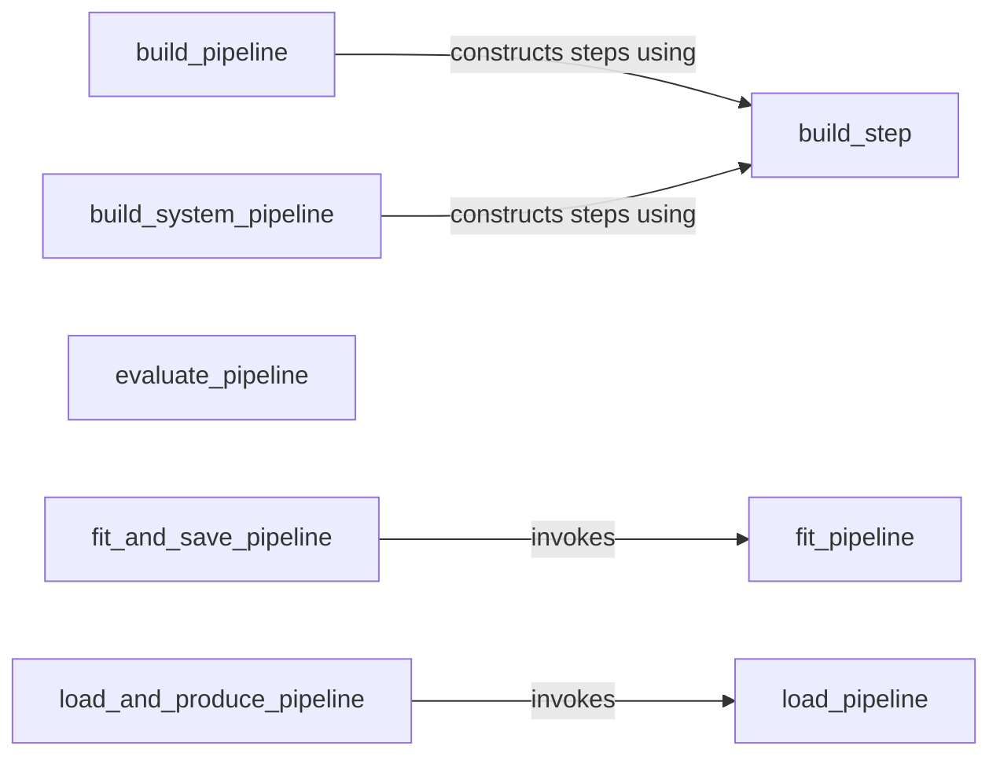

## Details

The `tods.utils` subsystem is central to the anomaly detection pipeline lifecycle, encompassing pipeline construction, training, evaluation, and deployment. The `build_pipeline` and `build_system_pipeline` components are responsible for assembling pipelines, with `build_step` serving as a foundational utility for adding individual primitives. Once a pipeline is constructed, `fit_pipeline` handles the training process. For persistence and reusability, `fit_and_save_pipeline` orchestrates the training and saving of pipelines, while `load_pipeline` facilitates loading. Finally, `load_and_produce_pipeline` manages the execution of loaded pipelines for inference, and `evaluate_pipeline` assesses their performance. This modular design allows for flexible pipeline creation, efficient training, and streamlined deployment of anomaly detection models.

Critical Interaction Pathways:
*   **Pipeline Construction:** `build_pipeline` and `build_system_pipeline` both interact with `build_step` to construct individual pipeline stages.
*   **Pipeline Training & Persistence:** `fit_and_save_pipeline` orchestrates the training process by invoking `fit_pipeline` and subsequently handles the saving of the fitted pipeline.
*   **Pipeline Deployment & Inference:** `load_and_produce_pipeline` relies on `load_pipeline` to retrieve a previously fitted pipeline, which it then uses to generate predictions.
*   **Pipeline Evaluation:** `evaluate_pipeline` takes a fitted pipeline as input to assess its performance.

### build_pipeline
Dynamically constructs an anomaly detection pipeline based on user-defined configurations. This component is crucial for the AutoML aspect, allowing flexible pipeline creation.

**Related Classes/Methods**:

- <a href="https://github.com/datamllab/tods/blob/master/tods/utils.py#L187-L279" target="_blank" rel="noopener noreferrer">`tods.utils.build_pipeline`:187-279</a>

### build_system_pipeline
Constructs pre-configured or system-defined pipelines, often for standard use cases or optimized templates. This complements `build_pipeline` by providing ready-to-use pipeline structures.

**Related Classes/Methods**:

- <a href="https://github.com/datamllab/tods/blob/master/tods/utils.py#L281-L391" target="_blank" rel="noopener noreferrer">`tods.utils.build_system_pipeline`:281-391</a>

### build_step
A fundamental utility component responsible for constructing individual steps or primitives that form part of a larger pipeline. It acts as a building block for both dynamic and system-defined pipelines.

**Related Classes/Methods**:

- <a href="https://github.com/datamllab/tods/blob/master/tods/utils.py#L625-L663" target="_blank" rel="noopener noreferrer">`tods.utils.build_step`:625-663</a>

### fit_pipeline
Manages the training (fitting) process of a constructed pipeline using input data. This is a core execution phase of any machine learning pipeline.

**Related Classes/Methods**:

- <a href="https://github.com/datamllab/tods/blob/master/tods/utils.py#L412-L430" target="_blank" rel="noopener noreferrer">`tods.utils.fit_pipeline`:412-430</a>

### evaluate_pipeline
Assesses the performance and effectiveness of a fitted pipeline against specified metrics. This component is vital for validating pipeline efficacy and for AutoML optimization loops.

**Related Classes/Methods**:

- <a href="https://github.com/datamllab/tods/blob/master/tods/utils.py#L151-L178" target="_blank" rel="noopener noreferrer">`tods.utils.evaluate_pipeline`:151-178</a>

### load_pipeline
Handles the deserialization and loading of pipeline definitions or previously saved pipeline instances, enabling persistence and reusability.

**Related Classes/Methods**:

- <a href="https://github.com/datamllab/tods/blob/master/tods/utils.py#L91-L100" target="_blank" rel="noopener noreferrer">`tods.utils.load_pipeline`:91-100</a>

### fit_and_save_pipeline
Orchestrates the complete process of fitting a pipeline and then persisting its trained state. This is a higher-level orchestration component combining execution and storage.

**Related Classes/Methods**:

- <a href="https://github.com/datamllab/tods/blob/master/tods/utils.py#L560-L563" target="_blank" rel="noopener noreferrer">`tods.utils.fit_and_save_pipeline`:560-563</a>

### load_and_produce_pipeline
Manages loading a previously fitted pipeline and executing it to generate anomaly detection results. This component handles the inference phase of a deployed pipeline.

**Related Classes/Methods**:

- <a href="https://github.com/datamllab/tods/blob/master/tods/utils.py#L565-L568" target="_blank" rel="noopener noreferrer">`tods.utils.load_and_produce_pipeline`:565-568</a>

### [FAQ](https://github.com/CodeBoarding/GeneratedOnBoardings/tree/main?tab=readme-ov-file#faq)