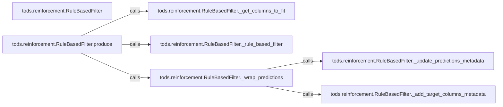

## Details

The `Post-processing & Calibration` subsystem is primarily encapsulated within the `tods.reinforcement.RuleBasedFilter` class. This class and its methods define the scope of refining raw anomaly detection outputs through rule-based filtering and calibration mechanisms.

### tods.reinforcement.RuleBasedFilter
The overarching component that orchestrates the entire post-processing and calibration workflow. It acts as the primary interface for applying rule-based refinements to anomaly detection results, embodying the Reinforcement/Calibration Module within the ML pipeline.

**Related Classes/Methods**:

- <a href="https://github.com/datamllab/tods/blob/master/tods/reinforcement/RuleBasedFilter.py" target="_blank" rel="noopener noreferrer">`tods.reinforcement.RuleBasedFilter`</a>

### tods.reinforcement.RuleBasedFilter.produce
Serves as the main entry point for initiating the post-processing workflow. It orchestrates the sequence of operations, from data preparation to the application of rules and final output wrapping. This method is crucial for integrating the component into larger ML pipelines.

**Related Classes/Methods**:

- <a href="https://github.com/datamllab/tods/blob/master/tods/reinforcement/RuleBasedFilter.py" target="_blank" rel="noopener noreferrer">`tods.reinforcement.RuleBasedFilter:produce`</a>

### tods.reinforcement.RuleBasedFilter._get_columns_to_fit
Responsible for identifying and preparing the relevant columns from the input data that require rule-based filtering. This is a foundational data preparation step, ensuring that the core logic operates on the correct data subset.

**Related Classes/Methods**:

- <a href="https://github.com/datamllab/tods/blob/master/tods/reinforcement/RuleBasedFilter.py" target="_blank" rel="noopener noreferrer">`tods.reinforcement.RuleBasedFilter:_get_columns_to_fit`</a>

### tods.reinforcement.RuleBasedFilter._rule_based_filter
Implements the core rule-based logic for filtering or calibrating anomaly scores. This method contains the specific algorithms or heuristics that refine the raw detection outputs, directly contributing to the "Reinforcement/Calibration" aspect of the system.

**Related Classes/Methods**:

- <a href="https://github.com/datamllab/tods/blob/master/tods/reinforcement/RuleBasedFilter.py" target="_blank" rel="noopener noreferrer">`tods.reinforcement.RuleBasedFilter:_rule_based_filter`</a>

### tods.reinforcement.RuleBasedFilter._wrap_predictions
Formats and finalizes the processed predictions, ensuring they conform to the expected output structure for downstream pipeline stages. This includes handling metadata and ensuring data integrity.

**Related Classes/Methods**:

- <a href="https://github.com/datamllab/tods/blob/master/tods/reinforcement/RuleBasedFilter.py" target="_blank" rel="noopener noreferrer">`tods.reinforcement.RuleBasedFilter:_wrap_predictions`</a>

### tods.reinforcement.RuleBasedFilter._update_predictions_metadata
Updates the metadata associated with the processed predictions. This is vital for traceability, reproducibility, and providing contextual information within an AutoML framework, supporting evaluation and debugging.

**Related Classes/Methods**:

- <a href="https://github.com/datamllab/tods/blob/master/tods/reinforcement/RuleBasedFilter.py" target="_blank" rel="noopener noreferrer">`tods.reinforcement.RuleBasedFilter:_update_predictions_metadata`</a>

### tods.reinforcement.RuleBasedFilter._add_target_columns_metadata
Specifically adds metadata related to target columns to the predictions. This provides crucial contextual information for understanding the anomaly scores and their relation to the original data features.

**Related Classes/Methods**:

- <a href="https://github.com/datamllab/tods/blob/master/tods/reinforcement/RuleBasedFilter.py" target="_blank" rel="noopener noreferrer">`tods.reinforcement.RuleBasedFilter:_add_target_columns_metadata`</a>

### [FAQ](https://github.com/CodeBoarding/GeneratedOnBoardings/tree/main?tab=readme-ov-file#faq)