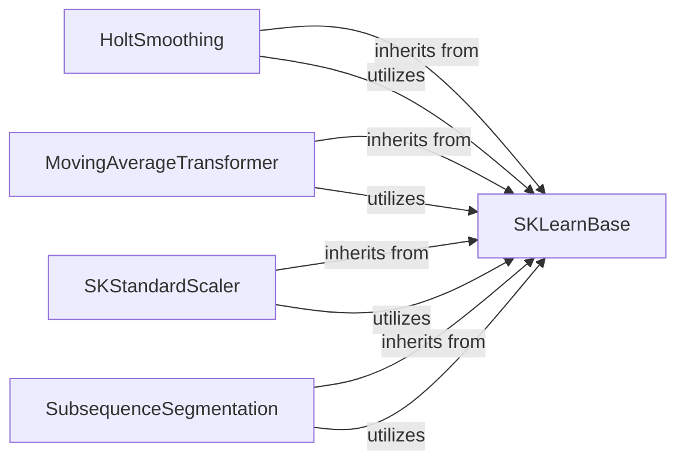

## Details

The `Time Series Transformation` subsystem is responsible for preparing time-series data for anomaly detection through various specialized transformations.

### SKLearnBase
Acts as the abstract base class for all time-series transformers within `tods`. It provides the foundational `fit()` and `produce()` methods, along with common utilities for metadata handling (`_wrap_predictions`, `_update_predictions_metadata`, `_copy_inputs_metadata`, `_add_target_columns_metadata`) and column selection (`_get_columns_to_fit`). This ensures consistency, reusability, and interoperability across different transformation components, which is vital for an AutoML pipeline.

**Related Classes/Methods**:

- <a href="https://github.com/datamllab/tods/blob/master/tods/sk_interface/base.py" target="_blank" rel="noopener noreferrer">`SKLearnBase:fit`</a>
- <a href="https://github.com/datamllab/tods/blob/master/tods/sk_interface/base.py" target="_blank" rel="noopener noreferrer">`SKLearnBase:produce`</a>
- <a href="https://github.com/datamllab/tods/blob/master/tods/sk_interface/base.py" target="_blank" rel="noopener noreferrer">`SKLearnBase:_wrap_predictions`</a>
- <a href="https://github.com/datamllab/tods/blob/master/tods/sk_interface/base.py" target="_blank" rel="noopener noreferrer">`SKLearnBase:_update_predictions_metadata`</a>
- <a href="https://github.com/datamllab/tods/blob/master/tods/sk_interface/base.py" target="_blank" rel="noopener noreferrer">`SKLearnBase:_copy_inputs_metadata`</a>
- <a href="https://github.com/datamllab/tods/blob/master/tods/sk_interface/base.py" target="_blank" rel="noopener noreferrer">`SKLearnBase:_add_target_columns_metadata`</a>
- <a href="https://github.com/datamllab/tods/blob/master/tods/sk_interface/base.py" target="_blank" rel="noopener noreferrer">`SKLearnBase:_get_columns_to_fit`</a>

### HoltSmoothing
Applies exponential smoothing to time-series data to smooth out irregularities and highlight underlying trends, crucial for forecasting and pattern recognition in anomaly detection.

**Related Classes/Methods**:

- <a href="https://github.com/datamllab/tods/blob/master/tods/timeseries_processing/HoltSmoothing.py" target="_blank" rel="noopener noreferrer">`HoltSmoothing:fit`</a>
- <a href="https://github.com/datamllab/tods/blob/master/tods/timeseries_processing/HoltSmoothing.py" target="_blank" rel="noopener noreferrer">`HoltSmoothing:produce`</a>
- <a href="https://github.com/datamllab/tods/blob/master/tods/sk_interface/base.py" target="_blank" rel="noopener noreferrer">`SKLearnBase:_get_columns_to_fit`</a>
- <a href="https://github.com/datamllab/tods/blob/master/tods/sk_interface/base.py" target="_blank" rel="noopener noreferrer">`SKLearnBase:_wrap_predictions`</a>

### MovingAverageTransformer
Calculates the moving average of time-series data, primarily for smoothing short-term fluctuations and identifying longer-term trends, which helps in reducing noise for anomaly detection.

**Related Classes/Methods**:

- <a href="https://github.com/datamllab/tods/blob/master/tods/timeseries_processing/MovingAverageTransformer.py" target="_blank" rel="noopener noreferrer">`MovingAverageTransformer:fit`</a>
- <a href="https://github.com/datamllab/tods/blob/master/tods/timeseries_processing/MovingAverageTransformer.py" target="_blank" rel="noopener noreferrer">`MovingAverageTransformer:produce`</a>
- <a href="https://github.com/datamllab/tods/blob/master/tods/sk_interface/base.py" target="_blank" rel="noopener noreferrer">`SKLearnBase:_get_columns_to_fit`</a>
- <a href="https://github.com/datamllab/tods/blob/master/tods/sk_interface/base.py" target="_blank" rel="noopener noreferrer">`SKLearnBase:_wrap_predictions`</a>

### SKStandardScaler
Standardizes time-series features by removing the mean and scaling to unit variance. This is a critical preprocessing step to ensure that features contribute equally to the model and to improve the performance of many machine learning algorithms, especially distance-based ones used in anomaly detection.

**Related Classes/Methods**:

- <a href="https://github.com/datamllab/tods/blob/master/tods/timeseries_processing/SKStandardScaler.py" target="_blank" rel="noopener noreferrer">`SKStandardScaler:fit`</a>
- <a href="https://github.com/datamllab/tods/blob/master/tods/timeseries_processing/SKStandardScaler.py" target="_blank" rel="noopener noreferrer">`SKStandardScaler:produce`</a>
- <a href="https://github.com/datamllab/tods/blob/master/tods/sk_interface/base.py" target="_blank" rel="noopener noreferrer">`SKLearnBase:_get_columns_to_fit`</a>
- <a href="https://github.com/datamllab/tods/blob/master/tods/sk_interface/base.py" target="_blank" rel="noopener noreferrer">`SKLearnBase:_wrap_predictions`</a>

### SubsequenceSegmentation
Divides a continuous time series into fixed-length subsequences. This is a fundamental preprocessing step for anomaly detection algorithms that analyze patterns within segments rather than the entire series, enabling localized anomaly detection.

**Related Classes/Methods**:

- <a href="https://github.com/datamllab/tods/blob/master/tods/timeseries_processing/SubsequenceSegmentation.py" target="_blank" rel="noopener noreferrer">`SubsequenceSegmentation:fit`</a>
- <a href="https://github.com/datamllab/tods/blob/master/tods/timeseries_processing/SubsequenceSegmentation.py" target="_blank" rel="noopener noreferrer">`SubsequenceSegmentation:produce`</a>
- <a href="https://github.com/datamllab/tods/blob/master/tods/timeseries_processing/SubsequenceSegmentation.py" target="_blank" rel="noopener noreferrer">`SubsequenceSegmentation:_get_sub_matrices`</a>
- <a href="https://github.com/datamllab/tods/blob/master/tods/timeseries_processing/SubsequenceSegmentation.py" target="_blank" rel="noopener noreferrer">`SubsequenceSegmentation:_get_sub_sequences_length`</a>
- <a href="https://github.com/datamllab/tods/blob/master/tods/sk_interface/base.py" target="_blank" rel="noopener noreferrer">`SKLearnBase:_wrap_predictions`</a>

### [FAQ](https://github.com/CodeBoarding/GeneratedOnBoardings/tree/main?tab=readme-ov-file#faq)