```mermaid
graph LR
    Data_Ingestion_Validation["Data Ingestion & Validation"]
    Data_Preprocessing["Data Preprocessing"]
    Time_Series_Transformation["Time Series Transformation"]
    Feature_Engineering["Feature Engineering"]
    Anomaly_Detection_Algorithms["Anomaly Detection Algorithms"]
    Post_processing_Calibration["Post-processing & Calibration"]
    Pipeline_Orchestration["Pipeline Orchestration"]
    AutoML_Engine["AutoML Engine"]
    Data_Ingestion_Validation -- "provides raw data to" --> Data_Preprocessing
    Data_Preprocessing -- "provides clean, structured data to" --> Time_Series_Transformation
    Data_Preprocessing -- "provides clean, structured data to" --> Feature_Engineering
    Time_Series_Transformation -- "enhances data for" --> Feature_Engineering
    Feature_Engineering -- "supplies processed features to" --> Anomaly_Detection_Algorithms
    Anomaly_Detection_Algorithms -- "outputs raw detections to" --> Post_processing_Calibration
    Pipeline_Orchestration -- "orchestrates" --> Data_Preprocessing
    Pipeline_Orchestration -- "orchestrates" --> Time_Series_Transformation
    Pipeline_Orchestration -- "orchestrates" --> Feature_Engineering
    Pipeline_Orchestration -- "orchestrates" --> Anomaly_Detection_Algorithms
    Pipeline_Orchestration -- "orchestrates" --> Post_processing_Calibration
    AutoML_Engine -- "optimizes" --> Pipeline_Orchestration
    click Data_Preprocessing href "https://github.com/CodeBoarding/GeneratedOnBoardings/blob/main/tods/Data_Preprocessing.md" "Details"
    click Time_Series_Transformation href "https://github.com/CodeBoarding/GeneratedOnBoardings/blob/main/tods/Time_Series_Transformation.md" "Details"
    click Feature_Engineering href "https://github.com/CodeBoarding/GeneratedOnBoardings/blob/main/tods/Feature_Engineering.md" "Details"
    click Anomaly_Detection_Algorithms href "https://github.com/CodeBoarding/GeneratedOnBoardings/blob/main/tods/Anomaly_Detection_Algorithms.md" "Details"
    click Post_processing_Calibration href "https://github.com/CodeBoarding/GeneratedOnBoardings/blob/main/tods/Post_processing_Calibration.md" "Details"
    click Pipeline_Orchestration href "https://github.com/CodeBoarding/GeneratedOnBoardings/blob/main/tods/Pipeline_Orchestration.md" "Details"
    click AutoML_Engine href "https://github.com/CodeBoarding/GeneratedOnBoardings/blob/main/tods/AutoML_Engine.md" "Details"
```

## Details

The TODS (Time-series Outlier Detection System) project is structured around a modular pipeline designed for comprehensive anomaly detection in time-series data. The process begins with `Data Ingestion & Validation`, ensuring raw datasets are properly loaded and validated. This is followed by `Data Preprocessing`, which cleans and structures the data, and `Time Series Transformation`, which applies specialized techniques to enhance time-series characteristics. `Feature Engineering` then extracts meaningful features, which are fed into `Anomaly Detection Algorithms` for outlier identification. The raw detections are refined by `Post-processing & Calibration`. The entire workflow is managed by `Pipeline Orchestration`, which dynamically builds, fits, and evaluates pipelines. An `AutoML Engine` further optimizes these pipelines by searching for optimal configurations and hyperparameters.

### Data Ingestion & Validation
Responsible for acquiring raw datasets, including downloading from external sources, loading local files, and performing initial validation to ensure data integrity and readiness for processing.

**Related Classes/Methods**:

- <a href="https://github.com/datamllab/tods/blob/master/datasets/tods_datasets.py#L95-L112" target="_blank" rel="noopener noreferrer">`datasets.tods_datasets.process`:95-112</a>
- <a href="https://github.com/datamllab/tods/blob/master/datasets/dataset_utils.py#L47-L88" target="_blank" rel="noopener noreferrer">`datasets.dataset_utils.download_url`:47-88</a>

### Data Preprocessing [[Expand]](./Data_Preprocessing.md)
Transforms raw or semi-processed data into a clean, structured format suitable for subsequent feature engineering and model training. This involves handling missing values, parsing data types, and basic data transformations.

**Related Classes/Methods**:

- <a href="https://github.com/datamllab/tods/blob/master/tods/data_processing/ColumnParser.py#L117-L142" target="_blank" rel="noopener noreferrer">`tods.data_processing.ColumnParser.produce`:117-142</a>
- <a href="https://github.com/datamllab/tods/blob/master/tods/data_processing/skimputer.py" target="_blank" rel="noopener noreferrer">`tods.data_processing.skimputer.SKImputer.produce`</a>
- <a href="https://github.com/datamllab/tods/blob/master/tods/data_processing/ContinuityValidation.py#L54-L77" target="_blank" rel="noopener noreferrer">`tods.data_processing.continuity_validation.ContinuityValidation.produce`:54-77</a>

### Time Series Transformation [[Expand]](./Time_Series_Transformation.md)
Applies specialized transformations to time-series data to enhance its characteristics for anomaly detection. This includes techniques like smoothing, scaling, and segmentation to reveal underlying patterns.

**Related Classes/Methods**:

- <a href="https://github.com/datamllab/tods/blob/master/tods/timeseries_processing/HoltSmoothing.py#L170-L187" target="_blank" rel="noopener noreferrer">`tods.timeseries_processing.HoltSmoothing.produce`:170-187</a>
- <a href="https://github.com/datamllab/tods/blob/master/tods/timeseries_processing/MovingAverageTransformer.py#L184-L206" target="_blank" rel="noopener noreferrer">`tods.timeseries_processing.MovingAverageTransformer.produce`:184-206</a>
- <a href="https://github.com/datamllab/tods/blob/master/tods/timeseries_processing/SKStandardScaler.py#L220-L261" target="_blank" rel="noopener noreferrer">`tods.timeseries_processing.SKStandardScaler.produce`:220-261</a>
- <a href="https://github.com/datamllab/tods/blob/master/tods/timeseries_processing/SubsequenceSegmentation.py#L164-L222" target="_blank" rel="noopener noreferrer">`tods.timeseries_processing.SubsequenceSegmentation.produce`:164-222</a>

### Feature Engineering [[Expand]](./Feature_Engineering.md)
Extracts meaningful and discriminative features from the processed time-series data. These features are crucial for anomaly detection algorithms to learn and identify anomalous patterns effectively.

**Related Classes/Methods**:

- <a href="https://github.com/datamllab/tods/blob/master/tods/feature_analysis/MatrixProfile.py#L176-L216" target="_blank" rel="noopener noreferrer">`tods.feature_analysis.MatrixProfile.produce`:176-216</a>
- <a href="https://github.com/datamllab/tods/blob/master/tods/feature_analysis/FastFourierTransform.py#L213-L269" target="_blank" rel="noopener noreferrer">`tods.feature_analysis.FastFourierTransform._produce`:213-269</a>
- <a href="https://github.com/datamllab/tods/blob/master/tods/feature_analysis/StatisticalMean.py#L123-L179" target="_blank" rel="noopener noreferrer">`tods.feature_analysis.StatisticalMean._produce`:123-179</a>
- <a href="https://github.com/datamllab/tods/blob/master/tods/feature_analysis/trmf.py" target="_blank" rel="noopener noreferrer">`tods.feature_analysis.trmf.TRMF._produce`</a>

### Anomaly Detection Algorithms [[Expand]](./Anomaly_Detection_Algorithms.md)
Implements a diverse set of anomaly detection models, ranging from traditional statistical methods to advanced deep learning and ensemble techniques. This component is responsible for identifying outliers based on the engineered features.

**Related Classes/Methods**:

- <a href="https://github.com/datamllab/tods/blob/master/tods/detection_algorithm/PyodXGBOD.py#L358-L367" target="_blank" rel="noopener noreferrer">`tods.detection_algorithm.PyodXGBOD.fit`:358-367</a>
- <a href="https://github.com/datamllab/tods/blob/master/tods/detection_algorithm/DeepLog.py#L323-L357" target="_blank" rel="noopener noreferrer">`tods.detection_algorithm.DeepLog.fit`:323-357</a>
- <a href="https://github.com/datamllab/tods/blob/master/tods/detection_algorithm/SystemWiseDetection.py#L127-L184" target="_blank" rel="noopener noreferrer">`tods.detection_algorithm.SystemWiseDetection.produce`:127-184</a>
- <a href="https://github.com/datamllab/tods/blob/master/tods/detection_algorithm/SODBasePrimitive.py#L156-L192" target="_blank" rel="noopener noreferrer">`tods.detection_algorithm.SODBasePrimitive._fit`:156-192</a>
- <a href="https://github.com/datamllab/tods/blob/master/tods/detection_algorithm/SODBasePrimitive.py#L194-L230" target="_blank" rel="noopener noreferrer">`tods.detection_algorithm.SODBasePrimitive._produce`:194-230</a>
- <a href="https://github.com/datamllab/tods/blob/master/tods/detection_algorithm/UODBasePrimitive.py#L787-L827" target="_blank" rel="noopener noreferrer">`tods.detection_algorithm.UODBasePrimitive._fit`:787-827</a>
- <a href="https://github.com/datamllab/tods/blob/master/tods/detection_algorithm/UODBasePrimitive.py#L829-L892" target="_blank" rel="noopener noreferrer">`tods.detection_algorithm.UODBasePrimitive._produce`:829-892</a>

### Post-processing & Calibration [[Expand]](./Post_processing_Calibration.md)
Refines the raw outputs from anomaly detection algorithms. This component applies rule-based filtering or other calibration mechanisms to improve the final anomaly scores or labels, enhancing the practical utility of the detections.

**Related Classes/Methods**:

- <a href="https://github.com/datamllab/tods/blob/master/tods/reinforcement/RuleBasedFilter.py#L112-L173" target="_blank" rel="noopener noreferrer">`tods.reinforcement.RuleBasedFilter.produce`:112-173</a>

### Pipeline Orchestration [[Expand]](./Pipeline_Orchestration.md)
Manages the end-to-end execution of anomaly detection pipelines. This includes dynamically building, fitting, and evaluating sequences of data processing, feature engineering, and detection primitives based on user-defined configurations.

**Related Classes/Methods**:

- <a href="https://github.com/datamllab/tods/blob/master/tods/utils.py#L187-L279" target="_blank" rel="noopener noreferrer">`tods.utils.build_pipeline`:187-279</a>
- <a href="https://github.com/datamllab/tods/blob/master/tods/utils.py#L151-L178" target="_blank" rel="noopener noreferrer">`tods.utils.evaluate_pipeline`:151-178</a>
- <a href="https://github.com/datamllab/tods/blob/master/tods/utils.py#L91-L100" target="_blank" rel="noopener noreferrer">`tods.utils.load_pipeline`:91-100</a>

### AutoML Engine [[Expand]](./AutoML_Engine.md)
Automates the search for optimal pipeline configurations and hyperparameters. It leverages various search strategies (e.g., brute-force, Nevergrad) to find the best-performing anomaly detection solution for a given dataset, optimizing for specified metrics.

**Related Classes/Methods**:

- <a href="https://github.com/datamllab/tods/blob/master/tods/searcher/searcher.py#L69-L146" target="_blank" rel="noopener noreferrer">`tods.searcher.searcher.search`:69-146</a>
- <a href="https://github.com/datamllab/tods/blob/master/tods/searcher/brute_force_search.py#L11-L30" target="_blank" rel="noopener noreferrer">`tods.searcher.brute_force_search.__init__`:11-30</a>

### [FAQ](https://github.com/CodeBoarding/GeneratedOnBoardings/tree/main?tab=readme-ov-file#faq)