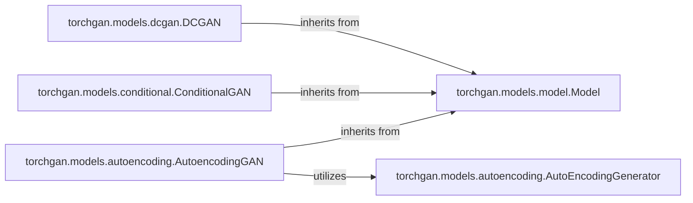

## Details

The `torchgan.models` subsystem provides a modular and extensible framework for implementing various Generative Adversarial Networks. At its core, the `torchgan.models.model.Model` abstract class establishes a common interface and foundational functionalities for all GAN architectures. Concrete GAN implementations, such as `torchgan.models.dcgan.DCGAN`, `torchgan.models.conditional.ConditionalGAN`, and `torchgan.models.autoencoding.AutoencodingGAN`, directly inherit from this base `Model`, ensuring adherence to the standardized structure. For specialized architectures like `AutoencodingGAN`, the framework further allows for the integration of specific sub-components, exemplified by `torchgan.models.autoencoding.AutoEncodingGenerator`, which is directly utilized by `AutoencodingGAN` to handle its unique autoencoding aspects. This hierarchical and compositional design promotes reusability and simplifies the development of new GAN variants.

### torchgan.models.model.Model
Serves as the abstract base class for all GAN models, providing a standardized interface and common functionalities, including a default weight initialization method (`_weight_initializer`). This aligns with the "Modular Design" and "Extensibility Pattern" by providing a common contract for all derived GAN architectures.

**Related Classes/Methods**:

- <a href="https://github.com/torchgan/torchgan/blob/master/torchgan/models/model.py" target="_blank" rel="noopener noreferrer">`torchgan.models.model.Model`</a>
- <a href="https://github.com/torchgan/torchgan/blob/master/torchgan/models/model.py" target="_blank" rel="noopener noreferrer">`torchgan.models.model.Model:_weight_initializer`</a>

### torchgan.models.dcgan.DCGAN
Implements the specific architecture and initialization logic for a Deep Convolutional Generative Adversarial Network (DCGAN), a foundational and widely recognized GAN type. This component represents a concrete realization of a GAN model, demonstrating how the abstract `Model` interface is implemented.

**Related Classes/Methods**:

- <a href="https://github.com/torchgan/torchgan/blob/master/torchgan/models/dcgan.py" target="_blank" rel="noopener noreferrer">`torchgan.models.dcgan.DCGAN`</a>

### torchgan.models.conditional.ConditionalGAN
Adapts existing GAN architectures to incorporate conditional inputs, enabling controlled data generation based on specific conditions (e.g., generating a specific digit in MNIST). This component demonstrates the extensibility of the framework by building upon the base `Model` to support more complex, controlled generation tasks.

**Related Classes/Methods**:

- <a href="https://github.com/torchgan/torchgan/blob/master/torchgan/models/conditional.py" target="_blank" rel="noopener noreferrer">`torchgan.models.conditional.ConditionalGAN`</a>

### torchgan.models.autoencoding.AutoencodingGAN
Defines GAN models that integrate autoencoding principles, typically involving an encoder-decoder structure within the generator or discriminator. This is used for tasks like feature learning or reconstruction, representing another specialized GAN architecture within the framework.

**Related Classes/Methods**:

- <a href="https://github.com/torchgan/torchgan/blob/master/torchgan/models/autoencoding.py" target="_blank" rel="noopener noreferrer">`torchgan.models.autoencoding.AutoencodingGAN`</a>

### torchgan.models.autoencoding.AutoEncodingGenerator
Provides the specific generator component designed for use within `AutoencodingGAN` architectures. It handles the encoding and decoding aspects, acting as a specialized building block for autoencoding-based GANs.

**Related Classes/Methods**:

- <a href="https://github.com/torchgan/torchgan/blob/master/torchgan/models/autoencoding.py#L12-L171" target="_blank" rel="noopener noreferrer">`torchgan.models.autoencoding.AutoEncodingGenerator`:12-171</a>

### [FAQ](https://github.com/CodeBoarding/GeneratedOnBoardings/tree/main?tab=readme-ov-file#faq)