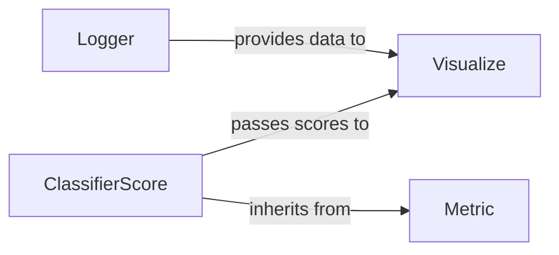

## Details

The `torchgan` logging and metrics subsystem is designed around a clear separation of concerns. The `Logger` component acts as the central data collection point for training progress and system events. This raw data is then consumed by the `Visualize` component, which is responsible for rendering and dispatching it to various visualization backends like TensorBoard or Visdom, providing real-time insights into the training process. Quantitative evaluation is handled by the `Metric` component, an abstract interface that defines how metrics should be preprocessed and calculated. The `ClassifierScore` component is a concrete implementation of `Metric`, specifically designed to evaluate the quality of generated samples using a classifier. This score, once computed, is then passed to the `Visualize` component for presentation, completing the feedback loop for performance monitoring.

### Logger
This component serves as the core logging mechanism, responsible for recording training progress, loss values, and general system events. It acts as the central hub for collecting and managing textual and numerical log data throughout the training process.

**Related Classes/Methods**:

- <a href="https://github.com/torchgan/torchgan/blob/master/torchgan/logging/logger.py" target="_blank" rel="noopener noreferrer">`torchgan.logging.logger.Logger`</a>

### Visualize
Manages the setup and dispatching of training progress, generated samples, and other relevant data to various logging backends (e.g., console, TensorBoard, Visdom). It focuses on the presentation and visualization of logged information, ensuring that users can effectively monitor and understand the training dynamics.

**Related Classes/Methods**:

- <a href="https://github.com/torchgan/torchgan/blob/master/torchgan/logging/visualize.py#L21-L108" target="_blank" rel="noopener noreferrer">`torchgan.logging.visualize.Visualize`:21-108</a>

### Metric
Defines a standardized abstract interface for all quantitative evaluation metrics within `torchgan`. It establishes the `preprocess` and `calculate_score` methods that concrete metric implementations must override, ensuring consistency in how metrics are defined and computed across the framework.

**Related Classes/Methods**:

- <a href="https://github.com/torchgan/torchgan/blob/master/torchgan/metrics/metric.py" target="_blank" rel="noopener noreferrer">`torchgan.metrics.metric.Metric:preprocess`</a>
- <a href="https://github.com/torchgan/torchgan/blob/master/torchgan/metrics/metric.py" target="_blank" rel="noopener noreferrer">`torchgan.metrics.metric.Metric:calculate_score`</a>

### ClassifierScore
A concrete implementation of the `Metric` interface, specifically designed to compute a performance score for generated samples. It typically leverages a pre-trained classifier to assess the quality, realism, or diversity of the outputs produced by the GAN's generator.

**Related Classes/Methods**:

- <a href="https://github.com/torchgan/torchgan/blob/master/torchgan/metrics/classifierscore.py#L11-L84" target="_blank" rel="noopener noreferrer">`torchgan.metrics.classifierscore.ClassifierScore`:11-84</a>

### [FAQ](https://github.com/CodeBoarding/GeneratedOnBoardings/tree/main?tab=readme-ov-file#faq)