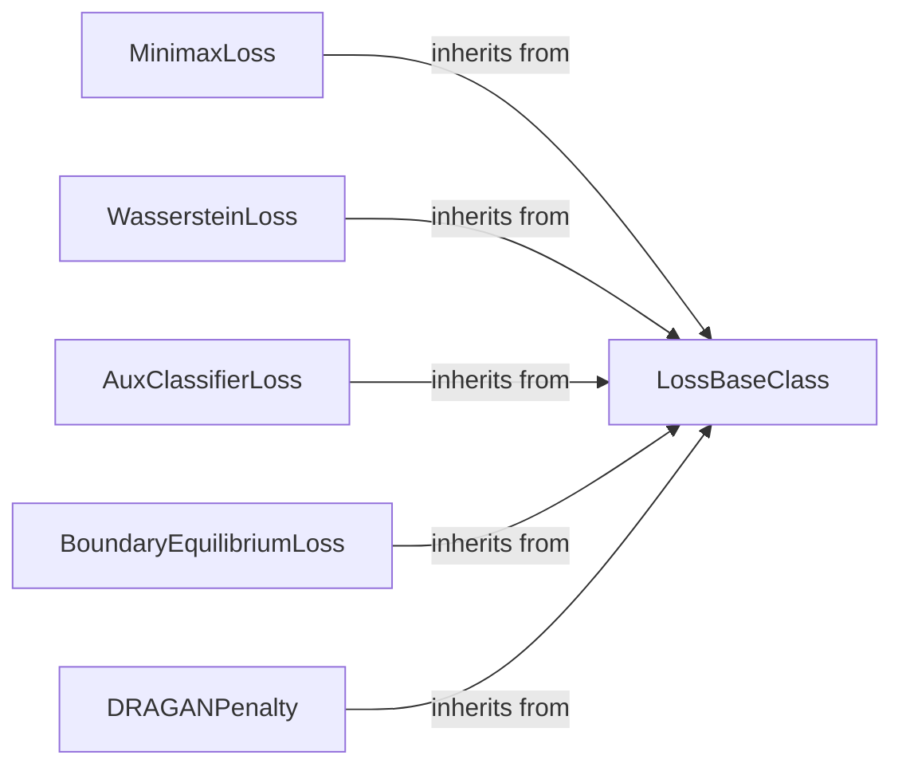

## Details

The Loss Functions subsystem in torchgan is dedicated to quantifying the discrepancy between model outputs and target values, guiding the training process for both Generator and Discriminator components within GANs. It is primarily encapsulated within the torchgan.losses package.

### LossBaseClass
This is the abstract base class for all loss functions within the `torchgan.losses` module. It establishes a common interface and shared initialization logic, ensuring consistency across different loss implementations. It serves as the foundation for extensibility, allowing new loss functions to be easily integrated.

**Related Classes/Methods**:

- <a href="https://github.com/torchgan/torchgan/blob/master/torchgan/losses/loss.py" target="_blank" rel="noopener noreferrer">`torchgan.losses.loss.LossBaseClass`</a>

### MinimaxLoss
A concrete implementation of the traditional Minimax GAN loss function. This loss is fundamental to the original GAN formulation, driving the generator to produce realistic samples and the discriminator to accurately distinguish real from fake.

**Related Classes/Methods**:

- <a href="https://github.com/torchgan/torchgan/blob/master/torchgan/losses/minimax.py" target="_blank" rel="noopener noreferrer">`torchgan.losses.minimax.MinimaxLoss`</a>

### WassersteinLoss
Implements the Wasserstein GAN (WGAN) loss, which aims to improve training stability and mitigate mode collapse by using the Earth Mover's distance. It often requires a critic (discriminator) that satisfies the Lipschitz constraint.

**Related Classes/Methods**:

- <a href="https://github.com/torchgan/torchgan/blob/master/torchgan/losses/wasserstein.py" target="_blank" rel="noopener noreferrer">`torchgan.losses.wasserstein.WassersteinLoss`</a>

### AuxClassifierLoss
Represents the loss function used in Auxiliary Classifier GANs (AC-GANs). This loss extends the standard GAN objective by adding an auxiliary classifier to the discriminator, which predicts the class label of the input image, enabling conditional image generation.

**Related Classes/Methods**:

- <a href="https://github.com/torchgan/torchgan/blob/master/torchgan/losses/auxclassifier.py" target="_blank" rel="noopener noreferrer">`torchgan.losses.auxclassifier.AuxClassifierLoss`</a>

### BoundaryEquilibriumLoss
Implements the Boundary Equilibrium GAN (BEGAN) loss. BEGAN focuses on matching the autoencoder loss distributions of real and generated images, leading to stable training and high-quality image generation.

**Related Classes/Methods**:

- <a href="https://github.com/torchgan/torchgan/blob/master/torchgan/losses/boundaryequilibrium.py" target="_blank" rel="noopener noreferrer">`torchgan.losses.boundaryequilibrium.BoundaryEquilibriumLoss`</a>

### DRAGANPenalty
A specific penalty term used in DRAGAN (Deep Regret Analytic Generative Adversarial Networks). This component adds a gradient penalty to the discriminator's loss, promoting stable training by enforcing a Lipschitz constraint on the discriminator.

**Related Classes/Methods**:

- <a href="https://github.com/torchgan/torchgan/blob/master/torchgan/losses/draganpenalty.py" target="_blank" rel="noopener noreferrer">`torchgan.losses.draganpenalty.DRAGANPenalty`</a>

### [FAQ](https://github.com/CodeBoarding/GeneratedOnBoardings/tree/main?tab=readme-ov-file#faq)