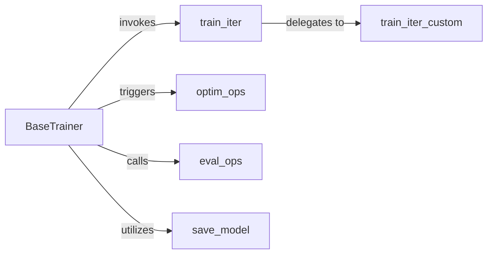

## Details

The `Trainer` subsystem is primarily defined by the `torchgan.trainer.base_trainer` module, with the `BaseTrainer` class serving as its central orchestrator. This subsystem encapsulates all logic related to the training lifecycle of Generative Adversarial Networks (GANs).

### BaseTrainer
The central orchestration unit for the entire GAN training lifecycle. It manages epochs, iterations, coordinates data flow, invokes model forward passes, calculates losses, updates model parameters via optimizers, evaluates metrics, and handles logging and model persistence.

**Related Classes/Methods**:

- <a href="https://github.com/torchgan/torchgan/blob/master/torchgan/trainer/base_trainer.py#L16-L476" target="_blank" rel="noopener noreferrer">`BaseTrainer`:16-476</a>

### train_iter
Executes a single forward and backward pass for the generator and discriminator models, including loss computation. This method embodies the core iterative training logic.

**Related Classes/Methods**:

- <a href="https://github.com/torchgan/torchgan/blob/master/torchgan/trainer/base_trainer.py#L305-L376" target="_blank" rel="noopener noreferrer">`train_iter`:305-376</a>

### optim_ops
Encapsulates the logic for performing optimization steps, such as calculating gradients and updating model parameters using configured optimizers. This is a critical component for the "Optimizers" pattern.

**Related Classes/Methods**:

- <a href="https://github.com/torchgan/torchgan/blob/master/torchgan/trainer/base_trainer.py#L391-L394" target="_blank" rel="noopener noreferrer">`optim_ops`:391-394</a>

### eval_ops
Manages the evaluation phase during training, calculating and reporting performance metrics on a validation set. This aligns with the "Metrics" and "Logging and Visualization" patterns.

**Related Classes/Methods**:

- <a href="https://github.com/torchgan/torchgan/blob/master/torchgan/trainer/base_trainer.py#L378-L389" target="_blank" rel="noopener noreferrer">`eval_ops`:378-389</a>

### save_model
Handles the saving of trained models, enabling checkpointing and final model storage. This is essential for model persistence and recovery.

**Related Classes/Methods**:

- <a href="https://github.com/torchgan/torchgan/blob/master/torchgan/trainer/base_trainer.py#L133-L174" target="_blank" rel="noopener noreferrer">`save_model`:133-174</a>

### train_iter_custom
Provides an explicit 'Extensibility Pattern' hook for users to inject custom training logic within a single iteration without modifying the core `train_iter` method. This is a key architectural feature for user customization.

**Related Classes/Methods**:

- <a href="https://github.com/torchgan/torchgan/blob/master/torchgan/trainer/base_trainer.py#L297-L302" target="_blank" rel="noopener noreferrer">`train_iter_custom`:297-302</a>

### [FAQ](https://github.com/CodeBoarding/GeneratedOnBoardings/tree/main?tab=readme-ov-file#faq)