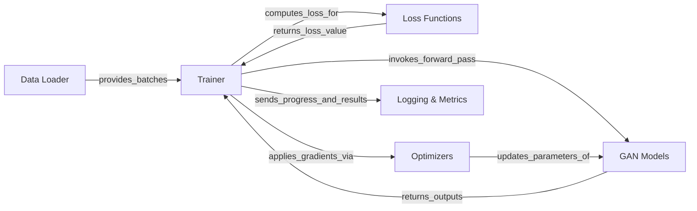

## Details

The `torchgan` project is structured around a central `Trainer` component that orchestrates the entire Generative Adversarial Network (GAN) training process. The `Trainer` interacts with `Data Loader` to receive input data batches, which are then fed to the `GAN Models` (comprising Generator and Discriminator). Outputs from the `GAN Models` are used by `Loss Functions` to compute the adversarial and other relevant losses. These losses guide the `Optimizers` (standard PyTorch components) in updating the parameters of the `GAN Models`. Throughout the training, the `Trainer` sends progress, loss values, and generated samples to the `Logging & Metrics` component for monitoring and evaluation. This clear separation of concerns facilitates modularity and allows for flexible experimentation with different GAN architectures, loss functions, and training strategies.

### Trainer [[Expand]](./Trainer.md)
The central orchestration unit for the entire GAN training lifecycle. It manages epochs, iterations, coordinates data flow, invokes model forward passes, calculates losses, updates model parameters via optimizers, evaluates metrics, and handles logging and model persistence.

**Related Classes/Methods**:

- <a href="https://github.com/torchgan/torchgan/blob/master/torchgan/trainer/base_trainer.py" target="_blank" rel="noopener noreferrer">`torchgan.trainer.base_trainer`</a>

### GAN Models [[Expand]](./GAN_Models.md)
Encapsulates the Generator and Discriminator neural network architectures. These are the core learnable components of the GAN, responsible for generating data and distinguishing between real and fake data.

**Related Classes/Methods**:

- <a href="https://github.com/torchgan/torchgan/blob/master/torchgan/models/model.py" target="_blank" rel="noopener noreferrer">`torchgan.models.model`</a>
- <a href="https://github.com/torchgan/torchgan/blob/master/torchgan/models/dcgan.py" target="_blank" rel="noopener noreferrer">`torchgan.models.dcgan`</a>
- <a href="https://github.com/torchgan/torchgan/blob/master/torchgan/models/conditional.py" target="_blank" rel="noopener noreferrer">`torchgan.models.conditional`</a>
- <a href="https://github.com/torchgan/torchgan/blob/master/torchgan/models/autoencoding.py" target="_blank" rel="noopener noreferrer">`torchgan.models.autoencoding`</a>

### Loss Functions [[Expand]](./Loss_Functions.md)
A collection of functions that quantify the discrepancy between model outputs and target values. They guide the training process for both Generator and Discriminator by providing gradients. Includes specialized GeneratorLoss and DiscriminatorLoss types.

**Related Classes/Methods**:

- <a href="https://github.com/torchgan/torchgan/blob/master/torchgan/losses/loss.py" target="_blank" rel="noopener noreferrer">`torchgan.losses.loss`</a>
- <a href="https://github.com/torchgan/torchgan/blob/master/torchgan/losses/minimax.py" target="_blank" rel="noopener noreferrer">`torchgan.losses.minimax`</a>
- <a href="https://github.com/torchgan/torchgan/blob/master/torchgan/losses/wasserstein.py" target="_blank" rel="noopener noreferrer">`torchgan.losses.wasserstein`</a>
- <a href="https://github.com/torchgan/torchgan/blob/master/torchgan/losses/auxclassifier.py" target="_blank" rel="noopener noreferrer">`torchgan.losses.auxclassifier`</a>

### Optimizers
Components (from PyTorch's `torch.optim`) responsible for updating the parameters of the GAN Models based on the gradients computed from the loss functions. These are standard PyTorch optimizers and not custom `torchgan` implementations.

**Related Classes/Methods**: _None_

### Data Loader
Manages the loading, batching, and pre-processing of real data, providing mini-batches to the Trainer for training and evaluation. This typically refers to PyTorch's `torch.utils.data.DataLoader`.

**Related Classes/Methods**: _None_

### Logging & Metrics [[Expand]](./Logging_Metrics.md)
Handles the recording and output of training progress, loss values, metrics, and generated samples to various logging backends (e.g., TensorBoard). It also includes components for quantitative evaluation of GAN performance.

**Related Classes/Methods**:

- <a href="https://github.com/torchgan/torchgan/blob/master/torchgan/logging/logger.py" target="_blank" rel="noopener noreferrer">`torchgan.logging.logger`</a>
- <a href="https://github.com/torchgan/torchgan/blob/master/torchgan/logging/visualize.py" target="_blank" rel="noopener noreferrer">`torchgan.logging.visualize`</a>
- <a href="https://github.com/torchgan/torchgan/blob/master/torchgan/metrics/metric.py" target="_blank" rel="noopener noreferrer">`torchgan.metrics.metric`</a>
- <a href="https://github.com/torchgan/torchgan/blob/master/torchgan/metrics/classifierscore.py" target="_blank" rel="noopener noreferrer">`torchgan.metrics.classifierscore`</a>

### [FAQ](https://github.com/CodeBoarding/GeneratedOnBoardings/tree/main?tab=readme-ov-file#faq)